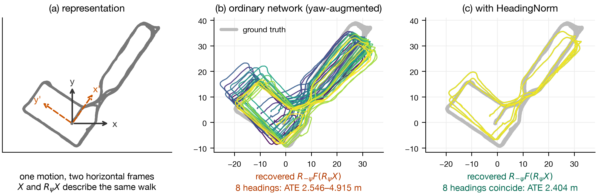
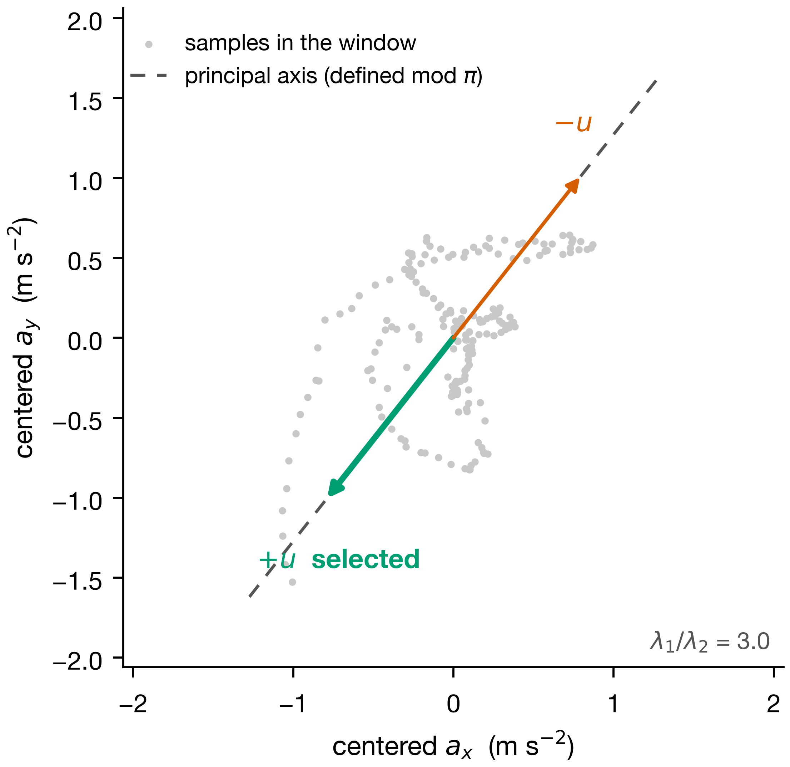
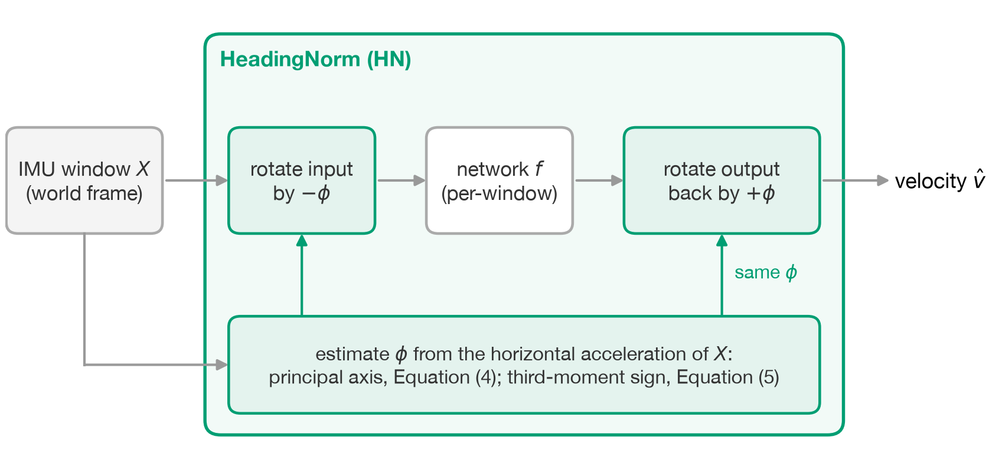
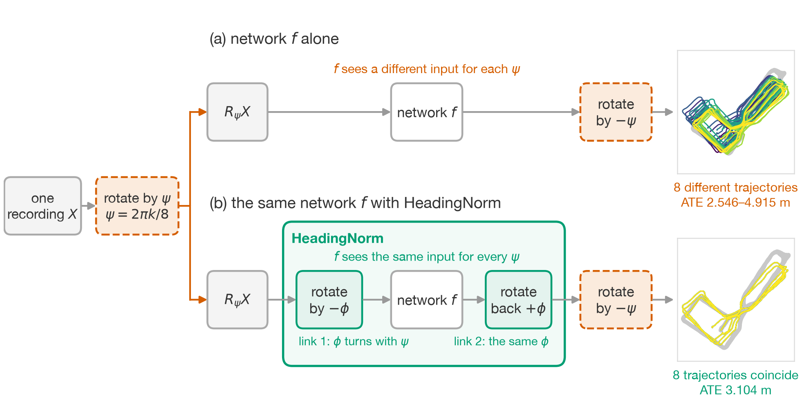
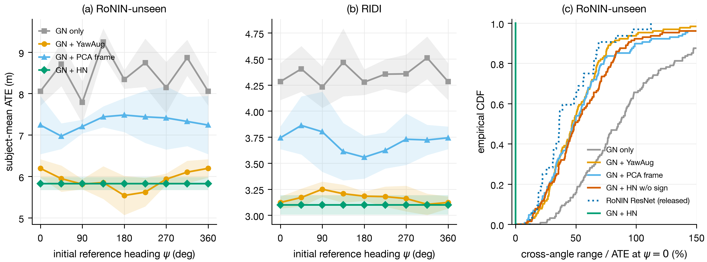
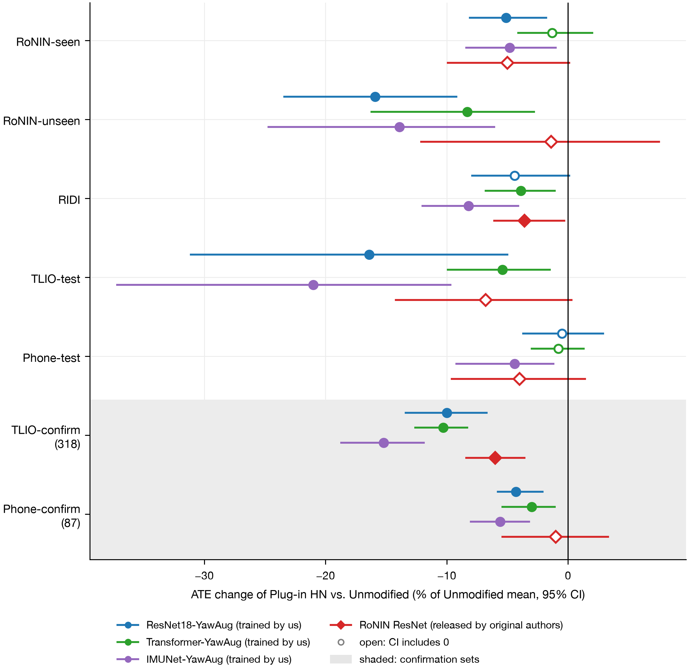
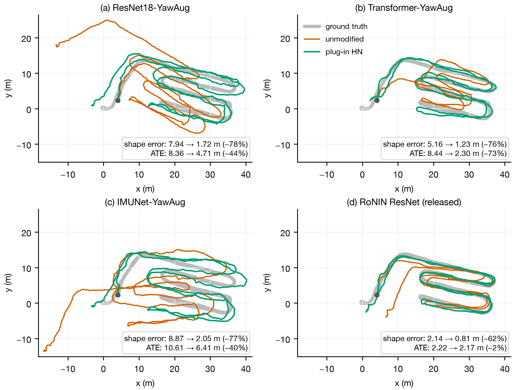

# HeadingNorm: Closed-Form Yaw Canonicalization for Inertial Velocity Regression without Retraining

**Yanlin Li 1,2, Xichen Cui 1 and Yu Quan 1,2,\***

1 School of Economics and Management, Yanbian University, Hunchun 133300, Jilin, China
2 Institute of International Logistics, School of Economics and Management, Yanbian University, Hunchun 133300, Jilin, China

\* Correspondence: yuquan@ybu.edu.cn

---

## Abstract

Learned inertial odometry regresses velocity from 1 s windows of gravity-aligned inertial data, whose horizontal reference heading is arbitrary. Conventional networks are not exactly equivariant to this heading, so the trajectory shape and error of a recording change with the initial device heading. Across eight headings, the median per-recording range of absolute trajectory error (ATE) was 46.9% of the dataset-heading ATE for a yaw-augmented network and 34.3–78.8% for released RoNIN models. We propose HeadingNorm (HN), which takes the principal axis of the horizontal acceleration covariance as a canonical heading and resolves its 180° ambiguity with the sign of the projected third moment. HN rotates each window into this frame and rotates the predicted velocity back. This closed-form, parameter-free front end makes any deterministic per-window network exactly yaw-equivariant on non-degenerate windows without retraining. In confirmatory tests on 318 held-out TLIO sequences, plug-in HN significantly reduced ATE by 10.0–15.2% for three yaw-augmented architectures and by 6.0% for the released RoNIN ResNet. Averaging both heading conventions over eight angles gave reductions of 5.3–13.2%. Trajectory shape error fell 1.7–2.1 times as much, and more where the unmodified network was more heading-sensitive. HN thus makes deployed networks independent of the initial heading and more accurate.

**Keywords:** inertial odometry; yaw equivariance; plug-and-play; test-time canonicalization; frozen networks; principal-axis sign ambiguity; confirmatory testing; smartphone IMU

---

## 1. Introduction

Smartphone inertial measurement units (IMUs) record accelerometer and gyroscope readings continuously and can support relative displacement estimation indoors and underground, where satellite positioning is limited. Double integration of acceleration, however, quickly accumulates bias and attitude errors. Learned inertial odometry instead estimates velocity or displacement from short windows and integrates successive predictions into a trajectory. Robust IMU Double Integration (RIDI) and Robust Neural Inertial Navigation (RoNIN) established this approach and have become common benchmarks for subsequent research [1,2].

Before entering the network, IMU readings are rotated into a gravity-aligned frame using an attitude estimate. This fixes the vertical direction but leaves the horizontal reference heading undetermined, because inertial measurements alone cannot determine the absolute initial yaw. The same motion can therefore be expressed in horizontal $x/y$ coordinates rotated by any angle, with the inputs and velocity labels rotated accordingly. The reference heading of a dataset is only one of these equivalent conventions; in RoNIN, for example, it is set by the initial attitude of the ground-truth device. Evaluation protocols account for this ambiguity by translating or rigidly aligning trajectories before computing errors.

These protocols assume that changing the horizontal reference heading changes only how the motion is represented, so the output of an algorithm should rotate by the same angle as its input. For a velocity regressor $F$ and a rotation $R_\psi$ about the vertical axis, this requirement is

$$F(R_\psi X)=R_\psi F(X).\tag{1}$$

We refer to Equation (1) as yaw equivariance. Common convolutional neural network (CNN), residual network (ResNet), and Transformer architectures do not satisfy it by construction. For such networks, changing the reference heading can alter not only the overall orientation of the predicted trajectory but also its shape. Rigid alignment cannot remove a change in shape, so the error on a given recording depends on an arbitrary choice of heading. For a yaw-augmented network, the median per-recording range of absolute trajectory error (ATE) across eight headings reaches 46.9% of the ATE at the dataset heading. For the RoNIN ResNet, long short-term memory (LSTM), and temporal convolutional network (TCN) models released by the original authors, it is 34.3–78.8%.

Figure 1 illustrates this variation on one RoNIN-unseen recording with the seed-0 models. The recording was chosen, without regard to prediction accuracy, because the cross-angle ATE range of the yaw-augmented model on it is closest to the median over the 32 sequences. With attitude estimated from the accelerometer and gyroscope alone, this rotation corresponds to starting the recording with a different phone heading, provided that the motion and the other attitude errors stay the same. The trajectory error can then change with the initial orientation of the phone, and the user has no way to tell whether a particular result is good or poor.

**Figure 1.** Effect of the horizontal reference heading on one recording (sequence a058_2). (a) The same motion in two horizontal frames separated by $\psi$, which differ in representation but not in motion; (b) a frozen ResNet18 trained with random yaw augmentation under eight initial reference headings; (c) a ResNet18 trained with HeadingNorm (HN) under the same eight headings.

Random yaw augmentation (YawAug), used to train RoNIN and Tight Learned Inertial Odometry (TLIO) [2,3], is the usual remedy. During training, it applies the same random horizontal rotation to the IMU vectors and the velocity labels. The network thus learns a response that, after rotation back, should not depend on the reference heading. The equivariance learned in this way is approximate, depends on the data distribution, and is not guaranteed for any individual recording. The 46.9% range quoted above was measured on a network trained with this augmentation. Augmentation also acts only during training and cannot be added to released weights without retraining.

We introduce HeadingNorm (HN), which moves each window into a canonical frame before it enters the network. A signed canonical heading is computed in closed form from the window's own signal. The input is rotated into this frame, the network predicts velocity, and the prediction is rotated back to the original frame. On non-degenerate windows, that is, windows whose horizontal acceleration has a dominant direction and is asymmetric along it, every horizontal rotation of a window yields the same canonical input, so any deterministic per-window network becomes exactly yaw-equivariant. This guarantee depends neither on the training distribution nor on an equivariant architecture. Unlike the rotation-equivariance supervision of RIO [4] and the learned canonical frame of EqNIO [5], HN has no learnable parameters and can be applied to trained per-window networks without retraining.

The main difficulty lies in the sign of the canonical heading. Principal component analysis (PCA) has been used to estimate the dominant direction of motion in pedestrian heading estimation [6]. However, the principal axis of the horizontal acceleration covariance is an undirected line: $u$ and $-u$ describe the same axis. Using the axis alone therefore reduces the continuous rotational ambiguity to a sign ambiguity, and the canonicalized input can switch between two representations separated by $180^\circ$. We adopt the construction used for point-cloud canonicalization, in which the projected third central moment selects one of the two directions [7]; this gives a closed-form canonicalization method [8]. Alternatively, the network can process both directions and average the two predictions after rotating them back, which is a special case of frame averaging [9]. Either approach removes the remaining sign ambiguity.

HN and random yaw augmentation act at different stages and can be combined: augmentation is applied during training, whereas HN can be added at inference to any trained per-window network, including a yaw-augmented one. Our main comparison is therefore between the same frozen network with and without HN.

The main contributions of this study are as follows:

1. **Quantification of heading-dependent error.** We vary the horizontal reference heading in a controlled experiment while keeping the motion unchanged. For yaw-augmented networks trained in this study and for three released RoNIN models, the predicted trajectory shape on the same recording changes with the reference heading. Optimal rotation alignment of each trajectory does not remove these changes.
2. **Closed-form HN with explicit equivariance conditions.** HN has no learnable parameters and makes any deterministic per-window regressor exactly yaw-equivariant on non-degenerate windows. Resolving the 180° ambiguity of the principal axis is a necessary step and can be done either by third-moment sign disambiguation or by two-way frame averaging.
3. **Confirmed plug-in gains without retraining.** HN can be applied to trained per-window networks, including those trained with random yaw augmentation. In prespecified tests on 318 previously unevaluated TLIO sequences, plug-in HN significantly reduced ATE by 6.0–15.2% relative to the unmodified networks, for three architectures trained in this study and for the released RoNIN ResNet. These figures use the dataset reference heading and the default canonical heading of HN. When the input reference heading of the unmodified network and the canonical-heading offset of HN are each averaged over eight values, the reductions are 5.3–13.2%, and trajectory shape error also decreases significantly.

Section 2 reviews related work. Section 3 defines the problem and presents HN, its equivariance conditions, and its use with trained networks. Section 4 describes the data, models, training, evaluation protocols, and statistical methods. Section 5 reports the results for networks trained in this study and for released models. Section 6 discusses the strength of the evidence, usage, error composition, and scope, and Section 7 concludes the paper.

---

## 2. Related Work

### 2.1. Learned Inertial Odometry

IONet was an early method for estimating motion quantities directly from IMU windows [10]. RIDI identifies how a phone is carried and corrects acceleration with the corresponding velocity regressor [1]. RoNIN directly regresses integrable motion quantities from attitude-compensated IMU data [2]. TLIO predicts three-dimensional displacement and its uncertainty and passes them to an extended Kalman filter (EKF) [3]. Later work addressed cross-domain transfer in MotionTransformer [11], cascaded orientation and position estimation in IDOL [12], and data requirements and on-device inference cost [13].

Recent studies have extended the network architectures used for inertial odometry. X-IONet supports both pedestrians and legged robots [14], while AirIO uses a body-frame representation to improve feature observability [15]. ResT-IMU combines ResNet and Transformer stages [16], and PedestrianDiffusion uses generative denoising [17]. Other studies apply diffusion-based generative learning to microelectromechanical systems (MEMS) devices [18], develop motion-augmented multi-sensor odometry in MARIO [19], and compare multilayer perceptron (MLP) and Kolmogorov–Arnold network (KAN) displacement regressors [20].

Training and system integration have also received attention. DINS-IO [21], Physical SSL [22], and KISS-IMU [23] reduce dependence on position labels. RNIN-VIO [24] and ALIVE-LIO [25] integrate learned inertial estimates into visual and LiDAR systems, respectively. Classical approaches include pedestrian dead reckoning and zero-velocity updates [26,27]. Recent developments include motion-state-adaptive step length [28], sliding-window factor graphs [29], and the invariant extended Kalman filter [30]. A survey of smartphone localization datasets is available in [31].

Another line of work improves the temporal representation of IMU inputs. Lie Events uses preintegrated events [32], while M2EIT and MInF introduce multi-band modeling [33,34]. EDIN jointly examines convolutional structure, attention, and training settings for inertial odometry [35].

### 2.2. Reference-Frame Handling

Existing approaches handle changes of reference frame either through training constraints or through signal geometry. RIO uses rotation-equivariance supervision [4]. EqNIO learns a canonical frame under equivariance constraints and maps between the input and canonical frames [5]; its ablation experiments also include a PCA frame. Earlier smartphone heading studies used PCA to estimate the dominant direction of motion and discussed the resulting direction ambiguity [6]. In point-cloud canonicalization, a PCA principal axis is combined with projected third-moment sign disambiguation [7], and on ModelNet40 classification every tested way of resolving this ambiguity outperformed plain PCA. Our experiments on inertial velocity regression show a consistent result.

HN computes the covariance from horizontal acceleration alone, obtains the principal axis in closed form in two dimensions, and fixes its sign with the third moment. The public PCA implementation of EqNIO, in contrast, concatenates horizontal gyroscope and acceleration samples and leaves the sign ambiguity unresolved. We compare these PCA frames under identical conditions on inertial time series. In addition, we measure repeatability across initial headings on individual recordings and run confirmatory tests of canonicalization applied at inference to trained networks.

HN belongs to the general class of canonicalization methods [8], in which a function that transforms together with the input maps it to a canonical pose before an arbitrary network processes it. Frame averaging is another general construction [9]; our two-way frame averaging is the special case that averages over the two directions of the principal axis.

Group theory also describes the relationship between data augmentation and equivariance [36]. Suppose that the data distribution and the loss are invariant to changes of reference heading and that the loss is convex in the prediction. Group averaging then does not increase the risk of a predictor, so an optimal solution of augmented training can be chosen to be equivariant. This result concerns the optimum and does not guarantee that a trained network is equivariant. Moreover, our per-coordinate Huber loss grows linearly in each coordinate beyond the transition point, so its value depends on the orientation of the coordinate axes and the loss-invariance assumption does not hold. Consistent with this, our yaw-augmented networks retain a substantial dependence on the reference heading.

### 2.3. Evaluation Protocols and Trajectory Metrics

Trajectory errors are usually computed after the predicted trajectory has been aligned with the reference. Visual simultaneous localization and mapping (SLAM) benchmarks often align the whole trajectory with a rigid or similarity transformation [37], for which Umeyama gave the closed-form least-squares solution [38]. Inertial odometry benchmarks more often translate the start point or apply rigid registration over an initial segment [1,2]. Scaling or whole-trajectory alignment absorbs global scale and heading errors and can reduce ATE substantially, so methods are comparable only under the same alignment protocol. Recent studies also report shape metrics such as path-length ratio and stepwise direction consistency [17]. Our unified evaluation protocol fixes the start point and the initial heading and then decomposes the remaining error into a complex-gain component and a shape component.

## 3. Method

This section defines the task and the reference-heading transformation, presents HN and its equivariance conditions, and then describes its use with trained networks and its two implementations.

### 3.1. Problem and Reference-Heading Transformation

The input is a six-channel IMU window of 200 consecutive samples (1 s at 200 Hz), with three-axis gyroscope readings followed by three-axis accelerometer readings. The target is the two-dimensional average velocity, that is, the displacement between the reference positions at the window endpoints divided by the actual time interval. At inference, the network predicts a velocity every 10 samples (0.05 s at 200 Hz), and integrating these predictions gives the trajectory.

The network receives only accelerometer and gyroscope readings, rotated into a gravity-aligned frame with the attitude supplied by each dataset. RoNIN uses the game rotation vector, initial attitude, and calibration information; RIDI uses the rotation vector; TLIO uses visual–inertial odometry (VIO) attitude; and the IMUNet phone data use the game rotation vector. HN operates after this transformation and before the network: it rotates the horizontal inputs into a canonical frame and rotates the predicted velocity back to the gravity-aligned input frame.

In our experiments, we rotate the whole input of a recording horizontally by an angle $\psi$ that we choose; at inference, there is no $\psi$. Let $X$ denote an IMU window. The rotation $R_{\psi}$ acts on the horizontal gyroscope $x/y$ and acceleration $x/y$ channels and leaves both vertical channels unchanged; the two-dimensional velocity target is rotated in the same way:

$$R_\psi:\quad a_h\mapsto R_\psi a_h,\ \ a_z\mapsto a_z,\quad \omega_h\mapsto R_\psi\omega_h,\ \ \omega_z\mapsto\omega_z,\quad v\mapsto R_\psi v .\tag{2}$$

Under a rotation about the vertical axis, the horizontal components of angular velocity rotate in the same way as acceleration, so HN applies the same rotation to both channel groups. Because $\psi$ does not change the physical motion, the desired property is the yaw equivariance of Equation (1): predictions rotated back to the original frame should give the same trajectory for every $\psi$.

This rotation reproduces a change of the initial heading of the device. A phone needs an attitude estimate to transform its readings from the body frame to a world frame. The IMUNet phone data and RoNIN use the Android game rotation vector, which is computed from the accelerometer and gyroscope without the magnetometer. Gravity fixes the vertical direction, but these sensors cannot fix a horizontal zero direction, so the game rotation vector starts from an arbitrary horizontal reference and tracks yaw changes by integrating the gyroscope; in RoNIN, this reference is aligned with the initial orientation of the ground-truth device. If the motion and the other attitude errors stay the same, starting a recording with a different initial heading therefore changes the network input by exactly $R_{\psi}$. RIDI, in contrast, uses the rotation vector, which includes magnetometer measurements and refers the horizontal zero to magnetic north; for RIDI, the rotation experiment tests how the model responds to a coordinate transformation.

### 3.2. HeadingNorm: Principal-Axis Canonicalization with Sign Disambiguation

HN computes the principal axis, resolves its sign, and rotates the input and the output; the canonical heading is determined from the window's signal alone. We first compute the mean and covariance of the horizontal acceleration $a_t=(a_{x,t},a_{y,t})^\top$:

$$\bar a=\frac1T\sum_t a_t,\qquad C=\frac1T\sum_t(a_t-\bar a)(a_t-\bar a)^\top .\tag{3}$$

For this 2 × 2 symmetric matrix, the principal-axis angle is

$$\phi_0=\tfrac12\operatorname{atan2}(2C_{xy},\,C_{xx}-C_{yy}).\tag{4}$$

The principal axis has two equivalent directions. We select one with the projected third central moment along $u_0=(\cos\phi_0,\sin\phi_0)^\top$:

$$m_3=\frac1T\sum_t\big[u_0^\top(a_t-\bar a)\big]^3,\qquad
\phi=\begin{cases}\phi_0, & m_3\ge 0,\\ \phi_0+\pi, & m_3<0.\end{cases}\tag{5}$$

HN rotates both horizontal channel groups by $-\phi$ while leaving the vertical channels unchanged. After normalization, the backbone predicts velocity in the canonical frame, and HN rotates this prediction back by $\phi$. With normalization $G$ and backbone $h$, the prediction is

$$\hat v(X)=R_{\phi(X)}\,h\big(G(R_{-\phi(X)}X)\big).\tag{6}$$

Figure 2 shows the principal axis and the selected sign for a real window. The canonical heading need not coincide with the forward direction of the body; its effect on velocity regression is assessed experimentally. During training, the prediction is rotated back and compared with the velocity target in the original frame. Algorithm 1 and Figure 3 give the complete procedure.

**Figure 2.** Principal axis and third-moment sign for a real 1 s window from the RoNIN test set.

**Algorithm 1.** HeadingNorm

Input: gravity-aligned IMU window $X$; trained per-window network $f$
Output: velocity $\hat v$ in the input frame

1. $\bar a\leftarrow\frac1T\sum_t a_t$; $\tilde a_t\leftarrow a_t-\bar a$
2. $C\leftarrow\frac1T\sum_t\tilde a_t\tilde a_t^\top$ (Equation (3))
3. $\phi_0\leftarrow\tfrac12\operatorname{atan2}(2C_{xy},\,C_{xx}-C_{yy})$; $u_0\leftarrow(\cos\phi_0,\sin\phi_0)^\top$ (Equation (4))
4. $m_3\leftarrow\frac1T\sum_t(u_0^\top\tilde a_t)^3$
5. if $m_3<0$ then $\phi\leftarrow\phi_0+\pi$ else $\phi\leftarrow\phi_0$ (Equation (5))
6. $X_c\leftarrow R_{-\phi}X$ (horizontal channels only)
7. $\hat v_c\leftarrow f(X_c)$
8. return $\hat v=R_\phi\hat v_c$ (Equation (6))

Centering is used only to compute the heading; the network receives the uncentered input, which preserves its amplitude and mean. For training-time HN, $f = h \circ G$; for plug-in HN, $f$ is the frozen network. Two-way frame averaging replaces lines 4–8 with

$$\hat v=\tfrac12\big[R_{\phi_0}f(R_{-\phi_0}X)+R_{\phi_0+\pi}f(R_{-\phi_0-\pi}X)\big].$$

**Figure 3.** Inference pipeline of HN. HN estimates $\phi$ from the current window $X$ alone and has no learnable parameters. For training-time HN, $f=h\circ G$; for plug-in HN, $f$ is a frozen network.

### 3.3. Yaw Equivariance: Proposition, Conditions, and Proof Sketch

The following proposition states when HN is yaw-equivariant. The proof sketch shows why each condition is needed and where the construction can fail.

**Proposition 1** (Conditional yaw equivariance). Suppose that the horizontal acceleration covariance $C$ of window $X$ has distinct eigenvalues and that the projected third central moment on the principal axis satisfies $m_3\neq0$. Then, for any $\psi$, Equation (5) gives $\phi(R_\psi X)=\phi(X)+\psi\ (\mathrm{mod}\ 2\pi)$. Moreover, for any deterministic function $f$, including the training-time form $h\circ G$ and any frozen per-window network, the output of Equation (6) satisfies Equation (7).

The proof follows the three steps of the construction.

(i) **Covariance.** Rotating the input maps $a_t\mapsto R_\psi a_t$, so the mean and covariance become $R_\psi\bar a$ and $C'=R_\psi CR_\psi^\top$.

(ii) **Principal axis.** Let $z=(C_{xx}-C_{yy})+\mathrm i\,2C_{xy}$. Direct expansion gives $z'=e^{\mathrm i2\psi}z$, so Equation (4) yields $\phi_0'=\phi_0+\psi\ (\mathrm{mod}\ \pi)$, that is, $u_0'=\pm R_\psi u_0$. The ambiguity modulo $\pi$ arises because atan2 determines only $2\phi_0$. This step fails when $z=0$, i.e., when the eigenvalues are equal.

(iii) **Sign.** If $u_0'=R_\psi u_0$, the projection $u_0'^\top R_\psi(a_t-\bar a)=u_0^\top(a_t-\bar a)$ is unchanged and $m_3'=m_3$. If $u_0'=-R_\psi u_0$, every projection changes sign and $m_3'=-m_3$. In both cases, Equation (5) selects $\operatorname{sign}(m_3)\,u_0$ rotated by $\psi$, so $\phi(R_\psi X)=\phi(X)+\psi\ (\mathrm{mod}\ 2\pi)$.

Without sign disambiguation, step (iii) fails, as the ablation experiments confirm. Two-way frame averaging avoids this step because it averages over $\{\phi_0,\phi_0+\pi\}$ regardless of which representative is chosen; it needs only step (ii) and hence only distinct eigenvalues.

The canonicalized input is therefore independent of $\psi$, since $R_{-\phi(R_\psi X)}R_\psi X=R_{-\phi(X)}X$. Normalization $G$ and backbone $h$ receive identical inputs, and the output is rotated by $\phi(X)+\psi$, so Equation (1) holds:

$$\hat v(R_\psi X)=R_\psi\,\hat v(X).\tag{7}$$

Yaw equivariance thus follows from the coordinate transformations of the input and output alone. The functions $G$ and $h$ act in the canonical frame and need only be deterministic; neither equivariant backbone layers nor commutation of $G$ with horizontal rotations is required. Our GlobalNorm (GN) uses a shared scale for the two horizontal axes, but this is an implementation choice, not a condition of the proof.

Figure 4 illustrates the two links of this construction. In link 1, the canonical heading follows the input rotation, which requires distinct eigenvalues and a nonzero projected third moment. In link 2, the output is rotated back to the original frame with the same $\phi$. Together, the two links give the network the same input for every $\psi$ and make its output yaw-equivariant.

**Figure 4.** Reference-heading experiment on sequence a058_2. (a) A frozen network $f$ (ResNet18-YawAug, seed 0) used alone; (b) the same network $f$ with HN. The orange dashed steps exist only in this experiment; the inference pipeline in Figure 3 has no $\psi$. Proposition 1 makes HN exactly yaw-equivariant on non-degenerate windows, so the eight trajectories in (b) coincide.

The proposition holds for non-degenerate windows, in which $C$ has distinct eigenvalues and $m_3 \neq 0$. The first condition makes the principal axis of Equation (4) unique, and the second allows Equation (5) to select one direction along this axis. For exactly degenerate windows, the implementation falls back on deterministic defaults, with $\operatorname{atan2}(0,0)=0$ and no flip when the third moment is zero; the output remains deterministic, but equivariance is no longer guaranteed. The proposition holds in exact arithmetic. With float32 inference, the largest per-recording ATE range across eight reference headings is $3.3\times10^{-6}$ m.

### 3.4. Plug-in Use and Implementations

Because HN has no learnable parameters, it can be applied directly to a trained per-window network. The input is rotated by $-\phi$ and passed to the frozen network $f$, and the prediction is rotated back by $\phi$. In other words, $f$ takes the place of $h \circ G$ in Equation (6); we call this use plug-in HN. Under the non-degeneracy conditions of Proposition 1, the output is exactly yaw-equivariant for any deterministic $f$; the accuracy of plug-in HN is evaluated in Section 5.4. Networks trained in this study keep their training-time GN when HN is plugged in. The released networks were trained without GN, and plug-in HN does not add it.

We use two implementations to resolve the direction ambiguity of the principal axis. Third-moment sign disambiguation needs one forward pass per window and requires distinct eigenvalues and a nonzero third moment. Two-way frame averaging (FA-2) evaluates both directions, $\phi_0$ and $\phi_0+\pi$, rotates both predictions back to the original frame, and averages them. As a special case of frame averaging [9], FA-2 needs no sign disambiguation and is exactly yaw-equivariant whenever the eigenvalues are distinct, at the cost of two forward passes per window. Because the two share the principal-axis computation and the rotation operations, we treat them as two implementations of HN.

HN rotates each window so that its canonical heading points along the $x$ axis. As in any canonicalization method, this target direction is a free choice: rotating each window to a fixed angle $\alpha$ instead, that is, replacing $\phi$ with $\phi - \alpha$ in Equation (6), leaves the output exactly yaw-equivariant. We call $\alpha$ the canonical-frame convention and use $\alpha = 0$. The two angles $\psi$ and $\alpha$ play different roles. The reference heading $\psi$ is set by the initial orientation of the device and differs between recordings, whereas $\alpha$ is a single constant shared by all recordings. Plug-in HN therefore removes the dependence on $\psi$, but it presents every window to the frozen network in the orientation set by $\alpha$, which can affect accuracy. To show that the results do not depend on the choice $\alpha = 0$, we also compare the unmodified network averaged over eight values of $\psi$ with plug-in HN averaged over eight values of $\alpha$.

The present construction applies to per-window networks. Sequence networks process a whole sequence, predict per-frame outputs, and integrate information across windows. HN determines a canonical heading for each window independently, and this heading can change between adjacent windows. It therefore provides no common canonical frame for a whole sequence, and sequence networks are outside the scope of this study. Upstream yaw drift also remains in the original frame after the predictions are rotated back, and HN does not correct it.

## 4. Experimental Setup

The experiments involve two groups of networks that differ in the source of their weights. Case 1 comprises networks trained from scratch in this study under a common training setup. Case 2 comprises networks released by the original authors, whose weights we load without further training. Plug-in HN is evaluated in both cases. This section describes the data, models, training, evaluation protocols, and statistical analysis.

### 4.1. Data

We use four public datasets: RoNIN, RIDI, TLIO, and the IMUNet phone data. All consist of IMU sequences recorded while pedestrians carried or wore the devices, and ground-truth trajectories are used only to generate training labels and to evaluate predictions. RoNIN, RIDI, and TLIO are sampled at 200 Hz. The phone data keep their original timestamps without resampling. Their mean sampling rates range from 190.4 to 200.0 Hz across sequences, and the per-sequence median duration of a 200-sample window ranges from 1.00 to 1.05 s.

- **RoNIN** [2]: Smartphones are carried in everyday positions such as in the hand, in a pocket, or in a bag, and ground truth comes from visual–inertial tracking of a second device fixed to the body. The public data include the official training and validation splits (88 sequences) and the official test set. The test set is divided into two groups according to whether the subjects appear in the official training data. The seen group has 31 subjects, 32 sequences, and 4.93 h of data; the unseen group has 15 subjects, 32 sequences, and 5.07 h.

- **RIDI** [1]: The dataset contains 94 sequences (2.71 h in total) with phones held in the hand, attached to the body, or carried in a bag or leg pocket. Subject identifiers are not available, so we group sequences by the collector names embedded in the filenames; each of the resulting 11 groups is treated as one subject in the statistical analysis.

- **TLIO** [3]: The data were collected with a head-mounted device, and both the input attitude and the ground truth come from VIO processing. Subject information is not available, so all statistics are computed per sequence. The official split contains 283 training, 35 validation, and 36 test sequences.

- **IMUNet phone data** [39]: Four subjects recorded indoor and outdoor walks with four phones (Tango, Galaxy S10, Galaxy S21, and Xiaomi). The authors assigned 90 sequences to training and 36 to testing; both splits contain the same subjects and devices.

Table 1 lists the training data, test sets, and confirmation sets; the durations of the test and confirmation sets are computed directly from the evaluation data.

All training data come from RoNIN, whose official training and validation data we re-split by subject. The training set (34 subjects, 74 sequences, 11.06 h) is used to train the networks and to compute the GN constants. The validation set (8 other subjects, 14 sequences, 2.27 h) is used only for checkpoint selection. The two sets share no subjects, and the split was based solely on sequence duration, without reference to any evaluation result. TLIO, RIDI, and the IMUNet phone data are not used for training, checkpoint selection, or hyperparameter selection.

We use five test sets. RoNIN-unseen is the main cross-subject test set; its 15 subjects appear in neither our training nor our validation set. RoNIN-seen contains 26 sequences from training subjects and 6 from validation subjects and is therefore an in-sample evaluation at the subject level. RIDI tests cross-dataset performance, and TLIO-test (36 sequences, 3.18 h) and Phone-test (36 sequences, 2.38 h, 9.46 km) test cross-device performance.

The confirmation sets are used only for the confirmatory tests of plug-in HN. TLIO-confirm combines the official TLIO training and validation splits, with 318 sequences and 28.43 h. Phone-confirm is the training split of the phone data, with 87 sequences and 6.42 h; 3 of the original 90 sequences were excluded under a prespecified loading rule because their timestamps were not increasing. Because we train on neither dataset, these official training splits are new data for our models. They were evaluated for the first time only after the hypotheses, metrics, and decision rules had been fixed. Phone-confirm and Phone-test share the same four subjects, so Phone-confirm adds new sequences but not new subjects.

**Table 1.** Data splits and their use.

| Dataset | Source split | Sequences | Subjects | Duration (h) | Use |
|---|---|---:|---|---:|---|
| **Training data** | | | | | |
| RoNIN-train | RoNIN official train/val, re-split by subject | 74 | 34 | 11.06 | Training; GN constants |
| RoNIN-val | RoNIN official train/val, re-split by subject | 14 | 8, disjoint from training | 2.27 | Checkpoint selection |
| **Test sets** | | | | | |
| RoNIN-seen | RoNIN official test, seen | 32 | 31 (26 seqs from training subjects, 6 from validation subjects) | 4.93 | Descriptive only (within-subject) |
| RoNIN-unseen | RoNIN official test, unseen | 32 | 15, disjoint from training and validation | 5.07 | Main cross-subject test |
| RIDI | All sequences | 94 | 11 groups by collector name | 2.71 | Cross-dataset test |
| TLIO-test | TLIO official test | 36 | not released (counted per sequence) | 3.18 | Cross-device test (head-mounted) |
| Phone-test | IMUNet phone data, test split | 36 | 4 | 2.38 | Cross-device phone test |
| **Confirmation sets** | | | | | |
| TLIO-confirm | TLIO official train + val | 318 | not released (counted per sequence) | 28.43 | Confirmatory test |
| Phone-confirm | IMUNet phone data, training split | 87 | the same 4 as Phone-test | 6.42 | Confirmatory test; direction only |

Both phone splits are processed in the same way. The inputs contain only accelerometer and gyroscope measurements, transformed into a gravity-aligned world frame with the game rotation vector recorded by the device. ARCore poses, magnetometer readings, and other sensor outputs are not used as input. The arbitrary horizontal orientation of this frame is handled by the unified evaluation protocol described below. ARCore positions serve as ground truth and are used only for evaluation.

### 4.2. Models and Weight Provenance

All networks trained in this study use GlobalNorm (GN) for input normalization. The GN constants are computed from the training set alone and kept fixed at inference. The two horizontal axes are zero-centered and share one scale, and the vertical channels use the training-set mean and standard deviation.

Case 1 networks serve both as plug-in targets and as training-time baselines. For the plug-in experiments, we train ResNet18, Transformer, and IMUNet backbones with random yaw augmentation (YawAug) and denote the resulting networks ResNet18-YawAug, Transformer-YawAug, and IMUNet-YawAug. YawAug follows the RoNIN and TLIO training setups [2,3]: for each training window, an angle is drawn uniformly from $[-\pi,\pi)$, and the horizontal gyroscope readings, horizontal acceleration, and two-dimensional velocity label are rotated together. No augmentation is applied during validation or testing. This is the conventional way to train per-window networks, and all three plug-in targets are kept frozen during evaluation.

The Transformer is a four-layer encoder [40] with pre-layer normalization (Pre-LN) and 3,238,658 parameters; it splits each 200-sample window into 25 patches of 8 samples. IMUNet follows the original paper [39], uses depthwise separable convolutions, and has 3,661,618 parameters, and ResNet18 has 4,634,882 parameters. The three backbones share the training data, window length, batch size, number of updates, and random seeds. Throughout this paper, ResNet18 and IMUNet refer to architectures trained from scratch in this study, not to weights released by the original authors.

The training-time baselines compare ways of handling the horizontal reference heading. All configurations share the ResNet18 backbone, GN, and training setup and differ only in how the reference heading is handled; only YawAug uses augmentation.

- GN only: no handling of the reference heading (baseline).
- GN + YawAug: the ResNet18-YawAug network described above.
- GN + PCA frame: the handcrafted frame used in the EqNIO ablation [5]. Horizontal gyroscope measurements and acceleration are concatenated into $2T$ two-dimensional samples and centered jointly. The two orthogonal principal directions are then extracted without resolving their signs.
- GN + HN w/o sign (HN without sign disambiguation): the principal-axis angle $\phi_0$ is obtained from horizontal acceleration, without the flip in Equation (5).
- GN + HN: HN used at training time.

The last three configurations form a stepwise comparison. The PCA frame and HN w/o sign differ in the samples they use and in how they obtain the principal direction. The PCA frame extracts two principal directions by eigendecomposition, whereas HN w/o sign uses Equation (4). HN w/o sign and HN differ only in sign disambiguation. We also train HN versions of the Transformer and IMUNet to test whether the invariance depends on the backbone.

Case 2 uses the ResNet, LSTM, and TCN weights released by the RoNIN authors. The ResNet is a per-window network and serves as a plug-in target. The LSTM and TCN take whole sequences as input and produce per-frame outputs; these sequence networks are outside the scope of plug-in HN and are used only to measure sensitivity to the reference heading.

Plug-in HN leaves all network weights unchanged. Networks trained in this study apply their existing GN and backbone to the rotated input, and the released RoNIN ResNet receives the rotated input directly. FA-2 uses the same rotation implementation. In the tables, the frozen network without additional processing is labeled Unmodified and the network with HN is labeled Plug-in HN; in the text, the former is called the unmodified network. Table 2 lists the networks, their provenance, and their roles in the experiments.

**Table 2.** Models and the experiments in which they are used.

| Provenance | Network | Orientation handling in training | Input normalization | Trainable params | Experiments without plug-in | Plug-in experiments |
|---|---|---|---|---:|---|---|
| Trained by us | ResNet18 | GN only / YawAug / PCA frame / HN w/o sign / HN | GN | 4,634,882 | Sensitivity; sign check; front-end comparison | ResNet18-YawAug: Plug-in HN, FA-2 |
| Trained by us | Transformer | YawAug / HN | GN | 3,238,658 | Invariance check (HN version) | Transformer-YawAug: Plug-in HN |
| Trained by us | IMUNet | YawAug / HN | GN | 3,661,618 | Invariance check (HN version) | IMUNet-YawAug: Plug-in HN |
| Released | RoNIN ResNet (per-window) | Authors' setting | No GN | — | Sensitivity | Plug-in HN |
| Released | RoNIN LSTM, RoNIN TCN (sequence) | Authors' setting | No GN | — | Sensitivity | Not applicable (sequence networks) |

### 4.3. Training

Each configuration is trained for 20,000 updates with a batch size of 256, using AdamW [41] with a weight decay of $10^{-4}$. The learning rate follows a OneCycle schedule [42] with a maximum of $10^{-3}$ and a 15% warm-up phase, and gradients are clipped to a norm of 5. The loss is a per-coordinate Huber loss [43] with a transition parameter of 0.27 m/s. Each configuration is trained with seeds 0–3, and all four models are retained. Training windows are sampled uniformly. Every 2000 steps, the Huber loss is computed on the same 40 × 256 validation windows, and the checkpoint with the lowest validation loss is retained; test metrics are not used for checkpoint selection.

### 4.4. Evaluation Protocols

Evaluation consists of trajectory reconstruction, alignment with the ground truth, and error computation.

The network predicts a window velocity $\hat v_j$ every 0.05 s. Following RoNIN, we accumulate positions from zero:

$$\hat P_j=\sum_{i=1}^{j}\hat v_i\,\Delta t,\tag{8}$$

where $\Delta t$ is the mean interval between consecutive prediction timestamps (0.05 s at 200 Hz). We linearly interpolate $\hat P_j$ to the ground-truth sampling times. This gives the predicted trajectory $\hat p_t$, matched point by point to the ground-truth trajectory $p_t$ ($t = 1,\ldots,N$).

Inertial measurements cannot determine the starting position or the initial heading, so the predicted trajectory is aligned with the ground truth before errors are computed. Alignment adjusts only these two quantities and leaves the scale unchanged.

We use two alignment schemes. The unified evaluation protocol applies the same procedure to all test and confirmation sets and is used for the plug-in comparisons and confirmatory tests. We represent planar trajectories as complex numbers, with $z_t = \hat p_t - \hat p_1$ and $q_t = p_t - p_1$. The predicted start point is first translated to the ground-truth start point. A single rotation is then fitted by least squares over the prefix $\mathcal{P}$ whose ground-truth path length does not exceed 10 m, and the fitted angle is kept fixed for the whole trajectory:

$$\theta=\arg\sum_{t\in\mathcal P}\overline{z_t}\,q_t,\qquad \tilde p_t=p_1+e^{\mathrm i\theta}z_t .\tag{9}$$

The prefix is defined by path length because RoNIN sequences usually begin with the subject standing still. The median ground-truth path length in the first 10 s is only 0.7–1.2 m, and a heading fitted over such a short displacement is very noisy. Across datasets, the median time needed to walk 10 m ranges from 10 to 27 s.

The official protocol follows the original publication of each dataset and is used to measure sensitivity to the reference heading and to compare training-time front ends under controlled conditions. On RoNIN, the input frame is already aligned with the ground truth, so the predicted trajectory is only translated to the ground-truth start point. RIDI, TLIO, and the IMUNet phone data use frames initialized from the device's own attitude. For these datasets, a two-dimensional rigid transformation without scaling or reflection is fitted over the first 10 s and applied to the whole sequence. The two protocols give nearly identical alignment on RoNIN. On the other datasets, the unified protocol replaces time-based rigid registration with a heading fit over a fixed path length.

Three metrics are computed after alignment. The primary metric, ATE, follows the per-coordinate root-mean-square error (RMSE) of the RoNIN code:

$$\mathrm{ATE}=\sqrt{\frac1{2N}\sum_{t=1}^{N}\|\tilde p_t-p_t\|_2^2}\,.\tag{10}$$

The RMSE based on two-dimensional Euclidean distance is $\sqrt{2}$ times this ATE, so comparisons with other publications require the same metric definition and alignment procedure. Relative trajectory error (RTE) measures the relative displacement error over $L = 12000$ samples (60 s at 200 Hz), also per coordinate:

$$\mathrm{RTE}=\sqrt{\frac1{2(N-L)}\sum_{t=1}^{N-L}\big\|(\tilde p_{t+L}-\tilde p_t)-(p_{t+L}-p_t)\big\|_2^2}\,;\tag{11}$$

For sequences shorter than $L$ samples, we follow the RoNIN code: the interval spans the whole sequence and the result is scaled by the length ratio. Because the phone data are not resampled, $L$ samples correspond to 59.9–63.5 s, based on per-sequence median durations. Sequence durations differ substantially between RoNIN-unseen and RIDI, so their 60 s RTE values should not be compared directly.

Shape error is used to examine where the trajectory error comes from. ATE contains global scale and rotation errors as well as deviations in trajectory shape. With the start point as the origin, let $\tilde z_t = \tilde p_t - p_1$. We fit the optimal complex gain $a^{*}$ using the ground truth; its modulus $|a^{*}|$ is the global scale and its argument $\arg a^{*}$ the global rotation. Shape error is the ATE that remains after this correction:

$$a^*=\frac{\sum_t\overline{\tilde z_t}\,q_t}{\sum_t|\tilde z_t|^2},\qquad \text{shape error}=\mathrm{ATE}\big(p_1+a^*\tilde z_t\big).\tag{12}$$

Equation (12) is equivalent to Umeyama similarity alignment with the start point as the origin [38]. Because this correction requires the ground truth, and because scale is itself observable in an inertial system, we use shape error only to analyze error composition and not as an accuracy metric.

We checked the evaluation pipeline by recomputing results with the official RoNIN ResNet weights. The sequence-weighted ATE on RoNIN-unseen was 5.140 m, matching the 5.14 m reported in the original paper. Only 152 of the 276 sequences in the original RoNIN study are public, but the unseen group retains all 15 of its subjects. We therefore compare our results with the original paper only on this group.

### 4.5. Statistics and Levels of Evidence

Every subject has the same weight in the reported ATE, regardless of how many sequences the subject recorded. The ATE of each sequence is first averaged over the four seeds; these values are then averaged within each subject, and the subject means are averaged. Released networks have a single set of weights, so they skip the seed average. TLIO has no subject information, so each of its sequences has the same weight. Tables of means report the mean and the sample standard deviation over the four seeds.

Methods are compared pairwise on the same data with a subject-level cluster bootstrap. In each comparison, the treatment is the method under test and the control is the method it is compared with. For each subject, we take the ATE of the treatment minus that of the control, so a negative difference means a lower error. Subjects are then resampled with replacement, keeping the original number of subjects; each selected subject enters with all of their sequences, and the mean difference is recomputed. This is repeated 10,000 times, and the percentile confidence interval (CI) is taken. Subjects are the resampling unit because sequences from the same subject are correlated; sequence-level intervals are reported separately for reference. A difference is statistically significant when its CI excludes 0. A CI that includes 0 indicates a nonsignificant difference, not equivalence. These CIs are conditional on the four trained models and do not include variation from retraining.

We use three types of CI. CI-A is a 95% interval under the official protocol, used to compare training-time front ends. CI-B is a 95% interval under the unified protocol, used for plug-in comparisons. CI-C is a 99.375% interval under the unified protocol, used for the confirmatory tests. For TLIO, which has no subject information, intervals resample sequences and assume that they are independent. The confirmatory family contains 8 tests, four hypotheses on each of the two confirmation sets. Bonferroni correction lowers the per-test significance level from 5% to 5%/8 = 0.625%, which gives a 99.375% CI.

Three further test families use the same correction. The shape-error family contains 8 tests with 99.375% CIs. The cross-architecture plug-in family contains 2 tests with 97.5% sequence intervals, on TLIO-confirm only. The relationship between plug-in gain and the heading sensitivity of the unmodified network is assessed with 4 tests using 98.75% sequence intervals, also on TLIO-confirm only. For the released RoNIN ResNet, the confirmatory test asks only for non-inferiority: plug-in HN must not increase ATE by more than 2% of the ATE of the unmodified network. This margin is smaller than the seed-to-seed standard deviation of ResNet18-YawAug in Table 6, 1.9–3.6% of ATE, that is, smaller than the variation caused by retraining the same model. Non-inferiority is established when the upper CI bound of the difference lies below this margin.

We distinguish four levels of evidence:

1. **Algebraic guarantee.** The equivariance proposition gives a guarantee that does not depend on data; experimental invariance checks serve only to verify the implementation.
2. **Confirmatory tests.** The initial hypotheses, metrics, and decision rules were fixed before either confirmation set was first evaluated. Each test was assessed once under the fixed convention with CI-C: the unmodified network uses the dataset reference heading, and plug-in HN uses $\alpha=0$. The cross-architecture test family was specified later, but neither of its two networks had been evaluated on the confirmation sets before.
3. **Supplementary tests.** Decision rules were fixed before computation, but the data had already been evaluated in the preceding tests, so these analyses do not provide independent confirmation. They include the eight-angle-average metrics on the confirmation sets, which use the same test families and corrections as the confirmatory tests. They also include shape error before and after plug-in HN and the relationship between plug-in gain and the heading sensitivity of the unmodified network. The eight-angle-average check of the released RoNIN ResNet on the test sets uses Bonferroni correction over 3 tests.
4. **Descriptive results.** All remaining test-set comparisons, including training-time front ends (CI-A) and plug-in comparisons (CI-B), are reported without correction for multiple comparisons. Here, “significant” means only that an individual 95% CI excludes 0.

With only four subjects, the subject-level interval for the phone data has limited resolution. When four subjects are drawn with replacement, the probability that a given subject is drawn all four times is $(1/4)^{4} = 1/256 \approx 0.39\%$, which exceeds the 0.3125% excluded from each tail of a 99.375% interval. For the theoretical bootstrap distribution, the interval endpoints are therefore the smallest and largest of the four subject differences, and a CI below 0 corresponds to improvement in all four subjects. Even without any effect, all four subjects would change in the same direction with probability $2\times(1/2)^{4} = 1/8$. Thus even an improvement in all four subjects cannot reach significance in a two-sided sign test. We therefore use the phone data only to check whether the direction of the effect agrees with TLIO; the confirmatory conclusions rest on TLIO.

## 5. Results

HN can be used during training or plugged in at inference. In training-time use, HN precedes a network that is trained from scratch with this front end, so this comparison is limited to Case 1 (networks trained in this study). Plug-in HN precedes a trained network whose weights stay frozen and is used only at inference; we evaluate it in Case 1 and in Case 2 (RoNIN networks released by the original authors). We first examine sensitivity to the reference heading and the invariance of HN, then test sign disambiguation, compare training-time front ends, and finally evaluate plug-in HN on frozen networks.

### 5.1. Effect of the Initial Reference Heading

The horizontal reference heading of an IMU depends on the device orientation when recording starts and can be arbitrary. To simulate this, we rotate the horizontal gyroscope and acceleration channels of each test sequence by a yaw angle $\psi$ and leave the vertical channels unchanged. The rotated input is fed to the network, and the predicted velocity is rotated back to the original frame. Figure 4 shows this experiment on one sequence. ATE is computed under the official protocol. This procedure changes the reference heading without changing the motion, so an exactly yaw-equivariant front end should give the same trajectory error for every $\psi$, within the conditions of the equivariance proposition. We evaluate eight headings, $\psi = 2\pi k/8,\ k = 0,\ldots,7$; the cross-angle range of a recording is the difference between its largest and smallest ATE over these headings. The original input corresponds to $\psi = 0$ and gives the usual evaluation result.

Table 3 and Figure 5 compare the reference-heading sensitivity of five training-time front ends on ResNet18. The first three numerical columns of Table 3 describe subject-mean ATE: its range over the eight headings, this range relative to the ATE at $\psi=0$, and the relative increase at the worst heading over $\psi=0$. Each is computed per seed and then averaged over the four seeds. The last three columns describe individual sequences over all (seed, sequence) pairs: the median cross-angle range, the median of this range relative to the ATE of each sequence at $\psi=0$, and the largest range. The shaded bands in Figure 5 show the sample standard deviation over the four seeds; they reflect training variability, not variation caused by the reference heading.

**Table 3.** ATE variation of ResNet18 across eight initial reference headings under the official protocol, with four training seeds.

| Training front-end | Range of subject-mean ATE (m) | Range / ATE | Worst angle vs. $\psi=0$ | Per-seq. range, median (m) | Per-seq. range / ATE, median | Per-seq. range, max (m) |
|---|---:|---:|---:|---:|---:|---:|
| **RoNIN-unseen** | | | | | | |
| GN only | 1.681 | 20.9% | +15.8% | 5.632 | 85.6% | 24.68 |
| GN + YawAug | 0.962 | 15.5% | +2.0% | 2.429 | 46.9% | 12.07 |
| GN + PCA frame | 0.927 | 12.8% | +7.0% | 2.757 | 48.2% | 20.66 |
| GN + HN w/o sign | 0.759 | 11.0% | +7.6% | 2.777 | 49.5% | 20.73 |
| GN + HN | **0.0000** | **0.0%** | **+0.0%** | **6.5e−07** | **0.0%** | **3.3e−06** |
| **RIDI** | | | | | | |
| GN only | 0.400 | 9.3% | +6.3% | 2.817 | 85.7% | 15.78 |
| GN + YawAug | 0.200 | 6.4% | +4.6% | 1.187 | 50.6% | 12.26 |
| GN + PCA frame | 0.500 | 13.3% | +6.2% | 1.346 | 49.2% | 11.52 |
| GN + HN w/o sign | 0.200 | 5.7% | +3.8% | 1.188 | 47.9% | 9.27 |
| GN + HN | **0.0000** | **0.0%** | **+0.0%** | **4.1e−07** | **0.0%** | **3.0e−06** |

**Figure 5.** Repeatability across initial reference headings. (a,b) Subject-mean ATE versus $\psi$ on RoNIN-unseen and RIDI; (c) empirical CDF of the per-sequence cross-angle range relative to the ATE at $\psi=0$ on RoNIN-unseen, with the horizontal axis truncated at 150%.

Table 3 and Figure 5 show that the error of HN stayed constant within numerical precision across initial reference headings. Over all (seed, sequence) pairs of RoNIN-seen, RoNIN-unseen, and RIDI, the median cross-angle range over eight headings was $5.0\times10^{-7}$ m. On RoNIN-unseen, the median was $6.5\times10^{-7}$ m and the maximum $3.3\times10^{-6}$ m, both at the level of numerical rounding. This agrees with the equivariance proposition, which guarantees invariance algebraically on non-degenerate windows, independently of training.

Normalization only, random yaw augmentation, and the PCA frame did not achieve this invariance; HN without sign disambiguation is examined in Section 5.2. With random yaw augmentation, the median per-sequence cross-angle range on RoNIN-unseen was 2.429 m, or 46.9% of the sequence ATE. The range exceeded 1 m in 91% of (seed, sequence) pairs and reached 12.07 m. On RIDI, the median was 1.187 m, or 50.6% of the sequence ATE. On RoNIN-unseen, normalization only had the largest median range, 85.6% of ATE. The PCA frame reached 48.2%, close to yaw augmentation.

Subject averages hide this variation. Different recordings are worst at different headings, so their changes largely cancel in the average. With yaw augmentation, the subject-mean ATE at the worst heading was only 2.0% higher than at $\psi = 0$ on RoNIN-unseen and 4.6% higher on RIDI. A benchmark average therefore barely depends on the reference heading, whereas the error of a single recording depends strongly on the device orientation at its start.

To test whether a global rotation alone, which rigid alignment would remove, explains this variation, we rotated each trajectory optimally about its start point before computing ATE. For ResNet18-YawAug on RoNIN-unseen, the median per-sequence cross-angle range remained 49.2% of ATE, above the prespecified 10% threshold (Section S5 of the Supplementary Materials). The variation is therefore not merely a change in the overall orientation of the trajectory.

The invariance of HN did not depend on the backbone. With GN + HN, ResNet18, Transformer, and IMUNet all had zero cross-angle range, with subject-mean ATE at $\psi=0$ of 5.825, 5.726, and 5.718 m, respectively. The invariance comes from the coordinate transformation of the front end, not from the backbone.

Networks released by the original authors were also sensitive to the reference heading, so this behavior is not specific to our training setup. We tested the released RoNIN ResNet, LSTM, and TCN weights to see whether insufficient yaw augmentation in our own training could explain the variation. Table 4 gives the results, and the dotted line in the right panel of Figure 5 shows the distribution on RoNIN-unseen. For the released ResNet, the median per-sequence cross-angle range was 34.3–50.0% of the sequence ATE, comparable to the 46.9% of ResNet18-YawAug. The LSTM and TCN sequence networks showed larger ranges of 56.2–78.8%.

**Table 4.** Median per-sequence cross-angle range of the released RoNIN networks under the official protocol, as a percentage of the ATE at $\psi = 0$.

| Released network | RoNIN-seen | RoNIN-unseen | RIDI | TLIO-test |
|---|---:|---:|---:|---:|
| RoNIN ResNet (per-window) | 34.3% | 36.2% | 44.3% | 50.0% |
| RoNIN LSTM (sequence) | 75.0% | 57.5% | 67.7% | 77.7% |
| RoNIN TCN (sequence) | 57.8% | 56.2% | 57.6% | 78.8% |

### 5.2. Role of Sign Disambiguation

HN determines the canonical heading in two steps: the closed-form principal axis defines a line, and the projected third central moment selects one of its two directions. Because sign disambiguation is essential to the method, we test it separately.

Exact yaw equivariance requires the canonical heading to rotate with the input, that is, $\phi(R_\psi X)=\phi(X)+\psi\ (\mathrm{mod}\ 2\pi)$. This property depends only on how the heading is computed, not on network weights, and can be tested without training. The principal axis alone fixes the heading only modulo $\pi$. When a rotation moves the principal-axis angle across the boundary of its range, the selected direction flips by 180°, and the relation above no longer holds. Table 5 tests whether the canonical heading follows the input rotation for 72 fixed windows and eight yaw angles, with a tolerance of $10^{-4}$ rad.

**Table 5.** (Window, angle) combinations for which the canonical heading fails to follow the input rotation.

| Yaw $\psi$ | 0° | 45° | 90° | 135° | 180° | 225° | 270° | 315° | Total |
|---|---:|---:|---:|---:|---:|---:|---:|---:|---:|
| HN (with third-moment sign) | 0/72 | 0/72 | 0/72 | 0/72 | 0/72 | 0/72 | 0/72 | 0/72 | **0/576** |
| HN w/o sign | 0/72 | 16/72 | 35/72 | 52/72 | 72/72 | 56/72 | 37/72 | 20/72 | **288/576** |

HN followed the input rotation in all 576 combinations, whereas without sign disambiguation exactly half (288/576) failed. The number of failures grew with the yaw angle, reached all windows at $\psi=\pi$, and then declined. The deviation modulo $\pi$ stayed of order $10^{-7}$, so the sign was wrong while the principal axis itself remained exactly equivariant, as step (ii) of the proof states. Exact invariance therefore requires resolving the 180° ambiguity of the principal axis: HN selects one direction by sign disambiguation, and two-way frame averaging averages over both.

Network outputs gave the same picture. With the same 72 windows and the seed-0 checkpoints, we rotated the input and returned the predicted velocity to the original frame. Relative to the unrotated input, the predictions changed by $0.9\text{–}1.4\times10^{-7}$ m/s for the three HN backbones, compared with 0.046–0.065 m/s for ResNet18-YawAug. Table 3 shows that HN trained without sign disambiguation was likewise sensitive to the reference heading. Its median per-sequence cross-angle range was 2.777 m on RoNIN-unseen and 1.188 m on RIDI, or 49.5% and 47.9% of ATE, close to the 46.9% and 50.6% of yaw augmentation.

### 5.3. Comparison of Training-Time Front Ends

In training-time use, the network $h\circ G$ in Equation (6) is trained from scratch with HN as its front end. Training from scratch does not apply to released weights, so this comparison is limited to Case 1. Table 6 compares five training-time front ends on ResNet18 under controlled conditions; the configurations differ only in how they handle the reference heading.

**Table 6.** Controlled comparison of training-time front ends (ResNet18, four seeds, subject-mean ATE in m; official protocol; 95% CI-A).

| Training front-end | RoNIN-unseen ATE | RIDI ATE | (GN + HN) − this row, RoNIN-unseen | (GN + HN) − this row, RIDI |
|---|---:|---:|---:|---:|
| GN only | 8.055±0.347 | 4.282±0.177 | — | — |
| GN + YawAug | 6.195±0.220 | 3.122±0.058 | −0.370 [−0.866, +0.156] | −0.023 [−0.179, +0.186] |
| GN + PCA frame | 7.239±0.702 | 3.743±0.109 | **−1.414 [−2.179, −0.756]** | **−0.644 [−0.857, −0.444]** |
| GN + HN w/o sign | 6.899±0.229 | 3.502±0.097 | **−1.073 [−2.079, −0.174]** | **−0.403 [−0.547, −0.259]** |
| GN + HN | **5.825±0.153** | **3.099±0.092** | — | — |

Training-time HN gave the lowest mean ATE on both test groups (Table 6), 27.7% lower than normalization only on RoNIN-unseen and 27.6% lower on RIDI. A component-separation experiment attributes this gain to the handling of the reference heading rather than to normalization (Section S14 of the Supplementary Materials).

HN was significantly more accurate than the PCA frame on both test sets, with reductions of 19.5% on RoNIN-unseen and 17.2% on RIDI; neither CI included 0. This comparison was also one of the four prespecified confirmatory tests, and the confirmation sets supported it. On TLIO-confirm, HN reduced ATE by 18.8% relative to the PCA frame on the original input. Against the PCA frame averaged over eight $\psi$, the reduction was 0.866 m, or 17.6%, with a 99.375% CI of [−1.086, −0.670] m, and 276 of 318 sequences improved. On Phone-confirm, the eight-angle reduction was 15.6%, and all four subjects improved.

Sign disambiguation accounted for most of this accuracy gap. Going from the PCA frame to HN without sign disambiguation restricts the principal-axis computation to horizontal acceleration and uses Equation (4). This step reduced mean ATE from 7.239 m to 6.899 m on RoNIN-unseen and from 3.743 m to 3.502 m on RIDI. Adding sign disambiguation lowered ATE further, to 5.825 m and 3.099 m, respectively. These further reductions of 1.073 m and 0.403 m both had CIs excluding 0 (Table 6).

Removing sign disambiguation affected trajectory accuracy much more than the window-level validation loss. The validation Huber loss rose only from 0.013779 ± 0.000289 to 0.014040 ± 0.000293 (+1.9%). Trajectory ATE, in contrast, rose by 18.4%, 13.0%, and 6.1% on RoNIN-unseen, RIDI, and RoNIN-seen, respectively; on RoNIN-seen, it increased from 4.936 m to 5.238 m. In this comparison, the window-level validation loss was therefore not a reliable indicator of trajectory accuracy.

Compared with random yaw augmentation, training-time HN reduced mean ATE by 6.0% on RoNIN-unseen and 0.7% on RIDI, but neither difference was significant. The two front ends thus reached similar accuracy, but only HN removed the dependence on the reference heading shown in Table 3.

### 5.4. Plug-in HN on Frozen Networks

Plug-in HN is placed in front of a trained network whose weights stay frozen. For the same frozen network, we compare ATE with and without HN under the unified protocol; Table 7 and Figure 6 summarize all datasets by model provenance. Case 1 comprises ResNet18-YawAug, Transformer-YawAug, and IMUNet-YawAug, trained in this study with random yaw augmentation as in RoNIN and TLIO. Case 2 is the RoNIN ResNet released by the original authors.

Table 7 and Figure 6 use the dataset reference heading ($\psi=0$) and $\alpha=0$, with 95% CIs (CI-B). TLIO uses sequence intervals and the remaining datasets use subject intervals, except the phone data, for which both the subject and the sequence interval must exclude 0; Figure 6 shows the intersection of these two intervals. We report the test-set results first, followed by the confirmatory tests on the confirmation sets and the changes in trajectory shape error.

**Table 7.** ATE change after plugging HN into frozen networks (unified protocol; $\psi=0$, $\alpha=0$).

| Frozen network | Test-time method | RoNIN-seen | RoNIN-unseen | RIDI | TLIO-test | Phone-test | **TLIO-confirm (318)** | **Phone-confirm (87)** |
|---|---|---:|---:|---:|---:|---:|---:|---:|
| **Trained by us** | | | | | | | | |
| ResNet18-YawAug | Unmodified ATE (m) | 5.002 | 6.202 | 3.145 | 4.742 | 10.278 | 4.193 | 11.191 |
| | Plug-in HN | −5.1%\* | −15.9%\* | −4.4% | −16.4%\* | −0.5% | −10.0%\* | −4.3%\* |
| | FA-2 | −6.0%\* | −16.3%\* | −5.1%\* | −15.6%\* | −2.0% | −10.4%\* | −5.8%\* |
| Transformer-YawAug | Unmodified ATE (m) | 4.827 | 5.582 | 2.676 | 4.103 | 8.593 | 3.706 | 9.537 |
| | Plug-in HN | −1.3% | −8.3%\* | −3.9%\* | −5.4%\* | −0.8% | −10.3%\* | −3.0%\* |
| IMUNet-YawAug | Unmodified ATE (m) | 4.945 | 6.327 | 3.149 | 5.131 | 10.337 | 4.588 | 11.471 |
| | Plug-in HN | −4.8%\* | −13.9%\* | −8.2%\* | −21.0%\* | −4.4%\* | −15.2%\* | −5.6%\* |
| **Released by original authors** | | | | | | | | |
| RoNIN ResNet | Unmodified ATE (m) | 3.848 | 5.052 | 2.877 | 3.512 | 8.594 | 3.354 | 10.193 |
| | Plug-in HN | −5.0% | −1.4% | −3.6%\* | −6.8% | −4.0% | −6.0%\* | −1.0% |

\* The 95% CI (CI-B) excludes 0.

**Figure 6.** ATE change of plug-in HN relative to the same frozen network, grouped by model provenance (95% CI).

#### 5.4.1. Results on the Test Sets

In Table 7, mean ATE with plug-in HN or FA-2 was lower than with the unmodified network in all 35 comparisons.

For ResNet18-YawAug, plug-in HN reduced ATE on all five test sets. On RoNIN-unseen, ATE fell by 15.9%, from 6.202 m to 5.216 m. The reductions on TLIO-test and RoNIN-seen were 16.4% and 5.1%, and all three were significant. Transformer-YawAug and IMUNet-YawAug also had lower ATE on all five test sets, with significant reductions on 3 and 5 of them, respectively.

Plug-in HN also reduced the ATE of the RoNIN ResNet released by the original authors. Because this network was trained without GN, HN was added without GN. Its ATE became independent of the reference heading within numerical precision: the largest ATE difference between $\psi = 90^{\circ}$ and $\psi = 0$ was $9.2\times10^{-6}$ m. With the dataset heading and $\alpha = 0$, its ATE decreased by 1.4–6.8% on the five test sets.

We also averaged the unmodified network over eight $\psi$ and plug-in HN over eight $\alpha$ on the three main test sets, using the official protocol and Bonferroni correction over 3 tests. ATE then decreased significantly by 8.8%, 4.3%, and 3.1% on RoNIN-unseen, RIDI, and TLIO-test, respectively (Section S10 of the Supplementary Materials).

Two-way frame averaging, which is also exactly yaw-equivariant, reached accuracy similar to plug-in HN. The two are implementations of the same method: third-moment sign disambiguation needs one forward pass and two-way frame averaging needs two. Compared with ResNet18 trained with HN, ResNet18-YawAug with plug-in HN had significantly lower ATE on TLIO-test (−8.5%); the differences on the other four test sets were not significant.

#### 5.4.2. Confirmatory Tests on the Confirmation Sets

The confirmatory tests evaluated the unchanged models on TLIO-confirm and Phone-confirm. All hypotheses, metrics, CIs, and decision thresholds were fixed before the confirmation sets were first evaluated, and each decision was made once. Besides the comparison of GN + HN with GN + PCA frame at training time, three hypotheses concern plug-in use:

- H1a (Case 1): for ResNet18-YawAug, plug-in HN has a lower ATE than the unmodified network;

- H1b (Case 1): for ResNet18-YawAug, FA-2 has a lower ATE than the unmodified network;

- H2 (Case 2): for the RoNIN ResNet released by the original authors, plug-in HN does not increase ATE by more than 2% of the ATE of the unmodified network.

After these tests and before running inference, we specified a cross-architecture test family to check whether the Case 1 result extends beyond ResNet18. It compares ATE with and without plug-in HN for Transformer-YawAug and IMUNet-YawAug on TLIO-confirm, with Bonferroni correction over 2 tests and 97.5% sequence intervals.

Each hypothesis was evaluated in two ways. Under the fixed convention, the unmodified network uses the dataset reference heading ($\psi=0$), and plug-in HN uses the canonical-frame convention $\alpha=0$; the value $\alpha=0$ was fixed before evaluation and not chosen from test results. These fixed-convention tests are the confirmatory tests described above.

Because both angles are arbitrary choices, the conclusions should not depend on them. After the confirmatory tests, we therefore added an eight-angle analysis as a supplementary test: ATE was averaged over eight $\psi$ for the unmodified network and over eight $\alpha$ for plug-in HN. For FA-2, four values of $\alpha$ suffice because its results are periodic in $\alpha$ with period $\pi$. Both analyses use the same hypotheses, sequences, test families, corrections, and decision rules.

Table 8 reports the eight-angle averages. H1a, H1b, and H2 use 99.375% CIs, and the two cross-architecture tests use 97.5% sequence intervals. TLIO has only sequence intervals; for the phone data, both the subject and the sequence interval must meet the decision criterion. The fixed-convention differences, intervals, and numbers of improved sequences are given in Tables S18 and S16 of the Supplementary Materials.

**Table 8.** Plug-in HN on the confirmation sets, averaged over eight headings (unified-protocol ATE, m; treatment − control).

| Hypothesis, frozen network: method | Dataset | Unmodified (8 ψ) | Treatment (8 α) | Difference (rel.) | Subject CI | Sequence CI | Improved | Result |
|---|---|---:|---:|---:|---:|---:|---:|---|
| **Trained by us** | | | | | | | | |
| H1a, ResNet18-YawAug: Plug-in HN | TLIO-confirm (318) | 4.252 | 3.803 | −0.449 (−10.6%) | — | [−0.586, −0.330] | 294/318 seqs | Significant decrease |
| H1a, ResNet18-YawAug: Plug-in HN | Phone-confirm (87, 4 subj.) | 11.205 | 10.608 | −0.597 (−5.3%) | [−0.726, −0.438] | [−0.768, −0.418] | 4/4 subj., 87/87 seqs | Decrease† |
| H1b, ResNet18-YawAug: FA-2 | TLIO-confirm (318) | 4.252 | 3.766 | −0.486 (−11.4%) | — | [−0.627, −0.361] | 296/318 seqs | Significant decrease |
| H1b, ResNet18-YawAug: FA-2 | Phone-confirm (87, 4 subj.) | 11.205 | 10.554 | −0.651 (−5.8%) | [−0.812, −0.472] | [−0.834, −0.462] | 4/4 subj., 87/87 seqs | Decrease† |
| Cross-arch., Transformer-YawAug: Plug-in HN | TLIO-confirm (318) | 3.695 | 3.327 | −0.368 (−10.0%) | — | [−0.458, −0.284] | 299/318 seqs | Significant decrease |
| Cross-arch., IMUNet-YawAug: Plug-in HN | TLIO-confirm (318) | 4.542 | 3.942 | −0.600 (−13.2%) | — | [−0.729, −0.481] | 306/318 seqs | Significant decrease |
| **Released by original authors** | | | | | | | | |
| H2, RoNIN ResNet: Plug-in HN | TLIO-confirm (318) | 3.325 | 3.150 | −0.175 (−5.3%) | — | [−0.252, −0.118] | 281/318 seqs | Significant decrease |
| H2, RoNIN ResNet: Plug-in HN | Phone-confirm (87, 4 subj.) | 10.224 | 10.042 | −0.182 (−1.8%) | [−0.266, −0.041] | [−0.297, −0.038] | 4/4 subj., 79/87 seqs | Decrease† |

† All four subjects improved; with only four subjects, significance cannot be reached at the subject level.

On TLIO-confirm, all hypotheses were supported under both analyses. Under the fixed convention, plug-in HN reduced the ATE of ResNet18-YawAug, Transformer-YawAug, and IMUNet-YawAug by 10.0%, 10.3%, and 15.2%, and FA-2 reduced the ATE of ResNet18-YawAug by 10.4%. Table 8 shows that with eight-angle averaging, these reductions were 10.6%, 10.0%, 13.2%, and 11.4%. For the released RoNIN ResNet, ATE decreased by 6.0% under the fixed convention and by 5.3% with eight-angle averaging; this met the non-inferiority criterion and was also a significant reduction. On the 318 TLIO-confirm sequences, plug-in HN thus significantly reduced ATE for all four frozen networks, which come from two sources and cover three architectures.

On Phone-confirm, all mean ATE changes had the same direction as on TLIO-confirm. With eight-angle averaging, plug-in HN and FA-2 reduced the ATE of ResNet18-YawAug by 5.3% and 5.8%, and the ATE of the released RoNIN ResNet decreased by 1.8%. All four subjects improved in each comparison (Table 8). Under the fixed convention, ResNet18-YawAug improved by 4.3% with plug-in HN and 5.8% with FA-2, again in all four subjects. The released RoNIN ResNet improved by only 1.0%, in 2 of 4 subjects; this difference was not significant, and non-inferiority was not demonstrated.

Under both analyses, RTE under the unified protocol and ATE under the official protocol changed in the same direction as above. These descriptive results with 95% CIs are given in Sections S11 and S12 of the Supplementary Materials.

#### 5.4.3. Trajectory Shape Error

To see whether the ATE reductions came with better trajectory shape, we compared shape error before and after plug-in HN. Shape error, defined in Equation (12), is the ATE that remains after the global scale and the rotation about the start point have been corrected with the ground truth. This supplementary analysis reused existing evaluation results. Its eight fixed-convention tests and their decision rules were specified before computation.

For ResNet18-YawAug, shape error decreased significantly by 11.7%, 32.3%, and 22.6% on RIDI, TLIO-test, and TLIO-confirm, respectively. For the released RoNIN ResNet, it decreased significantly by 9.3% on RIDI and 14.1% on TLIO-confirm. The remaining 3 tests showed decreases that were not significant. On TLIO-confirm, the shape error of Transformer-YawAug and IMUNet-YawAug decreased by 17.5% and 30.9%, respectively; these results are descriptive. Table 9 shows that with eight-angle averaging, the reductions for the four networks on TLIO-confirm were 21.6%, 16.9%, 27.9%, and 10.7%. Under both analyses, the relative reduction in shape error was larger than that in total ATE.

**Table 9.** Trajectory shape error in meters before and after plugging in HN on TLIO-confirm, averaged over eight headings, with 95% sequence CIs.

| Frozen network | Unmodified (8 ψ) | Plug-in HN (8 α) | Difference (rel.) | 95% CI | Improved seqs | ATE difference (rel.) |
|---|---:|---:|---:|---:|---:|---:|
| ResNet18-YawAug | 2.436 | 1.909 | −0.526 (−21.6%) | [−0.637, −0.421] | 271/318 | −10.6% |
| Transformer-YawAug | 2.118 | 1.760 | −0.358 (−16.9%) | [−0.433, −0.287] | 275/318 | −10.0% |
| IMUNet-YawAug | 2.695 | 1.944 | −0.751 (−27.9%) | [−0.899, −0.611] | 271/318 | −13.2% |
| RoNIN ResNet | 1.722 | 1.539 | −0.184 (−10.7%) | [−0.227, −0.144] | 275/318 | −5.3% |

Larger shape-error reductions went together with greater heading sensitivity of the unmodified network. For each TLIO-confirm sequence, sensitivity was measured as the relative range of the unmodified network's shape error over four input headings. Gain was measured as the relative shape-error reduction of plug-in HN with respect to the unmodified network's mean over the other four headings. The two quantities thus use disjoint headings, so the same results do not enter both.

Their rank correlation was tested with rules fixed before computation. The correlations for ResNet18-YawAug, Transformer-YawAug, IMUNet-YawAug, and the RoNIN ResNet were 0.648, 0.730, 0.513, and 0.508, respectively; all lower interval bounds were above 0, and the correlations remained 0.48–0.72 after controlling for baseline error. When the sequences were split into three groups by heading sensitivity, the mean shape-error reduction was 1.1–7.8% in the least sensitive group and 16.0–28.0% in the most sensitive group. The more sensitive the unmodified network was to the reference heading, the larger the gain from plug-in HN tended to be.

Figure 7 shows the shape-error reduction on one TLIO-confirm sequence. After global scale and rotation were corrected, all four unmodified networks produced distorted trajectories at the back-and-forth turns. For the three networks trained in this study, the maximum deviations from the ground truth were about 17–23 m. With plug-in HN, the trajectories followed the ground-truth polyline more closely, with maximum deviations of about 3–5 m and shape-error reductions of 62–78%.

This sequence covers 224 m in 176 s and was selected as follows. Eligible sequences had a path length of at least 100 m and lower shape error with HN for all four networks. Among them, we took the one with the largest mean relative shape-error reduction over the four networks (73.4%). The example therefore shows a pronounced effect and does not represent the average, which is reported in Tables 8 and 9. The unmodified networks use the dataset reference heading, plug-in HN uses $\alpha = 0$, and the networks trained in this study use seed 0. On this sequence, most of the RoNIN ResNet error came from global scale and heading: its shape error decreased by 62%, but its ATE by only 2%.

**Figure 7.** Trajectory shape before and after plug-in HN for one TLIO-confirm sequence, after correcting global scale and rotation (Equation (12)). The dot marks the common starting point.

## 6. Discussion

This section discusses the strength of the evidence for HN, its practical use, its relationship with existing reference-frame methods, the composition of the error, and the scope of the method.

### 6.1. Strength of Evidence and Usage Recommendations

The conclusions are organized by the four levels of evidence defined in Section 4.5.

First, HN gives an algebraic guarantee: on non-degenerate windows, the predictions of any deterministic per-window regressor are exactly yaw-equivariant, so the reconstructed trajectories coincide once the reference-frame rotation is accounted for. HN requires distinct eigenvalues and a nonzero projected third moment, and two-way frame averaging requires only distinct eigenvalues. Residuals of the float32 implementation are at the rounding level. Table 5 shows that without sign disambiguation, the canonical heading no longer rotates with the input and the guarantee is lost. None of these properties depends on the data, the training procedure, or the backbone.

Second, the fixed-convention tests provide confirmatory evidence. Each test was specified before the network it concerns had been evaluated on the confirmation sets, and each was assessed once. On the 318 TLIO-confirm sequences, plug-in HN significantly reduced the ATE of ResNet18-YawAug, Transformer-YawAug, and IMUNet-YawAug. The released RoNIN ResNet also showed a significant reduction and met the non-inferiority criterion. HN used at training time was significantly more accurate than the PCA frame.

Third, the supplementary tests reuse data that had already been evaluated. The plug-in conclusions held when the input heading of the unmodified network and the canonical-frame convention of HN were each averaged over eight angles. The eight-angle-average check of the released RoNIN ResNet on the test sets agreed. Shape error also decreased after HN was added, significantly so in the comparisons reported above, and greater heading sensitivity of the unmodified network was associated with a larger reduction in shape error.

Fourth, the remaining results are descriptive. ATE decreased in all 25 test-set comparisons of plug-in HN or two-way frame averaging. Training-time HN had the lowest mean ATE on RoNIN-unseen and RIDI, but its difference from random yaw augmentation was not significant; only HN removed the dependence on the reference heading. Sign disambiguation significantly reduced ATE. With only four subjects, the phone data serve only to show that the direction of the effect agrees with TLIO.

The choice among the three uses of HN depends on whether the network can be retrained. For a frozen network, plug-in HN needs one forward pass per window. On TLIO-confirm, it reduced ATE by 10.0–13.2% for the three YawAug networks and by 5.3% for the released RoNIN ResNet. Two-way frame averaging needs two forward passes but requires only distinct eigenvalues, and it gave a similar reduction of 11.4%. When the network can be retrained, HN can be used as its front end during training; on TLIO-confirm, it was 17.6% more accurate than the PCA frame. HN itself adds little computation: for ResNet18 on a desktop CPU, the median time per window was 1.445 ms with GN + HN and 1.370 ms with GN alone.

### 6.2. Practical Implications of Repeatability and Error Composition

With only approximate yaw equivariance, the same recording can have different errors under different reference headings, so each recording yields a single draw from a heading-dependent error distribution. When attitude is estimated from the accelerometer and gyroscope alone, the initial orientation of the device sets the horizontal reference heading. Without an external reference, the user cannot tell how this heading has affected the accuracy of a particular recording. The median cross-angle range was about one-third to one-half of the ATE at the dataset heading: 46.9% for ResNet18-YawAug and 34.3–50.0% for the released RoNIN ResNet. A known, constant bias can be calibrated, but this unobserved variation can only be absorbed into the error budget. Exact yaw equivariance removes the part of the variation that comes from the reference heading. HN still contains one arbitrary angle, the canonical-frame convention $\alpha$, but $\alpha$ is fixed once and shared by all recordings, whereas $\psi$ differs from recording to recording and cannot be observed.

Plug-in HN reduced trajectory shape error more than total ATE, and the form of the velocity error explains why. Shape error, defined in Equation (12), is the error that remains after the global scale and rotation of the trajectory have been corrected with the ground truth. If a network underestimates speed by a constant proportion and rotates velocity by a constant angle relative to the motion, integration scales and rotates the whole trajectory but preserves its shape. If instead the velocity error depends on the direction of motion in the input frame, it changes each time the person turns, and integration distorts the trajectory in a way that a global scale and rotation cannot remove. HN makes the network exactly yaw-equivariant and thus removes this dependence, although it does not guarantee more accurate velocity for individual windows. The results agree with this explanation. On TLIO-confirm, the relative reduction in shape error was 1.7–2.1 times that in total ATE for the four frozen networks, and it was larger for sequences on which the unmodified network was more sensitive to the reference heading. The gain is therefore limited by how much of the error is global. On the two RoNIN test groups, correcting global scale and rotation reduced ATE by only 12.4–20.8%, so most of the error was shape error. On RIDI, TLIO, and the phone data, this correction reduced ATE by 34.9–56.7%, and HN does not correct these global errors.

### 6.3. Relationship with Existing Reference-Frame Work

Exact yaw equivariance can in principle also be obtained with the learned frame of EqNIO [5], with general learned canonicalization [8], or with the PCA and third-moment canonicalization used for point clouds [7]. HN differs in how the frame is obtained and used. Its frame is computed in closed form without learnable parameters, so HN can be applied to trained per-window networks without further training and combined with random yaw augmentation during training.

Learned frames, by contrast, require training. EqNIO trains its frame network jointly with the backbone, and adapting large pretrained models through learned canonicalization requires training a separate frame network [44]. HN addresses the horizontal reference heading after gravity alignment and wraps an existing network with closed-form coordinate transformations. Accordingly, every plug-in comparison in this study uses the same frozen network as its control.

### 6.4. Scope

HN handles the horizontal reference heading after gravity alignment. It is not an independent heading measurement, and the principal axis of window motion need not coincide with the true orientation of the body. It does not correct tilt errors or estimate absolute position, and it does not directly address long-term drift or global scale errors. Exact equivariance requires non-degenerate windows, and plug-in use is limited to per-window networks. Within these conditions, the equivariance follows from the coordinate transformation, independently of data and training, whereas the accuracy gains are supported by the datasets and evaluation protocols examined here.

---

## 7. Conclusions

We proposed HeadingNorm (HN), a closed-form, parameter-free principal-axis canonicalization with sign disambiguation that removes the dependence of learned inertial velocity regression on the horizontal reference heading. This heading is arbitrary after gravity alignment, yet conventional per-window networks can produce different trajectory shapes when it changes. With attitude estimated from the accelerometer and gyroscope, different initial headings can therefore yield different errors even when the motion and other attitude errors are the same. Inertial measurements alone do not reveal how accurate a given recording is.

HN takes the principal axis of the horizontal acceleration covariance as the canonical heading. It resolves the 180° ambiguity either by third-moment sign disambiguation, with one forward pass, or by two-way frame averaging, with two. On non-degenerate windows, it makes any deterministic per-window regressor exactly yaw-equivariant. It can be added to frozen networks without retraining and combined with random yaw augmentation during training.

Confirmatory tests used 318 TLIO sequences that had not been evaluated before. With the dataset heading and $\alpha=0$, plug-in HN significantly reduced ATE by 6.0–15.2% for four frozen networks: three yaw-augmented architectures trained in this study and the released RoNIN ResNet. When the input reference heading and the canonical-frame convention were each averaged over eight angles, the reductions were 5.3–13.2%, and trajectory shape error also decreased significantly. HN can therefore be added at inference to deployed per-window networks without changing their weights. It makes their predictions consistent across reference headings, and on the data examined here it also improved their accuracy.

---

**Supplementary Materials:** The following supporting information can be downloaded at: [[journal-generated link]]. Document S1 (Supplementary Materials): Section S1: Implementation details; Section S2: Combining yaw augmentation with HN at training time; Section S3: Evaluation protocols and official baselines; Section S4: Absolute accuracy and unified cross-dataset evaluation; Section S5: Definition of the cross-angle range and robustness to the alignment protocol; Section S6: Direct check of the sign-disambiguation step; Section S7: Window-level velocity consistency and trajectory illustration; Section S8: Plug-in HN and test-time methods on the test sets; Section S9: Extension of plug-in HN to Transformer-YawAug and IMUNet-YawAug; Section S10: Eight-angle-average check over the input reference heading and the canonical-frame convention; Section S11: Complete results of the confirmatory tests; Section S12: Eight-angle-average tests on the confirmation sets; Section S13: Error composition and shape error; Section S14: Complete comparison of training-time front ends; Section S15: Inference time; Section S16: Code and data. Figure S1: Paired differences in unified-protocol ATE; Figure S2: Fraction of the 72 fixed windows whose canonical heading does not follow the applied rotation; Figure S3: Full trajectories of one sequence under four initial reference headings. Table S1: Additional accuracy summaries; Table S2: Archived GlobalNorm constants of the training set; Table S3: Configuration and parameter breakdown of the Transformer backbone; Table S4: Overview of the phone test data; Table S5: Euclidean trajectory RMSE of the ResNet18 baselines; Table S6: Published RoNIN training setup and our controlled front-end protocol; Table S7: Absolute accuracy compared with the RoNIN ResNet weights released by the original authors; Table S8: ATE under the unified evaluation protocol; Table S9: Paired differences between HN and three baselines on the same ResNet18 backbone, and between the RoNIN ResNet with and without plug-in HN; Table S10: Mean over seeds of the median cross-angle range; Table S11: Median per-sequence cross-angle range under two alignment protocols; Table S12: Network-independent check of the canonical heading; Table S13: Direct velocity inconsistency under coordinate rotation; Table S14: Plug-in HN for ResNet18-YawAug on the test sets; Table S15: Three methods on the same ResNet18-YawAug; Table S16: Differences with and without plug-in HN for Transformer-YawAug and IMUNet-YawAug; Table S17: Plug-in gain under the eight-angle average; Table S18: Main test family of the confirmatory tests; Table S19: Descriptive comparisons on the confirmation sets; Table S20: Sequence-mean ATE of the IMUNet phone data by device; Table S21: Eight-angle-average comparisons on the confirmation sets; Table S22: Error composition under the unified evaluation protocol; Table S23: Shape error with and without plug-in HN; Table S24: Four-seed subject-mean errors of training-time front ends; Table S25: Main paired differences of training-time front ends; Table S26: Separation of the two front-end components; Table S27: Comparison of three backbones; Table S28: Inference time of the complete HN models. Large numerical tables and per-sequence results are provided as CSV data files together with the code and data.

**Author Contributions:** Conceptualization, Y.L. and Y.Q.; methodology, Y.L.; software, Y.L. and X.C.; validation, Y.L. and X.C.; formal analysis, Y.L.; investigation, X.C.; resources, Y.Q.; data curation, Y.L. and X.C.; writing—original draft preparation, Y.L. and X.C.; writing—review and editing, Y.L. and Y.Q.; visualization, Y.L. and X.C.; supervision, Y.Q.; project administration, Y.Q. All authors have read and agreed to the published version of the manuscript.

**Funding:** This research received no external funding.

**Institutional Review Board Statement:** Not applicable. This study used only the public RoNIN, RIDI, TLIO, and IMUNet phone datasets. No new data were collected from human subjects.

**Informed Consent Statement:** Not applicable, for the same reason.

**Data Availability Statement:** RoNIN, RIDI, TLIO, and the IMUNet phone data are publicly available from their original authors [1–3,39]. The code, trained checkpoints, per-sequence results, and source data of all figures and tables are available at [https://github.com/balinshitou/HeadingNorm](https://github.com/balinshitou/HeadingNorm). Running `python reproduce/run_all.py` regenerates every table and figure of the main text and the Supplementary Materials from the archived results.

**Acknowledgments:** During this study, the authors used generative AI (DeepSeek and ChatGPT) to assist with algorithm and code development. This assistance mainly included code debugging, data checking, and LaTeX text generation. The authors supervised all AI outputs throughout the research process. The authors determined the research questions, method design, experimental plans, decision criteria, interpretation of results, and conclusions, and they checked all data, figures, tables, and references. The authors have reviewed and edited the output and take full responsibility for the content of this publication. Generative AI is not listed as an author.

**Conflicts of Interest:** The authors declare no conflicts of interest.

## Abbreviations

The following abbreviations are used in this manuscript:

| Abbreviation | Definition |
|---|---|
| ATE | absolute trajectory error |
| CI | confidence interval |
| EKF | extended Kalman filter |
| FA-2 | two-way frame averaging (one forward pass for each of the two directions of the principal axis, then averaging) |
| GN | GlobalNorm (global input normalization) |
| HN | HeadingNorm (principal-axis canonicalization with sign disambiguation; the proposed method) |
| IMU | inertial measurement unit |
| PCA | principal component analysis |
| RMSE | root-mean-square error |
| RTE | relative trajectory error |
| SLAM | simultaneous localization and mapping |
| VIO | visual–inertial odometry |
| YawAug | random yaw augmentation |

## References

1. Yan, H.; Shan, Q.; Furukawa, Y. RIDI: Robust IMU Double Integration. In Proceedings of the European Conference on Computer Vision (ECCV), Munich, Germany, 8–14 September 2018; pp. 641–656. https://doi.org/10.1007/978-3-030-01261-8_38
2. Herath, S.; Yan, H.; Furukawa, Y. RoNIN: Robust Neural Inertial Navigation in the Wild: Benchmark, Evaluations, & New Methods. In Proceedings of the IEEE International Conference on Robotics and Automation (ICRA), Paris, France, 31 May–31 August 2020; pp. 3146–3152. https://doi.org/10.1109/ICRA40945.2020.9196860
3. Liu, W.; Caruso, D.; Ilg, E.; Dong, J.; Mourikis, A.I.; Daniilidis, K.; Kumar, V.; Engel, J. TLIO: Tight Learned Inertial Odometry. *IEEE Robot. Autom. Lett.* **2020**, *5*, 5653–5660. https://doi.org/10.1109/LRA.2020.3007421
4. Cao, X.; Zhou, C.; Zeng, D.; Wang, Y. RIO: Rotation-Equivariance Supervised Learning of Robust Inertial Odometry. In Proceedings of the IEEE/CVF Conference on Computer Vision and Pattern Recognition (CVPR), New Orleans, LA, USA, 18–24 June 2022; pp. 6604–6613. https://doi.org/10.1109/CVPR52688.2022.00650
5. Jayanth, R.K.; Xu, Y.; Wang, Z.; Chatzipantazis, E.; Gehrig, D.; Daniilidis, K. EqNIO: Subequivariant Neural Inertial Odometry. In Proceedings of the International Conference on Learning Representations (ICLR), Singapore, 24–28 April 2025. https://openreview.net/forum?id=C8jXEugWkq
6. Deng, Z.-A.; Wang, G.; Hu, Y.; Wu, D. Heading Estimation for Indoor Pedestrian Navigation Using a Smartphone in the Pocket. *Sensors* **2015**, *15*, 21518–21536. https://doi.org/10.3390/s150921518
7. Sverdlov, Y.; Friedman, B.; Hordan, S.; Dym, N. When and How to Canonize: A Generalization Perspective. *arXiv* **2026**, arXiv:2605.11008.
8. Kaba, S.-O.; Mondal, A.K.; Zhang, Y.; Bengio, Y.; Ravanbakhsh, S. Equivariance with Learned Canonicalization Functions. In Proceedings of the 40th International Conference on Machine Learning (ICML), Honolulu, HI, USA, 23–29 July 2023; PMLR Volume 202, pp. 15546–15566. https://proceedings.mlr.press/v202/kaba23a.html
9. Puny, O.; Atzmon, M.; Ben-Hamu, H.; Misra, I.; Grover, A.; Smith, E.J.; Lipman, Y. Frame Averaging for Invariant and Equivariant Network Design. In Proceedings of the International Conference on Learning Representations (ICLR), Virtual, 25–29 April 2022. https://openreview.net/forum?id=zIUyj55nXR
10. Chen, C.; Lu, X.; Markham, A.; Trigoni, N. IONet: Learning to Cure the Curse of Drift in Inertial Odometry. In Proceedings of the AAAI Conference on Artificial Intelligence, New Orleans, LA, USA, 2–7 February 2018; Volume 32, pp. 6468–6476. https://doi.org/10.1609/aaai.v32i1.12102
11. Chen, C.; Miao, Y.; Lu, C.X.; Xie, L.; Blunsom, P.; Markham, A.; Trigoni, N. MotionTransformer: Transferring Neural Inertial Tracking between Domains. In Proceedings of the AAAI Conference on Artificial Intelligence, Honolulu, HI, USA, 27 January–1 February 2019; Volume 33, pp. 8009–8016. https://doi.org/10.1609/aaai.v33i01.33018009
12. Sun, S.; Melamed, D.; Kitani, K. IDOL: Inertial Deep Orientation-Estimation and Localization. In Proceedings of the AAAI Conference on Artificial Intelligence, Virtual, 2–9 February 2021; Volume 35, pp. 6128–6137. https://doi.org/10.1609/aaai.v35i7.16763
13. Chen, C.; Zhao, P.; Lu, C.X.; Wang, W.; Markham, A.; Trigoni, N. Deep-Learning-Based Pedestrian Inertial Navigation: Methods, Data Set, and On-Device Inference. *IEEE Internet Things J.* **2020**, *7*, 4431–4441. https://doi.org/10.1109/JIOT.2020.2966773
14. Shen, D.; Chen, C. X-IONet: Cross-Platform Inertial Odometry Network for Pedestrian and Legged Robot. *IEEE Robot. Autom. Lett.* **2026**, *11*, 7852–7859. https://doi.org/10.1109/LRA.2026.3692056
15. Qiu, Y.; Xu, C.; Chen, Y.; Zhao, S.; Geng, J.; Scherer, S. AirIO: Learning Inertial Odometry with Enhanced IMU Feature Observability. *IEEE Robot. Autom. Lett.* **2025**, *10*, 9368–9375. https://doi.org/10.1109/LRA.2025.3581130
16. Zhu, Y.; Zhang, J.; Chen, W.; Zhu, C.; Yan, S.; Chen, Q. ResT-IMU: A Two-Stage ResNet-Transformer Framework for Inertial Measurement Unit Localization. *Sensors* **2025**, *25*, 3441. https://doi.org/10.3390/s25113441
17. Lu, I.-H.; Han, D. PedestrianDiffusion: Multimodal Generative Denoising and Dense State Estimation for Inertial Navigation. *arXiv* **2026**, arXiv:2607.03349.
18. Lv, J.; Zhu, F.; Zhang, X. Overcoming the Intrinsic Performance Limitations of MEMS IMU via Diffusion-Based Generative Learning. *arXiv* **2026**, arXiv:2605.16391.
19. Li, Y.; Yeon, T.; Gao, C.; Xu, V.; Liu, X.; Ahuja, K. MARIO: Motion-Augmented Real-Time Multi-Sensor Inertial Odometry. *arXiv* **2026**, arXiv:2606.02996.
20. Tokluoğlu, O.; Keresteci, E. Delta-Position Estimation-Based IMU Odometry: A Comparison of MLP and Kolmogorov–Arnold Networks. *arXiv* **2026**, arXiv:2606.25454.
21. Qiao, H.; Wang, Y.; Kuang, J.; Niu, X. DINS-IO: Learned Inertial Odometry via Differentiable INS Consistency. *arXiv* **2026**, arXiv:2607.20232.
22. Leng, Y.; Liu, R.; Hu, S.; Zhao, P.; Chen, C.; Chen, S.; Yao, S. Physical Self-Supervised Learning: IMU Sensing without Manual Labels. In Proceedings of the 24th Annual International Conference on Mobile Systems, Applications and Services (MobiSys), Cambridge, UK, 21–25 June 2026; pp. 1011–1025. https://doi.org/10.1145/3745756.3809252
23. Choi, J.; Kim, H.; Yang, G.; Lee, J.; Cho, Y. KISS-IMU: Self-supervised Inertial Odometry with Motion-balanced Learning and Uncertainty-aware Inference. *arXiv* **2026**, arXiv:2603.06205.
24. Chen, D.; Wang, N.; Xu, R.; Xie, W.; Bao, H.; Zhang, G. RNIN-VIO: Robust Neural Inertial Navigation Aided Visual-Inertial Odometry in Challenging Scenes. In Proceedings of the IEEE International Symposium on Mixed and Augmented Reality (ISMAR), Bari, Italy, 4–8 October 2021; pp. 275–283. https://doi.org/10.1109/ISMAR52148.2021.00043
25. Kim, S.; Lee, D.; Hong, J.; Park, S.; Jo, H.; Han, S. ALIVE-LIO: Degeneracy-Aware Learning of Inertial Velocity for Enhancing ESKF-Based LiDAR-Inertial Odometry. *arXiv* **2026**, arXiv:2604.02706.
26. Harle, R. A Survey of Indoor Inertial Positioning Systems for Pedestrians. *IEEE Commun. Surv. Tutor.* **2013**, *15*, 1281–1293. https://doi.org/10.1109/SURV.2012.121912.00075
27. Foxlin, E. Pedestrian Tracking with Shoe-Mounted Inertial Sensors. *IEEE Comput. Graph. Appl.* **2005**, *25*, 38–46. https://doi.org/10.1109/MCG.2005.140
28. Liu, H.; Dou, W.; Wang, H. Motion-State-Aware Adaptive Step-Length Smartphone PDR for GPS-Denied Pedestrian Localization. *Sensors* **2026**, *26*, 4915. https://doi.org/10.3390/s26154915
29. Cheng, Y.; Li, H.; Liu, X.; Chen, S.; Zhu, S. Indoor Pedestrian Location via Factor Graph Optimization Based on Sliding Windows. *Sensors* **2025**, *25*, 5545. https://doi.org/10.3390/s25175545
30. Zhang, J.; Yan, Z.; Chen, Y.; He, Z.; Chen, J. Pedestrian Dead Reckoning Using Invariant Extended Kalman Filter. In Proceedings of the IEEE International Conference on Robotics and Biomimetics (ROBIO), Chengdu, China, 3–7 December 2025; pp. 1818–1824. https://doi.org/10.1109/ROBIO66223.2025.11378380
31. La Delfa, G.; Prieto, J.; Monteleone, S.; Rafique, H.; Palesi, M.; Patti, D. Survey of Smartphone-Based Datasets for Indoor Localization: A Machine Learning Perspective. *Internet Things* **2025**, *34*, 101753. https://doi.org/10.1016/j.iot.2025.101753
32. Jayanth, R.K.; Xu, Y.; Chatzipantazis, E.; Daniilidis, K.; Gehrig, D. Neural Inertial Odometry from Lie Events. In Proceedings of Robotics: Science and Systems XXI, Los Angeles, CA, USA, 21–25 June 2025. https://doi.org/10.15607/RSS.2025.XXI.143
33. Li, Y.; Xu, Y.; Chen, C.; Shi, Z.; Chen, W.; Xie, L.; Chen, H.; Yin, E. M2EIT: Multi-Domain Mixture of Experts for Robust Neural Inertial Tracking. In Proceedings of the IEEE/CVF International Conference on Computer Vision (ICCV), Honolulu, HI, USA, 19–23 October 2025; pp. 28207–28216.
34. Li, Y.; Wang, Y. MInF: Multi-Band Invariant Feature Learning for Efficient Inertial Navigation. In Proceedings of the 28th European Conference on Artificial Intelligence (ECAI), Bologna, Italy, 25–30 October 2025; pp. 795–802. https://doi.org/10.3233/FAIA250881
35. Wu, J.; Cheng, G.; Shang, J. EDIN: An Enhanced Deep Inertial Navigation Method for Pedestrian Localization. *Electronics* **2026**, *15*, 1306. https://doi.org/10.3390/electronics15061306
36. Chen, S.; Dobriban, E.; Lee, J.H. A Group-Theoretic Framework for Data Augmentation. *J. Mach. Learn. Res.* **2020**, *21*, 1–71.
37. Sturm, J.; Engelhard, N.; Endres, F.; Burgard, W.; Cremers, D. A Benchmark for the Evaluation of RGB-D SLAM Systems. In Proceedings of the IEEE/RSJ International Conference on Intelligent Robots and Systems (IROS), Vilamoura-Algarve, Portugal, 7–12 October 2012; pp. 573–580. https://doi.org/10.1109/IROS.2012.6385773
38. Umeyama, S. Least-Squares Estimation of Transformation Parameters between Two Point Patterns. *IEEE Trans. Pattern Anal. Mach. Intell.* **1991**, *13*, 376–380. https://doi.org/10.1109/34.88573
39. Zeinali, B.; Zanddizari, H.; Chang, M.J. IMUNet: Efficient Regression Architecture for Inertial IMU Navigation and Positioning. *IEEE Trans. Instrum. Meas.* **2024**, *73*, 2516213. https://doi.org/10.1109/TIM.2024.3381717
40. Vaswani, A.; Shazeer, N.; Parmar, N.; Uszkoreit, J.; Jones, L.; Gomez, A.N.; Kaiser, Ł.; Polosukhin, I. Attention Is All You Need. In Proceedings of the Advances in Neural Information Processing Systems 30 (NeurIPS), Long Beach, CA, USA, 4–9 December 2017; pp. 5998–6008.
41. Loshchilov, I.; Hutter, F. Decoupled Weight Decay Regularization. In Proceedings of the International Conference on Learning Representations (ICLR), New Orleans, LA, USA, 6–9 May 2019. https://openreview.net/forum?id=Bkg6RiCqY7
42. Smith, L.N. A Disciplined Approach to Neural Network Hyper-Parameters. *arXiv* **2018**, arXiv:1803.09820.
43. Huber, P.J. Robust Estimation of a Location Parameter. *Ann. Math. Stat.* **1964**, *35*, 73–101. https://doi.org/10.1214/aoms/1177703732
44. Mondal, A.K.; Panigrahi, S.S.; Kaba, S.-O.; Rajeswar, S.; Ravanbakhsh, S. Equivariant Adaptation of Large Pretrained Models. In Proceedings of the Advances in Neural Information Processing Systems 36 (NeurIPS), New Orleans, LA, USA, 10–16 December 2023. https://arxiv.org/abs/2310.01647
