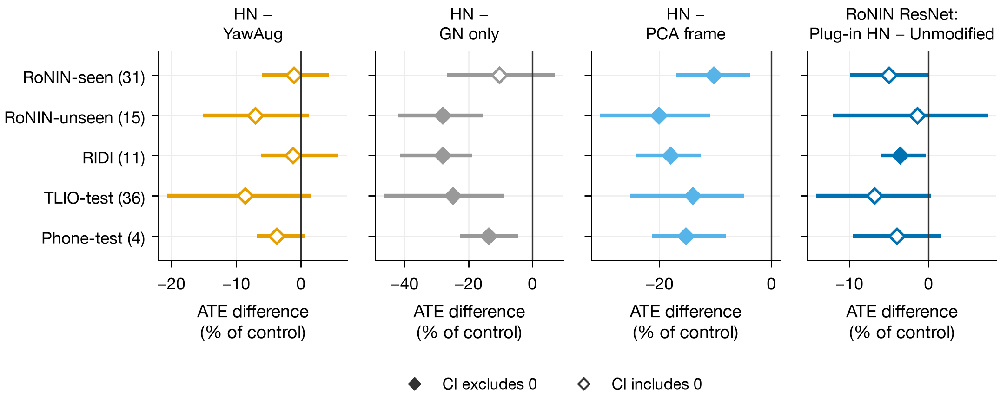
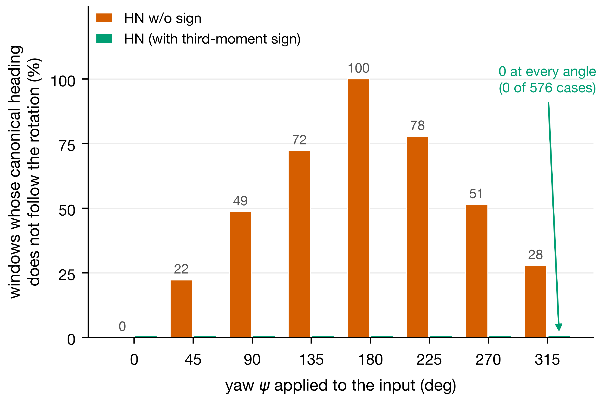
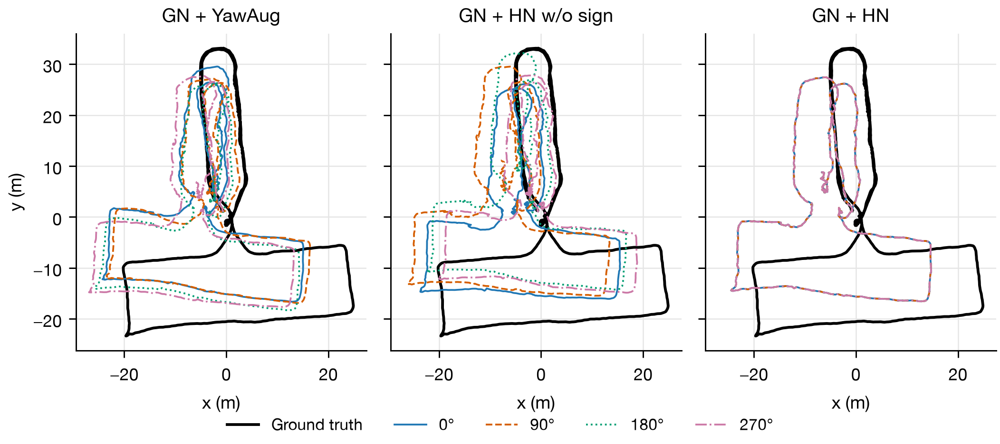

# Supplementary Materials

**HeadingNorm: Closed-Form Yaw Canonicalization for Inertial Velocity Regression without Retraining**

Yanlin Li, Xichen Cui and Yu Quan\*

> This document accompanies the main text. Table S31 lists the source data and scripts for all figures and tables.
> Absolute trajectory error (ATE) and relative trajectory error (RTE) use the per-coordinate root-mean-square error (RMSE) convention of the official RoNIN implementation. Section S3 describes the conversion to Euclidean RMSE.
> Sections S1–S16 and Tables S1–S31 are numbered independently. For example, Section S8 and Table S8 refer to the eighth supplementary section and table, respectively.

## Contents

- S1. Implementation Details
- S2. Combining Yaw Augmentation with HN at Training Time
- S3. Evaluation Protocols and Official Baselines
- S4. Absolute Accuracy and Unified Cross-Dataset Evaluation
- S5. Definition of the Cross-Angle Range and Robustness to the Alignment Protocol
- S6. Direct Check of the Sign-Disambiguation Step
- S7. Window-Level Velocity Consistency and Trajectory Illustration
- S8. Plug-in HN and Test-Time Methods on the Test Sets
- S9. Extension of Plug-in HN to Transformer-YawAug and IMUNet-YawAug
- S10. Eight-Angle-Average Check over the Input Reference Heading and the Canonical-Frame Convention
- S11. Complete Results of the Confirmatory Tests
- S12. Eight-Angle-Average Tests on the Confirmation Sets
- S13. Error Composition and Shape Error
- S14. Complete Comparison of Training-Time Front Ends
- S15. Inference Time
- S16. Reproducibility: Audit, Scripts, Result Files, and Sources of Figures and Tables

---

## S1. Implementation Details

The task uses six inertial measurement unit (IMU) input channels and two velocity outputs. Each window contains 200 samples (1 s at 200 Hz); the phone data are not resampled, and their actual mean sampling rates are 190.4–200.0 Hz. The channel order is $[\omega_x,\omega_y,\omega_z,a_x,a_y,a_z]$.

RoNIN preprocessing transforms the coordinates with the game rotation vector, initial attitude, and calibration information of the dataset; RIDI uses its supplied rotation vector, and TLIO uses the visual–inertial odometry (VIO) attitude. Preprocessing of the IMUNet phone data is described at the end of this section. All inputs are gravity-aligned before HeadingNorm (HN) is applied; we rely on the supplied attitudes and do not implement an upstream attitude estimator.

GlobalNorm (GN) uses fixed mean and scale vectors computed from the training split. In channel order, these are

$$
\mu=(0,0,-0.001234531,0,0,9.811804903),
\tag{S1}
$$

$$
s=(0.863238665,0.863238665,1.040780454,2.245341500,2.245341500,2.790995418).
\tag{S2}
$$

HN and the principal component analysis (PCA) frame apply these constants after the coordinate transformation. The constants stay fixed on test data, and GN does not normalize individual windows. On non-degenerate windows, any fixed deterministic normalization keeps the canonical input independent of $\psi$, so normalization need not commute with rotations in the original frame. Sharing one scale between the horizontal axes is an implementation choice.

Training uses uniform window sampling and four seeds, with 20,000 steps per main run. Augmentation draws from an independent NumPy random stream initialized with `SeedSequence([seed, 20260906])`. Validation uses 40 batches of 256 windows, with sampling seed 123 and no augmentation. The loader reconstructs the targets from cached float32 positions as $y_j=(p_{j+200}-p_j)/(t_{j+200}-t_j)$ for input samples $j$ through $j+199$. The cached `targ` array was computed from higher-precision positions and is not read directly, because using it would slightly change the training setup. Training runs on finite-precision Metal Performance Shaders (MPS), and unsupported deterministic operators produce warnings, so identical seeds do not guarantee identical results after retraining.

The Transformer has 4 encoder layers, a hidden dimension of 256, 8 attention heads per layer, and a feed-forward dimension of 1,024. Each input patch contains 8 samples; regression uses a classification token, and dropout is 0.1. ResNet18 has 4,634,882 learnable parameters, the Transformer has 3,238,658, and IMUNet has 3,661,618. HN adds no learnable parameters to any of these backbones.

Let $Q_j$ be the set of sequences of subject $j$. For seed $s$, the main statistic is

$$
M_s=\frac{1}{J}\sum_{j=1}^{J}\frac{1}{|Q_j|}\sum_{q\in Q_j}E_{q,s}.
\tag{S3}
$$

The main text reports the four-seed mean of $M_s$ and its sample standard deviation. Paired differences are first averaged over sequences and seeds within each subject, and subjects are then bootstrapped 10,000 times (NumPy seed 20260906) without resampling training runs. Subject labels come from sequence-name prefixes; the training, validation, and unseen groups share no subjects.

Table S1 gives descriptive results for sequence-weighted absolute trajectory error (ATE) and for RoNIN-seen. Sequence weighting gives more weight to subjects with more recordings and does not replace the main analysis with equal subject weights. RoNIN-seen contains training and validation subjects, so these results do not measure generalization to new subjects. All values use $\psi=0$, and all front ends include GN. Sequence-weighted ATE is averaged over sequences and then over the four seeds; the RoNIN-seen columns give subject-mean ATE and relative trajectory error (RTE) with sample standard deviations over seeds.

**Table S1.** Additional accuracy summaries (m; $\psi=0$).

| Backbone / front end | RoNIN-unseen, sequence ATE | RIDI, sequence ATE | RoNIN-seen, subject ATE | RoNIN-seen, subject RTE |
|---|---:|---:|---:|---:|
| ResNet18 / GN only | 7.953 | 4.230 | 5.640 ± 0.150 | 3.501 ± 0.041 |
| ResNet18 / YawAug | 6.012 | 3.119 | 5.009 ± 0.080 | 3.419 ± 0.029 |
| ResNet18 / PCA frame | 7.023 | 3.726 | 5.574 ± 0.398 | 3.637 ± 0.123 |
| ResNet18 / HN w/o sign | 6.659 | 3.600 | 5.238 ± 0.362 | 3.493 ± 0.057 |
| ResNet18 / HN | 5.589 | 3.119 | 4.936 ± 0.243 | 3.393 ± 0.085 |
| Transformer / YawAug | 5.544 | 2.618 | 4.855 ± 0.114 | 3.283 ± 0.031 |
| Transformer / HN | 5.502 | 2.792 | 4.965 ± 0.125 | 3.385 ± 0.100 |
| IMUNet / YawAug | 6.151 | 3.059 | 5.061 ± 0.066 | 3.413 ± 0.018 |
| IMUNet / HN | 5.552 | 3.053 | 4.840 ± 0.071 | 3.369 ± 0.019 |

### Definition and Archived Constants of GlobalNorm

GlobalNorm brings the six IMU channels to a common numerical range while preserving the horizontal rotation structure and the relative amplitudes of windows. The statistics are estimated from the current training subset only, excluding validation, test, and TLIO data, and training and inference use the same fixed constants, without per-window or per-batch normalization. For channel order $(\omega_x,\omega_y,\omega_z,a_x,a_y,a_z)$, the mean and scale vectors are

$$
\boldsymbol\mu=(0,0,\mu_{\omega z},0,0,\mu_{az}),\qquad
\mathbf s=(s_{\omega xy},s_{\omega xy},s_{\omega z},s_{axy},s_{axy},s_{az}).
$$

The vertical channels use the sample mean and standard deviation. The horizontal axes use zero mean and a shared root-mean-square (RMS) scale, for example, $s_{axy}=\sqrt{\frac{1}{2N}\sum_{n}\big[(a_x^{(n)})^2+(a_y^{(n)})^2\big]}$. Because the scale is shared, any horizontal rotation $\mathbf R(\psi)$ satisfies $\mathcal G(\mathcal R_\psi X)=\mathcal R_\psi\mathcal G(X)$; different horizontal scales would generally break this commutation.

This property of GlobalNorm alone does not make the complete network yaw-equivariant, nor is it needed for that purpose. GN acts after the rotation of HN, within the canonical frame. Under the conditions of Section 3.3 of the main text, the exact equivariance of the complete front end does not require this commutation. Velocity labels are not normalized; the model outputs two-dimensional velocity directly in m/s. Table S2 lists the constants of Equations (S1) and (S2), with angular velocity in rad/s and acceleration in m/s².

**Table S2.** Archived GlobalNorm constants of the training set.

| Training fraction | $\mu_{\omega z}$ | $\mu_{az}$ | $s_{\omega xy}$ | $s_{\omega z}$ | $s_{axy}$ | $s_{az}$ |
|---:|---:|---:|---:|---:|---:|---:|
| 100% | −0.001235 | 9.811805 | 0.863239 | 1.040780 | 2.245342 | 2.790995 |

### Front Ends and Backbones

GN constants are computed from the training files only and kept fixed at inference. The horizontal axes are zero-centered with a shared scale, and the vertical channels use the training mean and standard deviation. Per-sample normalization changes the relative scale between windows and can remove amplitude information that matters for absolute velocity regression [17]. We therefore use fixed training-set constants, with the same GN in all five training-time front ends.

- **GN only** leaves the horizontal reference heading unchanged.
- **GN + YawAug** applies random yaw augmentation during training, with an angle drawn uniformly from $[-\pi,\pi)$; both horizontal IMU vector groups and the two-dimensional velocity label are rotated together. An independent random stream keeps training-window sampling identical across configurations with the same seed. No augmentation is applied during validation or testing.
- **GN + PCA frame** uses the handcrafted frame of the EqNIO ablation [5] (source file `model_resnet_frame_pca.py`, commit 97b7a60). Horizontal gyroscope and acceleration samples are concatenated into $2T$ two-dimensional samples and centered jointly. The input is expressed in the two orthogonal principal directions and the output is mapped back, without third-moment sign disambiguation. Our implementation replaces randomized low-rank PCA with an exact two-dimensional symmetric eigendecomposition on the CPU and keeps this project's channel order. All comparisons use ResNet18, GN, and the same two-dimensional velocity loss, without a covariance head or extended Kalman filter (EKF). The original EqNIO ablation also used random yaw augmentation; here, augmentation is used only in the YawAug configuration, so that the configurations differ only in how they handle the reference heading.
- **GN + HN w/o sign** uses only the principal-axis angle $\phi_0$ of the horizontal acceleration, without the flip in Equation (5) of the main text.
- **GN + HN** uses the construction described in Section 3.2 of the main text.

The comparison with GN only isolates the effect of reference-heading handling, and the comparison with YawAug contrasts the two approaches. The PCA frame, HN w/o sign, and HN form a stepwise comparison: the first two differ in the samples used and in the principal-axis computation, and the last two differ only in sign disambiguation.

#### Velocity Regression Backbones

The front end handles the reference heading, and the backbone maps each window to velocity. All front-end comparisons use ResNet18; the Transformer and IMUNet are used to test whether the behavior of the front end carries over to other backbones.

**Transformer backbone.** A one-dimensional convolution with kernel size and stride 8 divides the $6\times200$ window into 25 non-overlapping patches (0.04 s each), each mapped to 256 dimensions. A learnable aggregation token (CLS) is prepended, and fixed sinusoidal positional encodings are added. The four-layer encoder uses pre-layer normalization (Pre-LN), 8-head self-attention, feed-forward dimensions 256→1024→256, Gaussian error linear units (GELU), and dropout 0.1; attention is restricted to the same 1 s window. The CLS feature then passes through LayerNorm, a 256→256 linear layer, GELU, dropout 0.2, and a 256→2 linear layer. In the HN configuration, the output is the velocity in the canonical frame.

**Table S3.** Configuration and parameter breakdown of the Transformer backbone.

| Module | Output shape | Configuration | Trainable params |
|---|---|---|---:|
| Input window | $B\times6\times200$ | $T=200$, 200 Hz | — |
| Patch embedding | $B\times256\times25$ | kernel = stride = 8, $P=25$ | 12,544 |
| CLS and positional encoding | $B\times26\times256$ | sinusoidal, not learnable | 256 |
| Transformer encoder | $B\times26\times256$ | $L=4$, $d=256$, $H=8$, $d_{\mathrm{ff}}=1024$ | 3,159,040 |
| Regression head (CLS only) | $B\times2$ | 256→256→2, GELU | 66,818 |
| **Total** | | | **3,238,658** |

**ResNet18 backbone.** A one-dimensional convolution with kernel size 7 and stride 2 is followed by max pooling. The basic residual blocks have counts $[2,2,2,2]$ and channel dimensions $[64,128,256,512]$. A final 512→128 transition convolution is flattened to 896 dimensions (128 × 7), and an 896→512→512→2 fully connected head predicts velocity, giving 4,634,882 trainable parameters. We implemented the public architecture independently and checked both the parameter counts and the tensor shapes.

**IMUNet backbone.** The implementation follows the original paper [39]. A 7-point convolutional stem is followed by depthwise separable and pointwise residual units, whose channel dimension increases to 1024 before a projection to 400. The flattened 1200-dimensional encoding is fused with the original 1200-dimensional window through a learnable affine correction, and the final head predicts two-dimensional velocity. The network has 3,661,618 trainable parameters.

All three backbones share the training data, window length, batch size, number of updates, and random seeds. In the tables, `ResNet18` and `IMUNet` denote networks trained from scratch in this study; the names refer to architectures, not to weights released by the original authors.

### Preprocessing of the IMUNet Phone Data

The IMUNet authors provided sequences recorded indoors and outdoors with several phones. We use their test split (`list_test.txt`, 36 sequences) and their training split (90 sequences), of which 87 remain for confirmation after 3 sequences with non-increasing timestamps are excluded. Both splits are converted to this project's cache format in the same way by `tools/build_imunet_cache_20260913.py`:

1. **Accelerometer and gyroscope inputs.** Both channel groups are transformed into a world frame with the Android game rotation vector (GAME_ROTATION_VECTOR), which uses only accelerometer and gyroscope readings. Its vertical axis points up, and its horizontal orientation is arbitrary. Magnetometer readings and other sensors are not used as input.
2. **ARCore pose not used for the inputs.** ARCore provides the camera pose, whose axes differ from the IMU axes by a fixed rotation; using this pose directly would rotate gravity into the horizontal plane.
3. **Ground truth.** Reference positions come from `pos_x` and `pos_y` in the authors' data, converted to a vertical-up frame. These positions are used only for evaluation.
4. **Alignment.** The arbitrary horizontal orientation is handled by the unified protocol or the official protocol. The former fixes the initial heading over the first 10 m of ground-truth path; the latter uses rigid registration over the first 10 s.

**Table S4.** Overview of the phone test data.

| Device | Sequences | Duration (min) | Ground-truth path length (km) |
|---|---:|---:|---:|
| Galaxy S10 | 12 | 39.2 | 2.64 |
| Galaxy S21 | 8 | 37.9 | 2.38 |
| Tango | 13 | 49.8 | 3.22 |
| Xiaomi | 3 | 15.7 | 1.21 |
| Total | 36 | 142.6 | 9.46 |

The test data comprise 36 sequences from 4 subjects, including 20 indoor and 16 outdoor sequences. Mean sampling rates are 191.2–200.0 Hz, and mean world-frame vertical acceleration is 8.81–9.96 m/s².

---

## S2. Combining Yaw Augmentation with HN at Training Time

On non-degenerate windows, adding random yaw augmentation to training-time HN does not change the input of the backbone, because canonicalization maps a rotated window and the unrotated one to the same canonical frame. The loss, however, is computed after the predictions are rotated back to the input frame. Because the per-coordinate loss can depend on the orientation of that frame, augmented training is not identical to training with HN alone.

Another option is to train an ordinary network with random yaw augmentation and to apply plug-in HN at test time (Section 3.4 of the main text). The network then sees inputs in all orientations during training and receives canonical-frame inputs at inference. Section 5.4 of the main text evaluates this combination on frozen networks.

---

## S3. Evaluation Protocols and Official Baselines

### Comparison with the Official Baseline and Metric Conversion

The official checkpoint is evaluated without HN or GN. Its SHA-256 hash begins with the 16 hexadecimal digits `5ae5c9e508f2dc96`, and the full digest is given in the replay report. All 32 RoNIN-unseen sequence identifiers match the main evaluation set. The original network code loads every checkpoint tensor strictly, and the replay uses our current cached measurements and reconstruction protocol.

Following the official RoNIN implementation, ATE is the square root of the mean squared coordinate residual, and RTE uses the same convention for displacement residuals. The Euclidean root-mean-square error (RMSE) equals the reported value multiplied by $\sqrt{2}$. The same factor applies to standard deviations and paired interval endpoints, so percentage reductions and inferential conclusions are unchanged. Table S5 shows this conversion for ResNet18, and the source data give both conventions for every configuration.

**Table S5.** Euclidean trajectory RMSE of the ResNet18 baselines (subject-mean, m).

| Front end | RoNIN-unseen ATE | RoNIN-unseen RTE | RIDI ATE | RIDI RTE |
|---|---:|---:|---:|---:|
| GN only | 11.391 | 7.685 | 6.056 | 7.030 |
| YawAug | 8.761 | 6.831 | 4.416 | 5.118 |
| PCA frame | 10.238 | 7.557 | 5.294 | 6.355 |
| HN w/o sign | 9.756 | 7.327 | 4.952 | 5.967 |
| HN | 8.238 | 7.195 | 4.383 | 5.121 |

The official checkpoint and our controlled models have different training histories. The released weights confirm that the evaluation pipeline is compatible, but they do not provide a baseline with a matched training budget. The two setups differ in loss, optimizer, normalization, sampling, validation, and aggregation, so the remaining accuracy gap cannot be attributed to any single factor. Table S6 compares the setups; the published training details are not sufficient to reconstruct the unpublished training manifest of the checkpoint.

**Table S6.** Published RoNIN training setup and our controlled front-end protocol.

| Setting | Published RoNIN training setup | Our controlled front-end experiments |
|---|---|---|
| Training source | Released pretrained checkpoint | 74 sequences from 34 subjects |
| Validation | Original validation protocol | 14 sequences from 8 disjoint subjects |
| Loss | Per-coordinate MSE | Per-coordinate Huber, threshold 0.27 |
| Optimizer | Adam | AdamW, weight decay 0.0001 |
| Learning rate | Initial 0.0001, reduced on validation plateau | OneCycle, maximum 0.001 |
| Budget | Epoch-based, typically about 100 epochs | 20,000 updates |
| Batch size | 128 | 256 |
| Window sampling | Shuffled strided windows with random shifts | Random windows matched across the 4 seeds |
| Fixed input normalization | No GN in the replay | Same GN constants for all configurations |
| Yaw augmentation | Used in the original training | Only as the yaw baseline |
| Main reporting | Published sequence aggregates | Subject-mean metrics and seed dispersion |
| Role of RIDI | Separate published benchmark protocol | Transfer from RoNIN without fine-tuning |

### Global Rotation in the Two Datasets

The official protocol (Section 4.4 of the main text) only translates RoNIN trajectories, whereas it registers RIDI trajectories rigidly over the first 10 s. These choices reflect the input frames of the two datasets. The reference heading of RoNIN is anchored to the Tango ground truth. For ResNet18 + GN + HN, we measure the global rotation $\theta_0$ of the predicted trajectory relative to the ground truth, i.e., the optimal rotation about the start point fitted over the whole trajectory. On RoNIN, its median magnitude is 5.9°, and its mean resultant length is $\bar R=0.988$. RIDI uses the device's own attitude instead, and there the median magnitude of $\theta_0$ is 76.9° ($\bar R=0.166$), with 44.1% of the (seed, sequence) pairs rotated by more than 90°.

The other 5 configurations are ResNet18 with GN only, YawAug, or the PCA frame, and the HN versions of the Transformer and IMUNet. They show the same pattern, with median $|\theta_0|$ of 5.46°–6.38° on RoNIN and 76.64°–83.32° on RIDI. These results support keeping the supplied RoNIN heading and estimating the initial rotation for RIDI under the official protocol. The statistics are recomputed from `theta_opt` at $\psi=0$ in `results/e1b_yaw_aligned/`, pooling the four seeds.

### RTE Scale in the Two Datasets

The RTE values of these two test groups are not directly comparable because their sequence durations differ. RoNIN-unseen sequences last 342–904 s (median 604 s), so the 60 s interval covers about 10% of a recording; RIDI sequences last 44–202 s (median 105 s), so 60 s covers 57% of a typical recording. For the 9 sequences shorter than 60 s, the frozen evaluation code extrapolates RTE in proportion to duration. Comparisons between front ends within RIDI remain valid, but RTE has a different temporal scale in the two datasets.

### Self-Check of the Evaluation Pipeline

We re-evaluated the official RoNIN ResNet weights with our data stream, attitude alignment, velocity integration, and ATE computation. The sequence-weighted ATE on RoNIN-unseen is 5.140 m, matching the 5.14 m of the original paper; on RoNIN-seen, it is 3.711 m, 4.8% above the reported 3.54 m. Each group contains the 32 sequences of the official lists (`list_test_seen.txt`, `list_test_unseen.txt`), and 3 further sequences on disk that are not in these lists are excluded. Both groups use the same pipeline and weights. On RoNIN-unseen, the per-sequence differences from the official code are 0, which supports the compatibility of the pipeline.

The remaining discrepancy on RoNIN-seen reflects differences between the public data and the data of the original study. The official repository states that “due to security concerns we were unable to publish 50% of our dataset” and notes that the released pretrained models were trained on the full dataset. The original paper used 276 sequences from 100 subjects [2]: 85 subjects were divided among training, validation, and seen-subject testing, and the remaining 15 formed the unseen-subject test set. The public release contains 152 sequences and retains all 15 unseen subjects, whose ATE agrees with the original paper, whereas the public seen-subject sequences cover only part of the original test set. Because the reported 3.54 m includes unpublished sequences, direct comparison with the original paper is limited to RoNIN-unseen.

RoNIN-unseen values are recomputed from `verification/priority_revision_20260909/official_replay.csv`, and RoNIN-seen values are the official-protocol ATE in `results/unified_eval_20260913/ext_resnet.json`.

### Resolution with Four Subjects

With only 4 subjects, the IMUNet phone data allow limited subject-level inference. In the cluster bootstrap, the probability that a given subject is drawn all 4 times is $(1/4)^4=0.390625\%$, which exceeds the $0.3125\%$ excluded from each tail of a two-sided 99.375% interval. For the theoretical bootstrap distribution, the CI-C endpoints are therefore the smallest and largest of the 4 subject differences, and a confidence interval (CI) below 0 corresponds to improvement in 4/4 subjects. A sign test with $n=4$ has a smallest attainable two-sided $p$ of $0.125$, above the per-test significance threshold of $0.00625$. A 95% interval (tail quantile 2.5%) avoids this endpoint constraint, but 4 subjects allow only 35 distinct resampling combinations. We therefore use the subject-level phone results only to check agreement in effect direction; the confirmatory conclusions rest on TLIO.

---

## S4. Absolute Accuracy and Unified Cross-Dataset Evaluation

> These comparisons provide context for absolute accuracy and are descriptive; the paper's main conclusions rest on the controlled and confirmatory analyses.

### Absolute Accuracy Compared with the Full Weights Released by the Original Authors

The comparisons above assess relative accuracy under a common protocol. Here, we compare our configurations with the official RoNIN ResNet weights in the same evaluation pipeline. The released weights were trained on the original full training split; the original RoNIN dataset contains 42.7 h, 276 sequences, and 100 subjects [2], of which only part was released publicly. We train on 74 public sequences totaling 11.06 h (Section 4.1 of the main text). All values in this subsection use equal sequence weights, as in the original paper; Table S24 gives the subject-weighted results used elsewhere.

**Table S7.** Absolute accuracy compared with the RoNIN ResNet weights released by the original authors (RoNIN-unseen, sequence-weighted ATE, m).

| Configuration | Training data | RoNIN-unseen ATE | Relative to official |
|---|---|---:|---:|
| RoNIN ResNet (weights released by the original authors) | Full training set | 5.140 | — |
| ResNet18 + GN + YawAug, plug-in HN at test time | 11.06 h | 5.085±0.134 | −1.1% |
| Transformer + HN + GN | 11.06 h | 5.502±0.197 | +7.0% |
| IMUNet + HN + GN | 11.06 h | 5.552±0.067 | +8.0% |
| ResNet18 + HN + GN | 11.06 h | 5.589±0.177 | +8.7% |
| ResNet18 + GN + YawAug | 11.06 h | 6.012±0.266 | +17.0% |
| ResNet18 + GN | 11.06 h | 7.953±0.248 | +54.7% |

With 11.06 h of public training data and 20,000 updates, the three HN + GN backbones have sequence-weighted ATE 7.0–8.7% above that of the released model (Table S7). The Transformer has the smallest gap. With the same data and backbone, most of this gap is closed by handling the reference heading. ResNet18 with GN only is 2.812 m behind the released model; adding HN reduces the difference to 0.448 m, closing 84.1% of the gap, whereas random yaw augmentation closes 69.0%. With a common front end, the three backbones differ by 1.9% on this test group (Section S14). Training with yaw augmentation and then applying plug-in HN gives a sequence-weighted ATE of 5.085±0.134 m, 1.1% below the released model. Table S14 reports the other test sets, and Section 5.4.2 of the main text reports the confirmatory tests.

Values are recomputed from the sequence-weighted summaries in `results/sensors_v4/analysis.json` and from `verification/priority_revision_20260909/official_replay.csv`. The plug-in row uses official-protocol ATE from `results/unified_eval_20260913/ours_yaw_hn_s{0–3}.json`.

### Unified Evaluation across Datasets and on Real Phones

The controlled comparisons above concentrate on RoNIN and RIDI, which have different official protocols. Here, we use the unified protocol of Section 4.4 of the main text to evaluate 8 models on five test sets. These test sets also include the official TLIO test set and the IMUNet phone data (Table 1 of the main text). The models are 6 configurations trained in this study (4 seeds each) and the released RoNIN ResNet with and without plug-in HN. No training or tuning is involved.

The unified protocol first translates the predicted start point to the ground-truth start point. It then fits a single rotation about that point over the first 10 m of the ground-truth path and keeps this rotation fixed. On the aligned trajectory, we compute ATE, RTE, the path-length ratio (TLR), and the mean cosine similarity of steps (MCS). TLR is the total predicted path length divided by the total ground-truth path length. MCS averages the cosine of the angle between predicted and reference displacements over adjacent samples. Both equal 1 in the ideal case. The complex-gain decomposition about the start point follows Equation (12) of the main text.

In the data file, the “Scale-only bound”, “Heading-only bound”, and “Complex-gain bound” columns give the change in ATE after correction with the ground truth; they describe error composition and are not available in deployment. The “ATE, official protocol” column uses translation alone for RoNIN and rigid registration over the first 10 s for RIDI, TLIO, and the IMUNet phone data.

Statistics follow Tables S25 and S9: the four seeds are averaged first, then sequences within each subject, and finally subjects with equal weights. Paired percentile CIs use a subject-level cluster bootstrap with 10,000 resamples and random seed 20260906, and sequence-level bootstrap intervals are also provided. For RoNIN and RIDI, subject identifiers are the sequence-name prefixes before the first underscore. For the phone data, identifiers follow `Subject_N`, including the original misspelling `Subjetc`. TLIO has no subject information and is analyzed by sequence. In the “Result” column of the data files, “lower” and “higher” mean that the subject-level cluster interval lies entirely below or above 0, and “ns” means that it contains 0. These comparisons are not corrected for multiple testing.

The file `supp_data/unified_eval_full_metrics.csv` contains ATE, RTE, TLR, MCS, and the complex-gain decomposition for the 8 models on the 5 test sets. Paired ATE comparisons under the unified and the official protocol are given in `supp_data/unified_paired_ate.csv` and `supp_data/literature_paired_ate.csv`, respectively. Table S8 reports sequence-weighted ATE, with each sequence averaged over the 4 seeds for the networks trained in this study. Because the released model was trained on different data, these absolute accuracies under a shared protocol do not rank the methods. The table also includes yaw-augmented training followed by plug-in HN (Section 5.4 of the main text); this configuration is not one of the 8 models in the other statistics of this subsection.

**Table S8.** ATE under the unified evaluation protocol (sequence-weighted, m).

| Model | RoNIN-seen | RoNIN-unseen | RIDI | TLIO-test | Phone-test |
|---|---:|---:|---:|---:|---:|
| Ours, ResNet18 + GN | 5.465 | 7.910 | 4.240 | 5.772 | 11.816 |
| Ours, ResNet18 + GN + YawAug | 4.967 | 5.984 | 3.123 | 4.742 | 10.496 |
| Ours, ResNet18 + GN + YawAug, plug-in HN at test time (Section 5.4 of the main text) | 4.711 | 5.029 | 2.938 | 3.963 | 10.470 |
| Ours, ResNet18 + GN + PCA frame | 5.448 | 6.969 | 3.738 | 5.042 | 11.850 |
| Ours, ResNet18 + GN + HN | 4.902 | 5.498 | 3.095 | 4.332 | 10.073 |
| Ours, Transformer + GN + HN | 4.933 | 5.388 | 2.791 | 3.757 | 9.020 |
| Ours, IMUNet + GN + HN | 4.761 | 5.465 | 3.035 | 4.243 | 10.155 |
| RoNIN ResNet | 3.868 | 4.938 | 2.785 | 3.512 | 8.660 |
| RoNIN ResNet + plug-in HN | 3.657 | 4.756 | 2.661 | 3.271 | 8.319 |

**Table S9.** Paired differences between HN and three baselines on the same ResNet18 backbone, and between the RoNIN ResNet with and without plug-in HN (unified-protocol ATE, m; 95% CI-B; bold: CI excludes 0).

| Comparison | RoNIN-seen | RoNIN-unseen | RIDI | TLIO-test | Phone-test |
|---|---:|---:|---:|---:|---:|
| HN − YawAug | −0.055 [−0.302, +0.218] | −0.437 [−0.936, +0.076] | −0.039 [−0.194, +0.183] | −0.409 [−0.978, +0.072] | −0.382 [−0.704, +0.067] |
| HN − GN only | −0.568 [−1.470, +0.391] | **−2.256 [−3.367, −1.252]** | **−1.216 [−1.786, −0.808]** | **−1.440 [−2.687, −0.501]** | **−1.562 [−2.607, −0.517]** |
| HN − PCA frame | **−0.568 [−0.941, −0.206]** | **−1.451 [−2.212, −0.791]** | **−0.685 [−0.915, −0.476]** | **−0.710 [−1.276, −0.244]** | **−1.786 [−2.495, −0.945]** |
| RoNIN ResNet: Plug-in HN − Unmodified | −0.192 [−0.381, +0.005] | −0.071 [−0.609, +0.378] | **−0.104 [−0.175, −0.010]** | −0.240 [−0.498, +0.010] | −0.343 [−0.824, +0.138] |

Table S9 reports subject-mean differences. The dataset columns contain 31, 15, 11, 36, and 4 analysis units, respectively; TLIO is analyzed by sequence because subject information is unavailable. All results are descriptive and not corrected for multiple comparisons. With only 4 subjects, the phone data allow at most 35 distinct subject-level resampling combinations, so we also check this column with a sequence-level bootstrap. For HN − GN only and HN − PCA frame, both interval types exclude 0 and all 4 subjects improve (`supp_data/unified_paired_ate.csv`).

Recomputing the first two dataset columns under the official protocol reproduces Table S25; for example, HN − PCA frame on RoNIN-unseen is −1.414 [−2.179, −0.756]. This agreement confirms that the unified evaluation and Section 5.3 of the main text share the same evaluation pipeline.

HN has significantly lower ATE than the PCA frame on all five test sets (−10.3% to −20.1%; Table S9 and Figure S1) and significantly lower ATE than normalization only on the four test sets other than RoNIN-seen. These descriptive results extend Section 5.3 of the main text to a head-mounted device and four phones. HN also has lower ATE than random yaw augmentation on all five test sets (−1.1% to −8.6%), but these differences are not significant. For the released RoNIN ResNet, plug-in HN reduces ATE on all five test sets, significantly on RIDI, and reduces RTE significantly on RIDI, TLIO, and the phone data.

**Figure S1.** Paired differences in unified-protocol ATE (% of the control mean; 95% CI-B).

The complex gain about the start point decomposes the unified-protocol error into global scale, global rotation, and shape; Section S13 gives the definitions and the values for each model. Correcting global scale and rotation with the ground truth reduces ATE by 12.4–20.8% on the two RoNIN groups and by 34.9–56.7% on RIDI, TLIO, and the phone data.

---

## S5. Definition of the Cross-Angle Range and Robustness to the Alignment Protocol

For each sequence and seed, let $r_{q,s}$ be the range of ATE across the 8 angles. Table S10 reports

$$
\bar r=\frac{1}{4}\sum_{s=0}^{3}\operatorname{median}_{q}(r_{q,s}).
\tag{S4}
$$

Equation (S4) averages medians computed separately for each seed; pooling all (sequence, seed) pairs would give a different statistic. The source data keep the median and maximum of each seed. Each configuration has 4 checkpoints, each evaluated on 158 sequences × 8 angles, and the complete matrix over all configurations contains 45,504 sequence–angle records.

**Table S10.** Mean over seeds of the median cross-angle range (m).

| Backbone / front end | RoNIN-unseen median range | RIDI median range | RoNIN-seen median range |
|---|---:|---:|---:|
| ResNet18 / GN only | 5.68e+00 | 2.82e+00 | 5.62e+00 |
| ResNet18 / YawAug | 2.38e+00 | 1.20e+00 | 1.96e+00 |
| ResNet18 / PCA frame | 2.79e+00 | 1.35e+00 | 2.74e+00 |
| ResNet18 / HN w/o sign | 2.82e+00 | 1.21e+00 | 2.59e+00 |
| ResNet18 / HN | 6.86e−07 | 4.30e−07 | 7.65e−07 |
| Transformer / YawAug | 1.89e+00 | 1.07e+00 | 1.61e+00 |
| Transformer / HN | 6.52e−07 | 3.35e−07 | 6.66e−07 |
| IMUNet / YawAug | 2.83e+00 | 1.26e+00 | 2.31e+00 |
| IMUNet / HN | 6.32e−07 | 3.47e−07 | 7.68e−07 |

The small HN values in Table S10 reflect finite-precision inference and trajectory reconstruction; they do not measure sensor resolution or the repeatability of physical data collection. The sweep rotates inputs after attitude preprocessing and returns the predicted velocities to the original frame before computing errors, without generating new inertial data. It therefore changes the horizontal reference heading but does not test device placement, gravity estimation errors, or time-varying heading disturbances.

### Robustness Check of the Alignment Protocol

Under the official protocol, RoNIN trajectories are aligned by translation alone, without estimating a rotation. We tested whether rotational alignment would remove the cross-angle variation of Table 3 of the main text. To this end, we recomputed Table 3 after aligning the start points and applying the closed-form optimal rotation about the start point. The rotation was computed from the entire trajectory, without scaling or reflection.

The criterion was prespecified in `config/e1b_yaw_aligned.md`: the main-text conclusion would be retained if the median relative cross-angle range of GN + YawAug on RoNIN-unseen stayed at or above 10% after rotational alignment. We checked the $\psi=0$ column entry by entry against the frozen results; the largest absolute difference over 1264 rows was 0.

**Table S11.** Median per-sequence cross-angle range under two alignment protocols (% of the ATE at $\psi=0$ in parentheses).

| Front end | RoNIN-unseen, official protocol | RoNIN-unseen, optimal rotation | RIDI, official protocol | RIDI, optimal rotation |
|---|---:|---:|---:|---:|
| GN only | 5.632 m (85.6%) | 5.200 m (83.0%) | 2.817 m (85.7%) | 2.474 m (83.7%) |
| GN + YawAug | 2.429 m (46.9%) | 2.416 m (49.2%) | 1.187 m (50.6%) | 1.088 m (49.8%) |
| GN + PCA frame | 2.757 m (48.2%) | 2.797 m (52.5%) | 1.346 m (49.2%) | 1.193 m (51.9%) |
| GN + HN | $<10^{-5}$ m (0.0%) | $<10^{-5}$ m (0.0%) | $<10^{-5}$ m (0.0%) | $<10^{-5}$ m (0.0%) |

After optimal rotational alignment, the median relative cross-angle range was still 49.2%, above the prespecified 10% threshold, so the conclusion of Table 3 of the main text stands. For the three non-equivariant front ends, the relative cross-angle ranges under the two protocols differed by at most 4.3 percentage points. The PCA-frame ranges increased slightly in both test groups, as did the yaw-augmentation range on RoNIN-unseen. For HN, the largest per-sequence cross-angle range stayed below $5\times10^{-6}$ m under both protocols, within the prespecified $10^{-4}$ m threshold. This robustness analysis supplements the evaluation under the official protocol.

---

## S6. Direct Check of the Sign-Disambiguation Step

The analytic test compares the change of the canonical heading with the applied rotation for 72 fixed windows and 8 angles. It uses no trained network, and the inconsistency tolerance is $10^{-4}$ rad. An unsigned principal axis can follow the rotation modulo $\pi$ but fail to follow it modulo $2\pi$, and this distinction changes the canonicalized signal that any backbone receives. Table S12 counts failures modulo $2\pi$, and its last column gives the deviation of the unsigned principal axis modulo $\pi$. Table S12, Figure S2, and Table 5 of the main text use the same data.

**Table S12.** Network-independent check of the canonical heading.

| Yaw (°) | Without sign: failures / 72 | With sign: failures / 72 | Modulo-π deviation without sign (rad) |
|---:|---:|---:|---:|
| 0 | 0 | 0 | 0.00e+00 |
| 45 | 16 | 0 | 1.19e−07 |
| 90 | 35 | 0 | 2.38e−07 |
| 135 | 52 | 0 | 2.38e−07 |
| 180 | 72 | 0 | 0.00e+00 |
| 225 | 56 | 0 | 5.96e−07 |
| 270 | 37 | 0 | 5.96e−07 |
| 315 | 20 | 0 | 5.96e−07 |

With sign disambiguation, there were no failures, whereas the unsigned construction failed in 288 of the 576 combinations. This agrees with the algebraic role of sign disambiguation under the non-degeneracy assumption. The test does not estimate an overall failure rate or the performance on new physical measurements.

**Figure S2.** Fraction of the 72 fixed windows whose canonical heading does not follow the applied rotation.

---

## S7. Window-Level Velocity Consistency and Trajectory Illustration

Before integration, the direct velocity analysis compares predictions under the required coordinate transformation through the inconsistency $\|F(R_\psi X)-R_\psi F(X)\|_2$. This quantity measures the response to a coordinate rotation and needs no ground-truth velocity, so it differs from the prediction error with respect to the motion reference.

The analysis uses seed-0 checkpoints and 72 fixed windows: 8 equally spaced windows from each of 9 recordings, 3 each from RoNIN-unseen, RoNIN-seen, and RIDI. For each angle, Table S13 gives the mean and maximum over all 72 windows for the 6 seed-0 checkpoints discussed in Section 5.2 of the main text and Section S14. These pooled values do not estimate subject-mean accuracy, and the source records keep the position of each window. A CPU replay reproduced all 32 summary values of the four ResNet18 front ends exactly.

**Table S13.** Direct velocity inconsistency under coordinate rotation (m/s; seed-0 checkpoints, 72 windows).

| Checkpoint (seed 0) | Rotation (°) | Windows | Mean inconsistency (m/s) | Max inconsistency (m/s) |
|---|---:|---:|---:|---:|
| ResNet18 / GN only | 30 | 72 | 1.40e−01 | 7.71e−01 |
| ResNet18 / GN only | 90 | 72 | 1.70e−01 | 1.49e+00 |
| ResNet18 / GN only | 180 | 72 | 1.64e−01 | 1.37e+00 |
| ResNet18 / GN only | 300 | 72 | 1.81e−01 | 1.39e+00 |
| ResNet18 / GN + YawAug | 30 | 72 | 4.58e−02 | 2.58e−01 |
| ResNet18 / GN + YawAug | 90 | 72 | 6.46e−02 | 5.28e−01 |
| ResNet18 / GN + YawAug | 180 | 72 | 5.67e−02 | 3.85e−01 |
| ResNet18 / GN + YawAug | 300 | 72 | 6.21e−02 | 5.59e−01 |
| ResNet18 / GN + PCA frame | 30 | 72 | 1.18e−02 | 2.22e−01 |
| ResNet18 / GN + PCA frame | 90 | 72 | 8.10e−02 | 1.54e+00 |
| ResNet18 / GN + PCA frame | 180 | 72 | 1.32e−01 | 1.54e+00 |
| ResNet18 / GN + PCA frame | 300 | 72 | 3.29e−02 | 6.87e−01 |
| ResNet18 / GN + HN | 30 | 72 | 1.21e−07 | 5.20e−07 |
| ResNet18 / GN + HN | 90 | 72 | 1.22e−07 | 6.14e−07 |
| ResNet18 / GN + HN | 180 | 72 | 1.19e−07 | 5.96e−07 |
| ResNet18 / GN + HN | 300 | 72 | 9.78e−08 | 5.27e−07 |
| Transformer / GN + HN | 30 | 72 | 9.05e−08 | 3.77e−07 |
| Transformer / GN + HN | 90 | 72 | 1.05e−07 | 4.55e−07 |
| Transformer / GN + HN | 180 | 72 | 9.35e−08 | 3.37e−07 |
| Transformer / GN + HN | 300 | 72 | 9.29e−08 | 3.58e−07 |
| IMUNet / GN + HN | 30 | 72 | 1.34e−07 | 6.14e−07 |
| IMUNet / GN + HN | 90 | 72 | 1.38e−07 | 5.20e−07 |
| IMUNet / GN + HN | 180 | 72 | 1.41e−07 | 5.80e−07 |
| IMUNet / GN + HN | 300 | 72 | 1.31e−07 | 7.77e−07 |

Figure S3 illustrates a complete sequence, the first RoNIN-unseen recording in alphabetical order. Seed 0 and 4 fixed rotations were specified before the replay, and all 24 replayed accuracy values matched the archived values exactly. The full trajectory is shown without additional yaw alignment or scale fitting.

The replay script is `tools/replay_mst_illustration_20260909.py`, and its output is in `verification/mst_revision_20260909/illustration/`. The plotting script reads these coordinates; the sequence was selected independently of accuracy.

**Figure S3.** Full trajectories of one sequence under four initial reference headings (RoNIN-unseen, seed 0). Under GN + HN, the four trajectories coincide.

---

## S8. Plug-in HN and Test-Time Methods on the Test Sets

We compare the two test-time methods of Section 3.4 of the main text with the unmodified ResNet18-YawAug on the same 4 frozen seeds, without retraining or changing any weights. All results on the five test sets are descriptive (Tables S14 and S15); Section 5.4.2 of the main text reports the confirmatory tests.

Before evaluation, we reproduced the existing official-protocol values on RoNIN-unseen, with differences of at most $5\times10^{-5}$ m for all 4 seeds. The phone data include only 4 subjects, so both the subject and the sequence interval must exclude 0. Tables S14 and S15 use 10,000 subject-level cluster bootstrap resamples for CI-B, resampling by sequence for TLIO; sequence-level intervals are also given.

**Table S14.** Plug-in HN for ResNet18-YawAug on the test sets (unified-protocol ATE, subject-mean, m; bold: CI excludes 0).

| Test set | Unmodified | Plug-in HN | Difference [subject CI] | Sequence CI | Subjects improved |
|---|---:|---:|---:|---:|---:|
| RoNIN-unseen | 6.202 | 5.216 | **−0.986 [−1.452, −0.574]** (−15.9%) | [−1.462, −0.533] | 15/15 |
| RoNIN-seen (in-sample at the subject level) | 5.002 | 4.749 | **−0.254 [−0.406, −0.092]** (−5.1%) | [−0.415, −0.100] | 26/31 |
| RIDI | 3.145 | 3.006 | −0.139 [−0.249, +0.003] (−4.4%) | [−0.282, −0.082] | 10/11 |
| TLIO-test | 4.742 | 3.963 | **−0.779 [−1.474, −0.235]** (−16.4%) | same | 23/36 |
| Phone-test | 10.278 | 10.225 | −0.053 [−0.403, +0.298] (−0.5%) | [−0.382, +0.314] | 2/4 |

Plug-in HN reduced ATE on all five test sets, significantly on RoNIN-unseen, RoNIN-seen, and TLIO-test; RoNIN-seen evaluates subjects included in training or validation (Section 4.1 of the main text). RTE decreased significantly on RIDI (−6.0%) and TLIO-test (−10.1%). Compared with ResNet18 trained with HN, ResNet18-YawAug with plug-in HN had significantly lower ATE on TLIO-test (−8.5%, interval [−0.765, −0.023]), and the differences on the other four test sets were not significant.

**Table S15.** Three methods on the same ResNet18-YawAug (unified-protocol ATE, subject-mean, m; bold: CI excludes 0).

| Method | Forward passes per window | RoNIN-seen | RoNIN-unseen | RIDI | TLIO-test | Phone-test | Per-sequence range under arbitrary headings |
|---|---:|---:|---:|---:|---:|---:|---:|
| Unmodified | 1 | 5.002 | 6.202 | 3.145 | 4.742 | 10.278 | 0.655 m (12.0%) |
| Plug-in HN | 1 | 4.749 | 5.216 | 3.006 | 3.963 | 10.225 | $2.5\times10^{-7}$ m (0.0%) |
| Two-way frame averaging | 2 | 4.701 | 5.190 | 2.984 | 4.000 | 10.076 | $2.1\times10^{-7}$ m (0.0%) |
| Plug-in HN − two-way frame averaging | | +0.048 [−0.006, +0.105] | +0.026 [−0.033, +0.083] | +0.022 [−0.029, +0.082] | −0.037 [−0.108, +0.031] | **+0.149 [+0.021, +0.273]** | |

The last column of Table S15 gives the median per-sequence ATE range on RoNIN-unseen under the official protocol, taken over four input angles sampled within a 45° interval. The values in parentheses are relative to each sequence's ATE.

For deterministic per-window regressors, exact yaw equivariance can also be obtained without sign disambiguation, provided that the principal axis is non-degenerate. Two-way frame averaging evaluates both principal-axis directions $\{\phi_0,\phi_0+\pi\}$, rotates the two predicted velocities back to the original frame, and averages them. The resulting velocity prediction is exactly yaw-equivariant regardless of the third-moment sign; it needs two forward passes, and its non-degeneracy condition requires only distinct eigenvalues. Trajectories compared in the same frame are therefore invariant to the reference heading.

Table S15 compares the two methods on the same ResNet18-YawAug. Plug-in HN differed significantly from two-way frame averaging only on the phone data (+1.5%; subject interval [+0.021, +0.273], sequence interval [+0.042, +0.316]). On the other four test sets, the differences were not significant (−0.9% to +1.0%), although three of the means slightly favored frame averaging. Two-way frame averaging also made the trajectory error invariant to the heading, with a largest per-sequence range of $1.2\times10^{-6}$ m.

As a descriptive result, yaw-augmented training followed by two-way frame averaging had significantly lower ATE than training-time HN on RoNIN-unseen and TLIO-test (−10.0% and −7.7%). The differences on the other test sets were not significant. The two test-time methods had similar accuracy and differed mainly in the number of forward passes (one versus two) and in their non-degeneracy conditions, two-way frame averaging requiring only distinct eigenvalues. Both implement the method of Section 3.4 of the main text. Third-moment sign disambiguation allows a single forward pass, whereas two-way frame averaging uses two and was slightly more accurate on the phone data.

The complete paired comparisons of plug-in HN and two-way frame averaging (unified-protocol ATE and RTE, official-protocol ATE, unified evaluation metrics, and heading repeatability) are given in `supp_data/testtime_plugin_paired.csv`, `testtime_plugin_metrics.csv`, `testtime_fa2_paired.csv`, `testtime_fa2_repeatability.csv`, and `testtime_fa2_metrics.csv`.

In the implementation, two-way frame averaging makes one forward pass for each principal-axis direction $\{\phi_0,\phi_0+\pi\}$, rotates the results back to the original frame, and averages them before integration. Each branch uses the same rotation implementation as plug-in HN.

---

## S9. Extension of Plug-in HN to Transformer-YawAug and IMUNet-YawAug

The decision criteria were specified before the new inference runs (`docs/91`), and the results and decisions are recorded in `docs/92`. The inference script is `tools/plugin_arch_eval_20260923.py`, and the decision script `tools/plugin_arch_verdict_20260923.py` was run only once. We evaluated Transformer-YawAug and IMUNet-YawAug, trained in this study under the same setup with 4 seeds each; inference and metric computation followed the unified protocol.

The main test family compared unified-protocol ATE with and without plug-in HN for both networks on TLIO-confirm (318 sequences), with Bonferroni correction over 2 tests and 97.5% sequence intervals. Both comparisons showed significant reductions, supporting the hypothesis.

Before the decision, we checked the official-protocol ATE of the unmodified networks on RoNIN-unseen against the preliminary plug-in experiment of 12 September 2026; the summary values agreed exactly (difference 0). That preliminary experiment had already evaluated plug-in HN for both networks on RoNIN-seen, RoNIN-unseen, RIDI, and TLIO-test under the official protocol. The results on these four datasets are therefore descriptive. In Table S16, the first two rows form the main test family, with 97.5% sequence intervals; all other rows are descriptive results with 95% intervals.

**Table S16.** Differences with and without plug-in HN for Transformer-YawAug and IMUNet-YawAug (plug-in HN − unmodified, m).

| Model | Dataset | Metric | Plug-in HN | Unmodified | Difference (rel.) | Subject CI | Sequence CI | Improved (subjects; sequences) |
|---|---|---|---:|---:|---:|---:|---:|---:|
| Transformer-YawAug | TLIO-confirm (main) | ATE | 3.323 | 3.706 | −0.383 (−10.3%) | — | [−0.476, −0.294] | 242/318; 242/318 |
| IMUNet-YawAug | TLIO-confirm (main) | ATE | 3.890 | 4.588 | −0.698 (−15.2%) | — | [−0.888, −0.528] | 228/318; 228/318 |
| Transformer-YawAug | TLIO-confirm | Shape error | 1.762 | 2.134 | −0.372 (−17.5%) | — | [−0.455, −0.294] | 242/318; 242/318 |
| Transformer-YawAug | Phone-test | ATE | 8.521 | 8.593 | −0.072 (−0.8%) | [−0.261, +0.113] | [−0.298, +0.110] | 2/4; 23/36 |
| Transformer-YawAug | Phone-test | Shape error | 4.777 | 4.910 | −0.133 (−2.7%) | [−0.286, −0.011] | [−0.376, +0.056] | 3/4; 23/36 |
| Transformer-YawAug | Phone-confirm | ATE | 9.246 | 9.537 | −0.290 (−3.0%) | [−0.643, −0.047] | [−0.511, −0.108] | 3/4; 51/87 |
| Transformer-YawAug | Phone-confirm | Shape error | 4.925 | 5.271 | −0.346 (−6.6%) | [−0.613, −0.149] | [−0.553, −0.131] | 4/4; 61/87 |
| Transformer-YawAug | RoNIN-seen (in-sample at the subject level) | ATE | 4.764 | 4.827 | −0.063 (−1.3%) | [−0.197, +0.095] | [−0.188, +0.096] | 20/31; 20/32 |
| Transformer-YawAug | RoNIN-seen (in-sample at the subject level) | Shape error | 3.782 | 3.837 | −0.055 (−1.4%) | [−0.184, +0.088] | [−0.173, +0.090] | 17/31; 17/32 |
| Transformer-YawAug | RoNIN-unseen | ATE | 5.119 | 5.582 | −0.463 (−8.3%) | [−0.903, −0.154] | [−0.893, −0.193] | 11/15; 23/32 |
| Transformer-YawAug | RoNIN-unseen | Shape error | 4.542 | 4.864 | −0.321 (−6.6%) | [−0.587, −0.109] | [−0.596, −0.164] | 12/15; 24/32 |
| Transformer-YawAug | RIDI | ATE | 2.571 | 2.676 | −0.105 (−3.9%) | [−0.182, −0.030] | [−0.236, −0.067] | 8/11; 60/94 |
| Transformer-YawAug | RIDI | Shape error | 1.594 | 1.753 | −0.158 (−9.0%) | [−0.232, −0.086] | [−0.299, −0.129] | 10/11; 72/94 |
| Transformer-YawAug | TLIO-test | ATE | 3.883 | 4.103 | −0.220 (−5.4%) | — | [−0.407, −0.063] | 25/36; 25/36 |
| Transformer-YawAug | TLIO-test | Shape error | 1.665 | 2.016 | −0.351 (−17.4%) | — | [−0.633, −0.125] | 27/36; 27/36 |
| IMUNet-YawAug | TLIO-confirm | Shape error | 1.907 | 2.758 | −0.852 (−30.9%) | — | [−1.037, −0.678] | 254/318; 254/318 |
| IMUNet-YawAug | Phone-test | ATE | 9.880 | 10.337 | −0.456 (−4.4%) | [−1.104, −0.070] | [−0.952, −0.127] | 4/4; 27/36 |
| IMUNet-YawAug | Phone-test | Shape error | 4.870 | 5.679 | −0.808 (−14.2%) | [−1.835, −0.109] | [−1.496, −0.392] | 4/4; 31/36 |
| IMUNet-YawAug | Phone-confirm | ATE | 10.832 | 11.471 | −0.639 (−5.6%) | [−1.053, −0.245] | [−0.920, −0.370] | 4/4; 61/87 |
| IMUNet-YawAug | Phone-confirm | Shape error | 4.953 | 5.984 | −1.031 (−17.2%) | [−1.623, −0.637] | [−1.345, −0.707] | 4/4; 75/87 |
| IMUNet-YawAug | RoNIN-seen (in-sample at the subject level) | ATE | 4.707 | 4.945 | −0.238 (−4.8%) | [−0.415, −0.047] | [−0.409, −0.050] | 23/31; 23/32 |
| IMUNet-YawAug | RoNIN-seen (in-sample at the subject level) | Shape error | 3.828 | 4.056 | −0.228 (−5.6%) | [−0.396, −0.057] | [−0.393, −0.059] | 22/31; 22/32 |
| IMUNet-YawAug | RoNIN-unseen | ATE | 5.449 | 6.327 | −0.878 (−13.9%) | [−1.565, −0.387] | [−1.447, −0.391] | 12/15; 23/32 |
| IMUNet-YawAug | RoNIN-unseen | Shape error | 4.769 | 5.510 | −0.741 (−13.4%) | [−1.236, −0.343] | [−1.143, −0.369] | 11/15; 22/32 |
| IMUNet-YawAug | RIDI | ATE | 2.889 | 3.149 | −0.260 (−8.2%) | [−0.378, −0.129] | [−0.380, −0.168] | 10/11; 66/94 |
| IMUNet-YawAug | RIDI | Shape error | 1.630 | 1.971 | −0.341 (−17.3%) | [−0.449, −0.226] | [−0.476, −0.243] | 10/11; 71/94 |
| IMUNet-YawAug | TLIO-test | ATE | 4.053 | 5.131 | −1.078 (−21.0%) | — | [−1.908, −0.497] | 31/36; 31/36 |
| IMUNet-YawAug | TLIO-test | Shape error | 1.807 | 2.899 | −1.092 (−37.7%) | — | [−2.105, −0.414] | 28/36; 28/36 |

Error decreased after HN was added in all 26 descriptive comparisons. TLIO has no subject information, so its results use sequences as analysis units and give no subject intervals.

---

## S10. Eight-Angle-Average Check over the Input Reference Heading and the Canonical-Frame Convention

Table 7 of the main text compares plug-in HN with the canonical-frame convention $\alpha=0$ against the unmodified network at the reference heading $\psi=0$, and both conventions are arbitrary. The input reference heading $\psi$ depends on the device orientation when recording begins. The angle $\alpha$ offsets the canonical heading of HN uniformly ($\phi\to\phi-\alpha$), which preserves exact yaw equivariance under the conditions of Proposition 1. We test whether the plug-in gains persist when both methods are averaged over 8 equally spaced angles.

The decision rule was specified in `results/angle_fair_20260926/PLAN_运行前判定标准.md` before the analysis script was run. For the released RoNIN ResNet, the primary metric is the mean ATE of plug-in HN over 8 values of $\alpha$ minus the mean ATE of the unmodified network over 8 values of $\psi$. The main test sets are RoNIN-unseen, RIDI, and TLIO-test; RoNIN-seen contains training subjects of the original authors and is descriptive only. We applied Bonferroni correction over 3 tests with 98.33% subject-level cluster intervals, using sequence intervals for TLIO. The hypothesis is supported if at least 2 of the 3 differences are significantly negative and none is significantly positive. This is a supplementary test as defined in Section 4.5 of the main text.

We re-analyzed existing per-sequence records without running any model, using `orig_ate_by_psi` and `hn_ate_by_alpha` in `results/hn_plugin_p0_20260912/ext_resnet.json` together with `results/e1_heading_repeatability/` and `results/unified_eval_20260913/ours_yaw_hn_s*.json`. All values use the official protocol and therefore differ from Table 7 of the main text, which uses the unified protocol.

Table S17 gives relative differences with respect to the mean of the subtracted quantity, with 98.33% intervals for the main test sets and 95% intervals otherwise. For the released RoNIN ResNet, "Seqs improved" counts the sequences that improve when both methods are averaged over angles. For ResNet18-YawAug, it compares plug-in HN at $\alpha=0$ with the mean of the unmodified network over 8 values of $\psi$. The ResNet18-YawAug results are averaged per sequence over 4 seeds and include a $\psi$ sweep but no $\alpha$ sweep; their $\alpha=0$ row uses official-protocol ATE from the unified evaluation files.

**Table S17.** Plug-in gain under the eight-angle average (official-protocol ATE, m; bold: CI excludes 0).

| Network | Test set | Seqs / subjects | Unmodified, ψ=0 | Unmodified, mean over 8 ψ | Plug-in HN, α=0 | Plug-in HN, mean over 8 α | Mean-α HN − mean-ψ Unmodified [CI] | Seqs improved (mean vs. mean) | α=0 − mean-α HN [95% CI] |
|---|---|---:|---:|---:|---:|---:|---:|---:|---:|
| RoNIN ResNet (released) | RoNIN-seen | 32 / 31 | 3.687 | 3.621 | 3.527 | 3.550 | **−0.071 (−2.0%) [−0.119, −0.038]** (95.00%) | 26/32 | −0.022 (−0.6%) [−0.132, +0.084] |
| RoNIN ResNet (released) | RoNIN-unseen | 32 / 15 | 5.309 | 5.387 | 5.041 | 4.911 | **−0.475 (−8.8%) [−1.044, −0.127]** (98.33%) | 30/32 | **+0.130 (+2.6%) [+0.015, +0.260]** |
| RoNIN ResNet (released) | RIDI | 94 / 11 | 2.822 | 2.885 | 2.741 | 2.762 | **−0.123 (−4.3%) [−0.179, −0.072]** (98.33%) | 87/94 | −0.021 (−0.8%) [−0.100, +0.036] |
| RoNIN ResNet (released) | TLIO-test | 36 / — | 4.146 | 4.115 | 3.949 | 3.989 | **−0.126 (−3.1%) [−0.211, −0.057]** (98.33%) | 30/36 | −0.040 (−1.0%) [−0.201, +0.103] |
| ResNet18-YawAug (ours, 4 seeds) | RoNIN-seen | 32 / 31 | 5.009 | 4.944 | 4.796 | not run | α=0: **−0.147 (−3.0%) [−0.255, −0.046]** (95.00%) | 24/32 | — |
| ResNet18-YawAug (ours, 4 seeds) | RoNIN-unseen | 32 / 15 | 6.195 | 5.876 | 5.246 | not run | α=0: **−0.630 (−10.7%) [−0.979, −0.320]** (95.00%) | 28/32 | — |
| ResNet18-YawAug (ours, 4 seeds) | RIDI | 94 / 11 | 3.122 | 3.172 | 2.973 | not run | α=0: **−0.199 (−6.3%) [−0.263, −0.138]** (95.00%) | 83/94 | — |

Plug-in HN significantly reduced ATE on all three main test sets (3/3), with no significant change in the opposite direction, so the hypothesis was supported. The gains therefore persisted beyond the fixed combination of $\psi=0$ and $\alpha=0$. ATE at $\alpha=0$ was significantly higher than the mean over 8 values of $\alpha$ only on RoNIN-unseen (+2.6%), and the differences on the other three groups were not significant. Choosing $\alpha=0$ therefore gave no systematic advantage.

---

## S11. Complete Results of the Confirmatory Tests

The criteria for the main test family were fixed before the confirmation sets were first evaluated (`docs/53`); the results and decisions are recorded in `docs/54`, and `tools/confirm_verdict_20260913.py` was run only once.

The confirmation data are two batches that had not been evaluated before. TLIO-confirm combines the TLIO training and validation splits (318 sequences); because subject information is unavailable, statistics are computed per sequence. Phone-confirm contains 87 sequences from the 4 subjects of the IMUNet phone training split; 3 further sequences were excluded under the prespecified loading rule because their timestamps were not increasing. None of the networks was trained on either batch.

The main family contains 8 tests (4 hypotheses × 2 datasets) with Bonferroni-corrected 99.375% intervals. For the phone data, both the subject and the sequence interval must meet the decision criterion. H2 tests non-inferiority with a margin of +2% of the control mean.

The phone data contain only 4 subjects. For $n=4$, the 99.375% subject interval of the theoretical bootstrap distribution spans the smallest and largest subject differences (Section 4.5 of the main text). A subject interval below 0 therefore corresponds to improvement in all 4 subjects. In Table S18, “Supported” for the phone data means that the prespecified rule was met; in these comparisons all 4/4 subjects improved (two-sided sign test $p=0.125$). This is a check of effect direction, not confirmation at the subject level. Non-inferiority was not demonstrated for the released RoNIN ResNet on Phone-confirm.

**Table S18.** Main test family of the confirmatory tests (unified-protocol ATE, m; treatment − control).

| Hypothesis | Comparison | Dataset | Treatment | Control | Difference (rel.) | Subject CI | Sequence CI | Improved (subjects; sequences) | Decision |
|---|---|---|---:|---:|---:|---:|---:|---:|---|
| H1a | ResNet18-YawAug plug-in HN − ResNet18-YawAug | TLIO-confirm | 3.774 | 4.193 | −0.419 (−10.0%) | [−0.623, −0.231] | [−0.623, −0.231] | 200/318; 200/318 | Supported |
| H1a | ResNet18-YawAug plug-in HN − ResNet18-YawAug | Phone-confirm | 10.712 | 11.191 | −0.478 (−4.3%) | [−0.797, −0.044] | [−0.727, −0.152] | 4/4; 57/87 | Supported |
| H1b | ResNet18-YawAug FA-2 − ResNet18-YawAug | TLIO-confirm | 3.759 | 4.193 | −0.435 (−10.4%) | [−0.634, −0.249] | [−0.634, −0.249] | 202/318; 202/318 | Supported |
| H1b | ResNet18-YawAug FA-2 − ResNet18-YawAug | Phone-confirm | 10.543 | 11.191 | −0.648 (−5.8%) | [−0.992, −0.320] | [−0.941, −0.334] | 4/4; 59/87 | Supported |
| H2 | RoNIN ResNet plug-in HN − RoNIN ResNet | TLIO-confirm | 3.152 | 3.354 | −0.201 (−6.0%) | [−0.317, −0.091] | [−0.317, −0.091] | 199/318; 199/318 | Non-inferior (supported) |
| H2 | RoNIN ResNet plug-in HN − RoNIN ResNet | Phone-confirm | 10.089 | 10.193 | −0.105 (−1.0%) | [−0.715, +0.412] | [−1.494, +0.511] | 2/4; 38/87 | Non-inferiority not demonstrated |
| Training-time front end | Training-time HN − PCA frame | TLIO-confirm | 4.047 | 4.982 | −0.935 (−18.8%) | [−1.181, −0.710] | [−1.181, −0.710] | 253/318; 253/318 | Supported |
| Training-time front end | Training-time HN − PCA frame | Phone-confirm | 10.534 | 12.717 | −2.183 (−17.2%) | [−2.600, −1.359] | [−2.914, −1.284] | 4/4; 71/87 | Supported |

**Table S19.** Descriptive comparisons on the confirmation sets (95% CI).

| Comparison | Dataset | Metric | Treatment | Control | Difference (rel.) | Subject CI | Sequence CI | Improved |
|---|---|---|---:|---:|---:|---:|---:|---:|
| Training-time HN − ResNet18-YawAug | TLIO-confirm | Unified-protocol ATE | 4.047 | 4.193 | −0.147 (−3.5%) | [−0.281, −0.019] | [−0.281, −0.019] | 153/318 |
| Training-time HN − ResNet18-YawAug | TLIO-confirm | Unified-protocol RTE | 3.291 | 3.390 | −0.099 (−2.9%) | [−0.185, −0.020] | [−0.185, −0.020] | 147/318 |
| Training-time HN − ResNet18-YawAug | TLIO-confirm | Official-protocol ATE | 4.312 | 4.459 | −0.147 (−3.3%) | [−0.318, +0.030] | [−0.318, +0.030] | 155/318 |
| Training-time HN − ResNet18-YawAug | Phone-confirm | Unified-protocol ATE | 10.534 | 11.191 | −0.656 (−5.9%) | [−0.991, −0.349] | [−1.128, −0.308] | 4/4 |
| Training-time HN − ResNet18-YawAug | Phone-confirm | Unified-protocol RTE | 9.340 | 9.569 | −0.228 (−2.4%) | [−0.674, +0.222] | [−0.567, +0.019] | 3/4 |
| Training-time HN − ResNet18-YawAug | Phone-confirm | Official-protocol ATE | 10.421 | 11.010 | −0.589 (−5.3%) | [−0.923, −0.341] | [−1.069, −0.235] | 4/4 |
| ResNet18-YawAug plug-in HN − ResNet18-YawAug FA-2 | TLIO-confirm | Unified-protocol ATE | 3.774 | 3.759 | +0.015 (+0.4%) | [−0.012, +0.042] | [−0.012, +0.042] | 143/318 |
| ResNet18-YawAug plug-in HN − ResNet18-YawAug FA-2 | TLIO-confirm | Unified-protocol RTE | 3.094 | 3.083 | +0.012 (+0.4%) | [−0.009, +0.032] | [−0.009, +0.032] | 136/318 |
| ResNet18-YawAug plug-in HN − ResNet18-YawAug FA-2 | TLIO-confirm | Official-protocol ATE | 4.021 | 3.992 | +0.028 (+0.7%) | [−0.008, +0.067] | [−0.008, +0.067] | 153/318 |
| ResNet18-YawAug plug-in HN − ResNet18-YawAug FA-2 | Phone-confirm | Unified-protocol ATE | 10.712 | 10.543 | +0.170 (+1.6%) | [+0.029, +0.267] | [+0.055, +0.329] | 1/4 |
| ResNet18-YawAug plug-in HN − ResNet18-YawAug FA-2 | Phone-confirm | Unified-protocol RTE | 9.293 | 9.164 | +0.129 (+1.4%) | [+0.045, +0.258] | [+0.056, +0.214] | 0/4 |
| ResNet18-YawAug plug-in HN − ResNet18-YawAug FA-2 | Phone-confirm | Official-protocol ATE | 10.515 | 10.349 | +0.165 (+1.6%) | [+0.044, +0.257] | [+0.032, +0.341] | 1/4 |
| ResNet18-YawAug FA-2 − training-time HN | TLIO-confirm | Unified-protocol ATE | 3.759 | 4.047 | −0.288 (−7.1%) | [−0.402, −0.175] | [−0.402, −0.175] | 217/318 |
| ResNet18-YawAug FA-2 − training-time HN | TLIO-confirm | Unified-protocol RTE | 3.083 | 3.291 | −0.208 (−6.3%) | [−0.291, −0.117] | [−0.291, −0.117] | 223/318 |
| ResNet18-YawAug FA-2 − training-time HN | TLIO-confirm | Official-protocol ATE | 3.992 | 4.312 | −0.320 (−7.4%) | [−0.468, −0.178] | [−0.468, −0.178] | 219/318 |
| ResNet18-YawAug FA-2 − training-time HN | Phone-confirm | Unified-protocol ATE | 10.543 | 10.534 | +0.009 (+0.1%) | [−0.454, +0.598] | [−0.286, +0.470] | 3/4 |
| ResNet18-YawAug FA-2 − training-time HN | Phone-confirm | Unified-protocol RTE | 9.164 | 9.340 | −0.177 (−1.9%) | [−0.670, +0.353] | [−0.429, +0.208] | 3/4 |
| ResNet18-YawAug FA-2 − training-time HN | Phone-confirm | Official-protocol ATE | 10.349 | 10.421 | −0.071 (−0.7%) | [−0.500, +0.492] | [−0.367, +0.395] | 3/4 |
| Training-time HN − GN only | TLIO-confirm | Unified-protocol ATE | 4.047 | 5.616 | −1.569 (−27.9%) | [−1.929, −1.238] | [−1.929, −1.238] | 251/318 |
| Training-time HN − GN only | TLIO-confirm | Unified-protocol RTE | 3.291 | 4.187 | −0.897 (−21.4%) | [−1.100, −0.710] | [−1.100, −0.710] | 263/318 |
| Training-time HN − GN only | TLIO-confirm | Official-protocol ATE | 4.312 | 5.882 | −1.570 (−26.7%) | [−1.942, −1.230] | [−1.942, −1.230] | 242/318 |
| Training-time HN − GN only | Phone-confirm | Unified-protocol ATE | 10.534 | 13.516 | −2.982 (−22.1%) | [−4.240, −1.762] | [−4.083, −2.192] | 4/4 |
| Training-time HN − GN only | Phone-confirm | Unified-protocol RTE | 9.340 | 10.848 | −1.507 (−13.9%) | [−2.577, −0.236] | [−2.244, −0.971] | 3/4 |
| Training-time HN − GN only | Phone-confirm | Official-protocol ATE | 10.421 | 13.348 | −2.927 (−21.9%) | [−3.945, −2.111] | [−4.014, −2.186] | 4/4 |
| ResNet18-YawAug plug-in HN − ResNet18-YawAug | TLIO-confirm | Unified-protocol RTE | 3.094 | 3.390 | −0.296 (−8.7%) | [−0.389, −0.208] | [−0.389, −0.208] | 207/318 |
| ResNet18-YawAug plug-in HN − ResNet18-YawAug | TLIO-confirm | Official-protocol ATE | 4.021 | 4.459 | −0.438 (−9.8%) | [−0.579, −0.298] | [−0.579, −0.298] | 204/318 |
| ResNet18-YawAug plug-in HN − ResNet18-YawAug | Phone-confirm | Unified-protocol RTE | 9.293 | 9.569 | −0.276 (−2.9%) | [−0.528, −0.120] | [−0.370, −0.123] | 4/4 |
| ResNet18-YawAug plug-in HN − ResNet18-YawAug | Phone-confirm | Official-protocol ATE | 10.515 | 11.010 | −0.495 (−4.5%) | [−0.766, −0.218] | [−0.696, −0.238] | 4/4 |
| ResNet18-YawAug FA-2 − ResNet18-YawAug | TLIO-confirm | Unified-protocol RTE | 3.083 | 3.390 | −0.308 (−9.1%) | [−0.396, −0.223] | [−0.396, −0.223] | 221/318 |
| ResNet18-YawAug FA-2 − ResNet18-YawAug | TLIO-confirm | Official-protocol ATE | 3.992 | 4.459 | −0.467 (−10.5%) | [−0.607, −0.330] | [−0.607, −0.330] | 204/318 |
| ResNet18-YawAug FA-2 − ResNet18-YawAug | Phone-confirm | Unified-protocol RTE | 9.164 | 9.569 | −0.405 (−4.2%) | [−0.605, −0.210] | [−0.494, −0.266] | 4/4 |
| ResNet18-YawAug FA-2 − ResNet18-YawAug | Phone-confirm | Official-protocol ATE | 10.349 | 11.010 | −0.660 (−6.0%) | [−0.922, −0.427] | [−0.874, −0.414] | 4/4 |
| RoNIN ResNet plug-in HN − RoNIN ResNet | TLIO-confirm | Unified-protocol RTE | 2.505 | 2.609 | −0.104 (−4.0%) | [−0.157, −0.052] | [−0.157, −0.052] | 210/318 |
| RoNIN ResNet plug-in HN − RoNIN ResNet | TLIO-confirm | Official-protocol ATE | 3.684 | 3.908 | −0.224 (−5.7%) | [−0.383, −0.073] | [−0.383, −0.073] | 203/318 |
| RoNIN ResNet plug-in HN − RoNIN ResNet | Phone-confirm | Unified-protocol RTE | 9.035 | 9.148 | −0.113 (−1.2%) | [−0.231, −0.014] | [−0.514, +0.151] | 3/4 |
| RoNIN ResNet plug-in HN − RoNIN ResNet | Phone-confirm | Official-protocol ATE | 9.617 | 10.032 | −0.414 (−4.1%) | [−1.295, +0.249] | [−2.033, +0.305] | 2/4 |
| Training-time HN − PCA frame | TLIO-confirm | Unified-protocol RTE | 3.291 | 3.856 | −0.566 (−14.7%) | [−0.677, −0.458] | [−0.677, −0.458] | 259/318 |
| Training-time HN − PCA frame | TLIO-confirm | Official-protocol ATE | 4.312 | 5.117 | −0.805 (−15.7%) | [−0.976, −0.641] | [−0.976, −0.641] | 239/318 |
| Training-time HN − PCA frame | Phone-confirm | Unified-protocol RTE | 9.340 | 10.892 | −1.552 (−14.2%) | [−2.389, −0.847] | [−1.825, −1.055] | 4/4 |
| Training-time HN − PCA frame | Phone-confirm | Official-protocol ATE | 10.421 | 12.445 | −2.025 (−16.3%) | [−2.390, −1.501] | [−2.550, −1.327] | 4/4 |

**Table S20.** Sequence-mean ATE of the IMUNet phone data by device (Phone-confirm, unified protocol, m).

| Device (sequences) | ResNet18-YawAug plug-in HN | ResNet18-YawAug FA-2 | ResNet18-YawAug (unmodified) | Training-time HN | PCA frame |
|---|---:|---:|---:|---:|---:|
| Galaxy S10 (25) | 11.343 | 11.318 | 11.520 | 10.524 | 12.571 |
| Galaxy S21 (18) | 11.132 | 10.955 | 11.512 | 11.166 | 11.965 |
| Tango (36) | 8.124 | 8.072 | 8.891 | 8.712 | 11.071 |
| Xiaomi (8) | 19.445 | 18.152 | 19.370 | 16.276 | 20.101 |

### Descriptive Comparisons on the Confirmation Sets

Table S19 contains descriptive results with 95% intervals, which were not used for the decisions; its last column counts improved subjects for the phone data and improved sequences for TLIO. For the main comparisons, unified-protocol RTE and official-protocol ATE change in the same direction as unified-protocol ATE.

Between the two test-time methods, the difference on TLIO is not significant (plug-in HN − frame averaging, +0.4%), whereas on the phone data frame averaging is slightly better (+1.6%, a significant difference). Both directions agree with the test-set results of Section S8.

Training-time HN has 3.5% and 5.9% lower ATE than yaw augmentation on the two confirmation sets, and both differences are significant. This agrees in direction with Section S4, where all five test-set means favor HN but the differences are not significant. The comparison is outside the main test family and remains descriptive. Table S20 gives the results for each device.

---

## S12. Eight-Angle-Average Tests on the Confirmation Sets

Section S10 applies eight-angle averaging to the released RoNIN ResNet on the test sets. Here, the analysis is extended to all plug-in networks and to both confirmation sets, TLIO-confirm (318 sequences) and Phone-confirm (87 sequences).

The decision rules were fixed before the inference script was first run (`docs/100_确认集8角公平对照_运行前判定标准_20260927.md`). The main family keeps the 4 hypotheses × 2 datasets and the Bonferroni-corrected 99.375% intervals of the main text; only the metric changes to the eight-angle average. TLIO uses sequence intervals, and for the phone data both the subject and the sequence interval must meet the criterion. The two cross-architecture tests keep their 97.5% intervals.

Here, $U(\psi)$ denotes inference with the unmodified network after its horizontal input channels have been rotated by $\psi$, with the output rotated back to the original frame. $T(\alpha)$ denotes plug-in HN or FA-2. For plug-in HN, the canonical heading is offset by $\alpha$, giving $\phi\to\phi-\alpha$. FA-2 averages the velocities obtained under the canonical-frame conventions $\alpha$ and $\alpha+\pi$, so its results are periodic in $\alpha$ with period $\pi$ and 4 values suffice. The angle-averaged ATE values are denoted by $\bar U$ and $\bar T$. For networks trained in this study, the 4 seeds are first averaged within each sequence.

This analysis was added after the fixed-convention tests and uses the same sequences, so it is a supplementary test in the sense of Section 4.5 of the main text. Before specifying it, the authors had seen an eight-angle trial of ResNet18-YawAug (seed 0) on the first 60 TLIO-confirm sequences.

As a consistency check, $U(0)$ and $T(0)$ reproduce the original confirmation results sequence by sequence, with a largest difference of $2.7\times10^{-7}$ m. The “Fixed” differences also match, item by item, the fixed-convention results in Tables S18 and S16 and the training-time front-end result in Section 5.3 of the main text.

Inference uses `tools/confirm_anglefair_eval_20260927.py`, the decisions use `tools/confirm_anglefair_verdict_20260927.py`, and the table is generated from `results/confirm_anglefair_20260927/verdict.json` by `tools/build_anglefair_tables_20260927.py`. Table S21 contains 95% descriptive intervals that were not used for the decisions. The confirmatory decisions are reported in Tables S18 and S16 and in Section 5.3 of the main text for the training-time front end, and the eight-angle-average tests in Table 8 of the main text. Each difference is followed by its value relative to the control mean; for TLIO, only sequence intervals are listed.

**Table S21.** Eight-angle-average comparisons on the confirmation sets (unified-protocol ATE, m; 95% CI).

| Frozen network, test-time method | Dataset | Comparison | Treatment | Control | Difference (rel.) | Subject CI | Sequence CI | Improved seqs |
|---|---|---|---:|---:|---:|---:|---:|---:|
| ResNet18-YawAug, Plug-in HN | TLIO-confirm (318) | Fixed: T(α=0) − U(ψ=0) | 3.774 | 4.193 | −0.419 (−10.0%) | — | [−0.563, −0.281] | 200/318 |
| ResNet18-YawAug, Plug-in HN | TLIO-confirm (318) | T(α=0) − Ū | 3.774 | 4.252 | −0.478 (−11.2%) | — | [−0.582, −0.377] | 250/318 |
| ResNet18-YawAug, Plug-in HN | TLIO-confirm (318) | T̄ − Ū (primary) | 3.803 | 4.252 | −0.449 (−10.6%) | — | [−0.543, −0.361] | 294/318 |
| ResNet18-YawAug, Plug-in HN | TLIO-confirm (318) | Worst α − Ū | 3.861 | 4.252 | −0.391 (−9.2%) | — | [−0.487, −0.302] | 223/318 |
| ResNet18-YawAug, Plug-in HN | TLIO-confirm (318) | U(ψ=0) − Ū | 4.193 | 4.252 | −0.058 (−1.4%) | — | [−0.144, +0.023] | 182/318 |
| ResNet18-YawAug, Plug-in HN | TLIO-confirm (318) | T(α=0) − T̄ | 3.774 | 3.803 | −0.029 (−0.8%) | — | [−0.060, +0.003] | 171/318 |
| ResNet18-YawAug, Plug-in HN | TLIO-confirm (318) | T̄ − Ū, RTE | 3.127 | 3.386 | −0.258 (−7.6%) | — | [−0.312, −0.207] | 294/318 |
| ResNet18-YawAug, Plug-in HN | TLIO-confirm (318) | T̄ − Ū, official-protocol ATE | 4.037 | 4.459 | −0.422 (−9.5%) | — | [−0.513, −0.336] | 300/318 |
| ResNet18-YawAug, Plug-in HN | TLIO-confirm (318) | T̄ − Ū, shape error | 1.909 | 2.436 | −0.526 (−21.6%) | — | [−0.637, −0.421] | 271/318 |
| ResNet18-YawAug, Plug-in HN | Phone-confirm (87, 4 subj.) | Fixed: T(α=0) − U(ψ=0) | 10.712 | 11.191 | −0.478 (−4.3%) | [−0.765, −0.191] | [−0.650, −0.236] | 57/87 |
| ResNet18-YawAug, Plug-in HN | Phone-confirm (87, 4 subj.) | T(α=0) − Ū | 10.712 | 11.205 | −0.493 (−4.4%) | [−0.686, −0.239] | [−0.632, −0.291] | 70/87 |
| ResNet18-YawAug, Plug-in HN | Phone-confirm (87, 4 subj.) | T̄ − Ū (primary) | 10.608 | 11.205 | −0.597 (−5.3%) | [−0.695, −0.484] | [−0.715, −0.461] | 87/87 |
| ResNet18-YawAug, Plug-in HN | Phone-confirm (87, 4 subj.) | Worst α − Ū | 10.712 | 11.205 | −0.493 (−4.4%) | [−0.686, −0.239] | [−0.632, −0.291] | 70/87 |
| ResNet18-YawAug, Plug-in HN | Phone-confirm (87, 4 subj.) | U(ψ=0) − Ū | 11.191 | 11.205 | −0.015 (−0.1%) | [−0.128, +0.128] | [−0.199, +0.162] | 49/87 |
| ResNet18-YawAug, Plug-in HN | Phone-confirm (87, 4 subj.) | T(α=0) − T̄ | 10.712 | 10.608 | +0.104 (+1.0%) | [−0.001, +0.245] | [−0.031, +0.277] | 40/87 |
| ResNet18-YawAug, Plug-in HN | Phone-confirm (87, 4 subj.) | T̄ − Ū, RTE | 9.232 | 9.473 | −0.241 (−2.5%) | [−0.308, −0.192] | [−0.282, −0.193] | 87/87 |
| ResNet18-YawAug, Plug-in HN | Phone-confirm (87, 4 subj.) | T̄ − Ū, official-protocol ATE | 10.424 | 11.040 | −0.617 (−5.6%) | [−0.695, −0.513] | [−0.736, −0.478] | 86/87 |
| ResNet18-YawAug, Plug-in HN | Phone-confirm (87, 4 subj.) | T̄ − Ū, shape error | 5.032 | 5.913 | −0.880 (−14.9%) | [−1.049, −0.702] | [−1.148, −0.664] | 87/87 |
| ResNet18-YawAug, FA-2 | TLIO-confirm (318) | Fixed: T(α=0) − U(ψ=0) | 3.759 | 4.193 | −0.435 (−10.4%) | — | [−0.575, −0.302] | 202/318 |
| ResNet18-YawAug, FA-2 | TLIO-confirm (318) | T(α=0) − Ū | 3.759 | 4.252 | −0.493 (−11.6%) | — | [−0.596, −0.395] | 263/318 |
| ResNet18-YawAug, FA-2 | TLIO-confirm (318) | T̄ − Ū (primary) | 3.766 | 4.252 | −0.486 (−11.4%) | — | [−0.585, −0.393] | 296/318 |
| ResNet18-YawAug, FA-2 | TLIO-confirm (318) | Worst α − Ū | 3.774 | 4.252 | −0.478 (−11.2%) | — | [−0.581, −0.381] | 254/318 |
| ResNet18-YawAug, FA-2 | TLIO-confirm (318) | U(ψ=0) − Ū | 4.193 | 4.252 | −0.058 (−1.4%) | — | [−0.144, +0.023] | 182/318 |
| ResNet18-YawAug, FA-2 | TLIO-confirm (318) | T(α=0) − T̄ | 3.759 | 3.766 | −0.007 (−0.2%) | — | [−0.025, +0.010] | 166/318 |
| ResNet18-YawAug, FA-2 | TLIO-confirm (318) | T̄ − Ū, RTE | 3.096 | 3.386 | −0.290 (−8.6%) | — | [−0.348, −0.236] | 298/318 |
| ResNet18-YawAug, FA-2 | TLIO-confirm (318) | T̄ − Ū, official-protocol ATE | 3.984 | 4.459 | −0.475 (−10.7%) | — | [−0.570, −0.384] | 300/318 |
| ResNet18-YawAug, FA-2 | TLIO-confirm (318) | T̄ − Ū, shape error | 1.874 | 2.436 | −0.561 (−23.0%) | — | [−0.677, −0.451] | 271/318 |
| ResNet18-YawAug, FA-2 | Phone-confirm (87, 4 subj.) | Fixed: T(α=0) − U(ψ=0) | 10.543 | 11.191 | −0.648 (−5.8%) | [−0.876, −0.425] | [−0.846, −0.413] | 59/87 |
| ResNet18-YawAug, FA-2 | Phone-confirm (87, 4 subj.) | T(α=0) − Ū | 10.543 | 11.205 | −0.662 (−5.9%) | [−0.892, −0.469] | [−0.794, −0.499] | 77/87 |
| ResNet18-YawAug, FA-2 | Phone-confirm (87, 4 subj.) | T̄ − Ū (primary) | 10.554 | 11.205 | −0.651 (−5.8%) | [−0.774, −0.519] | [−0.776, −0.506] | 87/87 |
| ResNet18-YawAug, FA-2 | Phone-confirm (87, 4 subj.) | Worst α − Ū | 10.555 | 11.205 | −0.650 (−5.8%) | [−0.832, −0.429] | [−0.769, −0.458] | 73/87 |
| ResNet18-YawAug, FA-2 | Phone-confirm (87, 4 subj.) | U(ψ=0) − Ū | 11.191 | 11.205 | −0.015 (−0.1%) | [−0.128, +0.128] | [−0.199, +0.162] | 49/87 |
| ResNet18-YawAug, FA-2 | Phone-confirm (87, 4 subj.) | T(α=0) − T̄ | 10.543 | 10.554 | −0.011 (−0.1%) | [−0.124, +0.093] | [−0.086, +0.067] | 35/87 |
| ResNet18-YawAug, FA-2 | Phone-confirm (87, 4 subj.) | T̄ − Ū, RTE | 9.188 | 9.473 | −0.285 (−3.0%) | [−0.343, −0.250] | [−0.332, −0.232] | 87/87 |
| ResNet18-YawAug, FA-2 | Phone-confirm (87, 4 subj.) | T̄ − Ū, official-protocol ATE | 10.363 | 11.040 | −0.678 (−6.1%) | [−0.777, −0.565] | [−0.808, −0.529] | 86/87 |
| ResNet18-YawAug, FA-2 | Phone-confirm (87, 4 subj.) | T̄ − Ū, shape error | 4.981 | 5.913 | −0.931 (−15.8%) | [−1.118, −0.734] | [−1.213, −0.706] | 87/87 |
| Transformer-YawAug, Plug-in HN | TLIO-confirm (318) | Fixed: T(α=0) − U(ψ=0) | 3.323 | 3.706 | −0.383 (−10.3%) | — | [−0.465, −0.307] | 242/318 |
| Transformer-YawAug, Plug-in HN | TLIO-confirm (318) | T(α=0) − Ū | 3.323 | 3.695 | −0.373 (−10.1%) | — | [−0.449, −0.300] | 253/318 |
| Transformer-YawAug, Plug-in HN | TLIO-confirm (318) | T̄ − Ū (primary) | 3.327 | 3.695 | −0.368 (−10.0%) | — | [−0.447, −0.294] | 299/318 |
| Transformer-YawAug, Plug-in HN | TLIO-confirm (318) | Worst α − Ū | 3.368 | 3.695 | −0.327 (−8.9%) | — | [−0.404, −0.257] | 248/318 |
| Transformer-YawAug, Plug-in HN | TLIO-confirm (318) | U(ψ=0) − Ū | 3.706 | 3.695 | +0.010 (+0.3%) | — | [−0.024, +0.044] | 137/318 |
| Transformer-YawAug, Plug-in HN | TLIO-confirm (318) | T(α=0) − T̄ | 3.323 | 3.327 | −0.005 (−0.1%) | — | [−0.025, +0.016] | 162/318 |
| Transformer-YawAug, Plug-in HN | TLIO-confirm (318) | T̄ − Ū, RTE | 2.688 | 2.889 | −0.201 (−6.9%) | — | [−0.246, −0.159] | 298/318 |
| Transformer-YawAug, Plug-in HN | TLIO-confirm (318) | T̄ − Ū, official-protocol ATE | 3.768 | 4.100 | −0.331 (−8.1%) | — | [−0.404, −0.264] | 284/318 |
| Transformer-YawAug, Plug-in HN | TLIO-confirm (318) | T̄ − Ū, shape error | 1.760 | 2.118 | −0.358 (−16.9%) | — | [−0.433, −0.287] | 275/318 |
| Transformer-YawAug, Plug-in HN | Phone-confirm (87, 4 subj.) | Fixed: T(α=0) − U(ψ=0) | 9.246 | 9.537 | −0.290 (−3.0%) | [−0.643, −0.047] | [−0.511, −0.108] | 51/87 |
| Transformer-YawAug, Plug-in HN | Phone-confirm (87, 4 subj.) | T(α=0) − Ū | 9.246 | 9.636 | −0.389 (−4.0%) | [−0.528, −0.250] | [−0.522, −0.251] | 66/87 |
| Transformer-YawAug, Plug-in HN | Phone-confirm (87, 4 subj.) | T̄ − Ū (primary) | 9.221 | 9.636 | −0.415 (−4.3%) | [−0.536, −0.314] | [−0.519, −0.321] | 85/87 |
| Transformer-YawAug, Plug-in HN | Phone-confirm (87, 4 subj.) | Worst α − Ū | 9.271 | 9.636 | −0.364 (−3.8%) | [−0.484, −0.258] | [−0.492, −0.206] | 66/87 |
| Transformer-YawAug, Plug-in HN | Phone-confirm (87, 4 subj.) | U(ψ=0) − Ū | 9.537 | 9.636 | −0.099 (−1.0%) | [−0.396, +0.169] | [−0.254, +0.111] | 51/87 |
| Transformer-YawAug, Plug-in HN | Phone-confirm (87, 4 subj.) | T(α=0) − T̄ | 9.246 | 9.221 | +0.026 (+0.3%) | [−0.042, +0.063] | [−0.048, +0.110] | 40/87 |
| Transformer-YawAug, Plug-in HN | Phone-confirm (87, 4 subj.) | T̄ − Ū, RTE | 8.234 | 8.406 | −0.173 (−2.1%) | [−0.248, −0.127] | [−0.200, −0.135] | 87/87 |
| Transformer-YawAug, Plug-in HN | Phone-confirm (87, 4 subj.) | T̄ − Ū, official-protocol ATE | 9.042 | 9.458 | −0.416 (−4.4%) | [−0.516, −0.315] | [−0.513, −0.326] | 85/87 |
| Transformer-YawAug, Plug-in HN | Phone-confirm (87, 4 subj.) | T̄ − Ū, shape error | 4.859 | 5.307 | −0.449 (−8.5%) | [−0.595, −0.302] | [−0.546, −0.344] | 87/87 |
| IMUNet-YawAug, Plug-in HN | TLIO-confirm (318) | Fixed: T(α=0) − U(ψ=0) | 3.890 | 4.588 | −0.698 (−15.2%) | — | [−0.860, −0.547] | 228/318 |
| IMUNet-YawAug, Plug-in HN | TLIO-confirm (318) | T(α=0) − Ū | 3.890 | 4.542 | −0.652 (−14.4%) | — | [−0.780, −0.530] | 270/318 |
| IMUNet-YawAug, Plug-in HN | TLIO-confirm (318) | T̄ − Ū (primary) | 3.942 | 4.542 | −0.600 (−13.2%) | — | [−0.711, −0.494] | 306/318 |
| IMUNet-YawAug, Plug-in HN | TLIO-confirm (318) | Worst α − Ū | 4.047 | 4.542 | −0.495 (−10.9%) | — | [−0.601, −0.394] | 252/318 |
| IMUNet-YawAug, Plug-in HN | TLIO-confirm (318) | U(ψ=0) − Ū | 4.588 | 4.542 | +0.045 (+1.0%) | — | [−0.028, +0.121] | 151/318 |
| IMUNet-YawAug, Plug-in HN | TLIO-confirm (318) | T(α=0) − T̄ | 3.890 | 3.942 | −0.052 (−1.3%) | — | [−0.085, −0.022] | 159/318 |
| IMUNet-YawAug, Plug-in HN | TLIO-confirm (318) | T̄ − Ū, RTE | 3.235 | 3.542 | −0.307 (−8.7%) | — | [−0.364, −0.253] | 297/318 |
| IMUNet-YawAug, Plug-in HN | TLIO-confirm (318) | T̄ − Ū, official-protocol ATE | 4.177 | 4.759 | −0.581 (−12.2%) | — | [−0.688, −0.480] | 303/318 |
| IMUNet-YawAug, Plug-in HN | TLIO-confirm (318) | T̄ − Ū, shape error | 1.944 | 2.695 | −0.751 (−27.9%) | — | [−0.899, −0.611] | 271/318 |
| IMUNet-YawAug, Plug-in HN | Phone-confirm (87, 4 subj.) | Fixed: T(α=0) − U(ψ=0) | 10.832 | 11.471 | −0.639 (−5.6%) | [−1.053, −0.245] | [−0.920, −0.370] | 61/87 |
| IMUNet-YawAug, Plug-in HN | Phone-confirm (87, 4 subj.) | T(α=0) − Ū | 10.832 | 11.489 | −0.657 (−5.7%) | [−1.055, −0.389] | [−0.887, −0.444] | 71/87 |
| IMUNet-YawAug, Plug-in HN | Phone-confirm (87, 4 subj.) | T̄ − Ū (primary) | 10.826 | 11.489 | −0.663 (−5.8%) | [−1.017, −0.454] | [−0.820, −0.517] | 86/87 |
| IMUNet-YawAug, Plug-in HN | Phone-confirm (87, 4 subj.) | Worst α − Ū | 10.955 | 11.489 | −0.534 (−4.6%) | [−0.673, −0.395] | [−0.720, −0.376] | 69/87 |
| IMUNet-YawAug, Plug-in HN | Phone-confirm (87, 4 subj.) | U(ψ=0) − Ū | 11.471 | 11.489 | −0.018 (−0.2%) | [−0.193, +0.150] | [−0.213, +0.180] | 38/87 |
| IMUNet-YawAug, Plug-in HN | Phone-confirm (87, 4 subj.) | T(α=0) − T̄ | 10.832 | 10.826 | +0.006 (+0.1%) | [−0.054, +0.066] | [−0.105, +0.121] | 40/87 |
| IMUNet-YawAug, Plug-in HN | Phone-confirm (87, 4 subj.) | T̄ − Ū, RTE | 9.467 | 9.721 | −0.253 (−2.6%) | [−0.309, −0.193] | [−0.295, −0.219] | 87/87 |
| IMUNet-YawAug, Plug-in HN | Phone-confirm (87, 4 subj.) | T̄ − Ū, official-protocol ATE | 10.568 | 11.252 | −0.685 (−6.1%) | [−1.021, −0.485] | [−0.844, −0.537] | 84/87 |
| IMUNet-YawAug, Plug-in HN | Phone-confirm (87, 4 subj.) | T̄ − Ū, shape error | 4.967 | 5.956 | −0.989 (−16.6%) | [−1.546, −0.628] | [−1.305, −0.745] | 86/87 |
| RoNIN ResNet (released), Plug-in HN | TLIO-confirm (318) | Fixed: T(α=0) − U(ψ=0) | 3.152 | 3.354 | −0.201 (−6.0%) | — | [−0.283, −0.120] | 199/318 |
| RoNIN ResNet (released), Plug-in HN | TLIO-confirm (318) | T(α=0) − Ū | 3.152 | 3.325 | −0.173 (−5.2%) | — | [−0.236, −0.115] | 218/318 |
| RoNIN ResNet (released), Plug-in HN | TLIO-confirm (318) | T̄ − Ū (primary) | 3.150 | 3.325 | −0.175 (−5.3%) | — | [−0.229, −0.133] | 281/318 |
| RoNIN ResNet (released), Plug-in HN | TLIO-confirm (318) | Worst α − Ū | 3.176 | 3.325 | −0.150 (−4.5%) | — | [−0.222, −0.085] | 201/318 |
| RoNIN ResNet (released), Plug-in HN | TLIO-confirm (318) | U(ψ=0) − Ū | 3.354 | 3.325 | +0.028 (+0.8%) | — | [−0.053, +0.106] | 150/318 |
| RoNIN ResNet (released), Plug-in HN | TLIO-confirm (318) | T(α=0) − T̄ | 3.152 | 3.150 | +0.002 (+0.1%) | — | [−0.047, +0.053] | 175/318 |
| RoNIN ResNet (released), Plug-in HN | TLIO-confirm (318) | T̄ − Ū, RTE | 2.507 | 2.616 | −0.109 (−4.2%) | — | [−0.136, −0.084] | 286/318 |
| RoNIN ResNet (released), Plug-in HN | TLIO-confirm (318) | T̄ − Ū, official-protocol ATE | 3.684 | 3.869 | −0.185 (−4.8%) | — | [−0.234, −0.143] | 271/318 |
| RoNIN ResNet (released), Plug-in HN | TLIO-confirm (318) | T̄ − Ū, shape error | 1.539 | 1.722 | −0.184 (−10.7%) | — | [−0.227, −0.144] | 275/318 |
| RoNIN ResNet (released), Plug-in HN | Phone-confirm (87, 4 subj.) | Fixed: T(α=0) − U(ψ=0) | 10.089 | 10.193 | −0.105 (−1.0%) | [−0.549, +0.340] | [−0.982, +0.372] | 38/87 |
| RoNIN ResNet (released), Plug-in HN | Phone-confirm (87, 4 subj.) | T(α=0) − Ū | 10.089 | 10.224 | −0.135 (−1.3%) | [−0.505, +0.133] | [−0.608, +0.107] | 43/87 |
| RoNIN ResNet (released), Plug-in HN | Phone-confirm (87, 4 subj.) | T̄ − Ū (primary) | 10.042 | 10.224 | −0.182 (−1.8%) | [−0.264, −0.097] | [−0.254, −0.078] | 79/87 |
| RoNIN ResNet (released), Plug-in HN | Phone-confirm (87, 4 subj.) | Worst α − Ū | 10.635 | 10.224 | +0.411 (+4.0%) | [−0.406, +2.005] | [−0.241, +2.120] | 55/87 |
| RoNIN ResNet (released), Plug-in HN | Phone-confirm (87, 4 subj.) | U(ψ=0) − Ū | 10.193 | 10.224 | −0.031 (−0.3%) | [−0.252, +0.196] | [−0.412, +0.452] | 48/87 |
| RoNIN ResNet (released), Plug-in HN | Phone-confirm (87, 4 subj.) | T(α=0) − T̄ | 10.089 | 10.042 | +0.046 (+0.5%) | [−0.408, +0.369] | [−0.500, +0.305] | 32/87 |
| RoNIN ResNet (released), Plug-in HN | Phone-confirm (87, 4 subj.) | T̄ − Ū, RTE | 8.906 | 8.995 | −0.089 (−1.0%) | [−0.150, −0.052] | [−0.134, −0.022] | 79/87 |
| RoNIN ResNet (released), Plug-in HN | Phone-confirm (87, 4 subj.) | T̄ − Ū, official-protocol ATE | 9.783 | 10.007 | −0.224 (−2.2%) | [−0.329, −0.118] | [−0.315, −0.123] | 80/87 |
| RoNIN ResNet (released), Plug-in HN | Phone-confirm (87, 4 subj.) | T̄ − Ū, shape error | 4.686 | 4.974 | −0.288 (−5.8%) | [−0.385, −0.191] | [−0.406, −0.211] | 81/87 |

Across all networks and both confirmation sets, the error of the unmodified network at the dataset heading does not differ significantly from its eight-heading mean (−1.4% to +1.0%). There is thus no evidence that an unfavorable control heading inflated the fixed-convention gains in Table S18. On TLIO-confirm, plug-in HN remains more accurate than the eight-angle mean of the unmodified network even at the least favorable $\alpha$ (−4.5% to −10.9%). FA-2 depends less on $\alpha$ than plug-in HN: for ResNet18-YawAug on TLIO-confirm, $T(0)-\bar T$ is −0.2% for FA-2 and −0.8% for plug-in HN. With eight-angle averaging, RTE, official-protocol ATE, and shape error all decrease significantly in the plug-in comparisons, in the same direction as ATE.

The per-angle mean ATE values are given in `supp_data/confirm_anglefair_per_angle.csv`, indexed by $\psi$ for the unmodified networks and by $\alpha$ for the test-time methods.

---

## S13. Error Composition and Shape Error

Equation (12) of the main text defines shape error and the complex gain $a^*$. Let the aligned prediction be $\tilde z_t=\tilde p_t-p_1$ and the ground truth be $q_t=p_t-p_1$. Then $a^*=\sum_t\overline{\tilde z_t}\,q_t/\sum_t|\tilde z_t|^2$ is the least-squares solution for a two-dimensional similarity transformation with a fixed origin and no translation. This is Umeyama registration with the start point as the origin [38]. This section reports further properties and per-model values.

The modulus and argument of $a^*$ give the optimal global scale correction $\varepsilon_s=|a^*|-1$ and the global rotation $\varepsilon_\theta=\arg a^*$, which we call **scale error** and **yaw error**. Both correct the whole trajectory and are not the same as velocity calibration error or initial heading error. Because the initial heading has already been aligned over the first 10 m, $\arg a^*$ can absorb heading drift accumulated over time.

Least-squares orthogonality gives
$$\sum_t|q_t-\tilde z_t|^2=\sum_t|q_t-a^*\tilde z_t|^2+|a^*-1|^2\sum_t|\tilde z_t|^2,$$
so the complex-gain and shape components are additive in squared error. We also report three bounds fitted with the ground truth, which correct the scale alone, the heading alone, or both; the scale-only correction uses the least-squares solution for a real $s$. The bounds are expressed as ATE reductions, not as shares of squared error. They describe error composition, are not available in deployment, and do not identify physical error sources. Table S22 gives the per-sequence median scale and yaw errors together with the three bounds.

**Table S22.** Error composition under the unified evaluation protocol.

| Model | Test set | Scale error $\varepsilon_s$ | Yaw error $\lvert\varepsilon_\theta\rvert$ | TLR | Scale-only bound | Heading-only bound | Complex-gain bound |
|---|---|---:|---:|---:|---:|---:|---:|
| Ours, ResNet18 + GN + HN | RoNIN-seen | −0.006 | 5.1° | 0.954 | −10.3% | −8.6% | −19.6% |
| | RoNIN-unseen | +0.034 | 6.0° | 0.887 | −7.8% | −6.5% | −14.8% |
| | RIDI | +0.094 | 4.4° | 0.911 | −19.3% | −13.8% | −40.0% |
| | TLIO-test | +0.019 | 15.6° | 0.680 | −38.9% | −16.2% | −56.7% |
| | Phone-test | +0.202 | 5.2° | 0.848 | −21.9% | −20.1% | −50.1% |
| RoNIN ResNet | RoNIN-seen | +0.006 | 4.4° | 0.948 | −3.4% | −11.0% | −14.9% |
| | RoNIN-unseen | +0.052 | 4.7° | 0.886 | −5.8% | −7.2% | −13.6% |
| | RIDI | +0.110 | 2.7° | 0.896 | −22.8% | −11.7% | −41.8% |
| | TLIO-test | −0.029 | 12.3° | 0.701 | −36.5% | −20.2% | −55.8% |
| | Phone-test | +0.177 | 4.4° | 0.829 | −27.1% | −10.4% | −46.9% |

Error composition differs markedly across test sets. On the two RoNIN groups, correcting global scale and rotation reduces ATE relatively little. The complex-gain bounds of the 8 models range from −12.4% to −20.8%, and most of the error remains as shape error. On RIDI, TLIO, and the phone data, the bounds range from −34.9% to −56.7%, so global corrections reduce ATE much more on these datasets.

The advantage of HN over yaw augmentation in Table S9 also appears in shape error. After complex-gain correction, HN has lower shape error on all five test sets, by 0.117–0.753 m with equal sequence weights, and these differences exceed the corresponding differences in total ATE. Neither method consistently has the lower scale error; on TLIO, for example, the median $\varepsilon_s$ is +0.019 for HN and −0.145 for yaw augmentation. Per-model shape errors are given in `supp_data/unified_eval_full_metrics.csv`.

### Shape Error with and without Plug-in HN

The decision criteria were fixed before the statistical analysis (`docs/89`), and the results and decisions are recorded in `docs/90`. The script `tools/shape_verdict_20260923.py` reads only existing results and was run once. Because these data had already been evaluated for ATE, this test is supplementary in the sense of Section 4.5 of the main text.

Shape error is the unified-protocol ATE that remains after the optimal global scale and rotation about the start point have been fitted with the ground truth. The main family contains 2 comparisons × 4 datasets with Bonferroni-corrected 99.375% intervals. RIDI uses subject-level cluster intervals; both TLIO batches and Phone-test use sequence intervals, because the phone subject interval degenerates at $n=4$ (Section 4.5 of the main text). A comparison is supported if the error decreases significantly on at least 2 datasets and increases significantly on none. Both comparisons, for ResNet18-YawAug and for the released RoNIN ResNet, meet this rule.

**Table S23.** Shape error with and without plug-in HN (m; treatment − control; 99.375% CI).

| Comparison | Dataset | Plug-in HN | Unmodified | Difference (rel.) | Interval used for the decision | Improved (subjects; sequences) | Result | Unified-protocol ATE difference for the same comparison |
|---|---|---:|---:|---:|---:|---:|---|---:|
| ResNet18-YawAug | RIDI | 1.725 | 1.953 | −0.228 (−11.7%) | Subject [−0.439, −0.031] | 10/11; 71/94 | **Significant decrease** | −0.139 (−4.4%) |
| ResNet18-YawAug | TLIO-test | 1.779 | 2.628 | −0.849 (−32.3%) | Sequence [−1.806, −0.177] | 27/36; 27/36 | **Significant decrease** | −0.779 (−16.4%) |
| ResNet18-YawAug | TLIO-confirm | 1.865 | 2.411 | −0.546 (−22.6%) | Sequence [−0.745, −0.373] | 220/318; 220/318 | **Significant decrease** | −0.419 (−10.0%) |
| ResNet18-YawAug | Phone-test | 5.154 | 5.409 | −0.255 (−4.7%) | Sequence [−0.795, +0.197] | 4/4; 22/36 | Not significant | −0.053 (−0.5%) |
| RoNIN ResNet | RIDI | 1.485 | 1.637 | −0.152 (−9.3%) | Subject [−0.258, −0.042] | 10/11; 59/94 | **Significant decrease** | −0.104 (−3.6%) |
| RoNIN ResNet | TLIO-test | 1.436 | 1.554 | −0.118 (−7.6%) | Sequence [−0.318, +0.067] | 23/36; 23/36 | Not significant | −0.240 (−6.8%) |
| RoNIN ResNet | TLIO-confirm | 1.532 | 1.783 | −0.252 (−14.1%) | Sequence [−0.347, −0.166] | 212/318; 212/318 | **Significant decrease** | −0.201 (−6.0%) |
| RoNIN ResNet | Phone-test | 4.116 | 4.569 | −0.453 (−9.9%) | Sequence [−1.066, +0.139] | 3/4; 23/36 | Not significant | −0.343 (−4.0%) |

Further descriptive comparisons use 95% intervals and were not used for the decisions. Two-way frame averaging significantly reduces shape error on all 7 datasets. On the test sets, training-time HN does not differ significantly from yaw augmentation in ATE, but its shape error is significantly lower on 5 of the 7 datasets. These comparisons are outside the prespecified test family.

### Plug-in Gain and the Heading Sensitivity of the Unmodified Network

The decision criteria were fixed before computation (`docs/114`), and the results and decisions are recorded in `docs/115`. The script `tools/mechanism_doseresponse_20261001.py` reads only the per-sequence, per-angle results behind Table 8 of the main text (`results/confirm_anglefair_20260927/`); it was run once, and its results are saved in `results/mechanism_doseresponse_20261001/verdict.json`. Because this analysis defines a new statistic on confirmation data already used for Table 8, it is supplementary in the sense of Section 4.5 of the main text.

Let $U_k$ denote the shape error of the unmodified network at the input heading $\psi_k=45^\circ k$, and $H_k$ the shape error of plug-in HN at the canonical-frame convention $\alpha_k$. We divide the 8 headings into two groups, $\mathcal A=\{0^\circ,90^\circ,180^\circ,270^\circ\}$ and $\mathcal B=\{45^\circ,135^\circ,225^\circ,315^\circ\}$, and define heading sensitivity as $S_{\mathcal A}=(\max_{\mathcal A}U_k-\min_{\mathcal A}U_k)/\overline{U}_{\mathcal A}$ and plug-in gain as $G_{\mathcal B}=(\overline{U}_{\mathcal B}-\overline{H})/\overline{U}_{\mathcal B}$, where $\overline H$ is the mean over the 8 values of $\alpha$.

Sensitivity and gain thus use non-overlapping results of the unmodified network, so an unusually high error at one heading cannot inflate both quantities. Swapping the groups gives $(S_{\mathcal B},G_{\mathcal A})$, and the main statistic $\rho$ is the mean of the two Spearman rank correlations. For networks trained in this study, $S$ and $G$ are first computed for each sequence and seed and then averaged over the 4 seeds before the rank correlations are computed.

The main family contains the 4 frozen networks and uses Bonferroni-corrected 98.75% sequence bootstrap intervals (10,000 resamples, seed 20260906). For each network, the lower interval bound must be above 0, and the partial rank correlation after adjustment for baseline error ($\log\overline U$) must be positive. The hypothesis is supported if at least 3 networks meet these conditions and none shows a significant negative correlation.

All 4 networks meet these criteria, so the hypothesis is supported. On TLIO-confirm, $\rho$ is 0.648 [0.562, 0.719] for ResNet18-YawAug, 0.730 [0.658, 0.784] for Transformer-YawAug, 0.513 [0.397, 0.608] for IMUNet-YawAug, and 0.508 [0.413, 0.594] for the released RoNIN ResNet. The two groupings give similar results (0.479–0.737), and the partial rank correlations are 0.630, 0.721, 0.483, and 0.507, respectively.

Across sensitivity terciles, the mean relative shape-error reductions are 2.6%/18.4%/25.3% for ResNet18-YawAug, 1.1%/15.2%/25.5% for Transformer-YawAug, 7.8%/26.1%/28.0% for IMUNet-YawAug, and 3.4%/13.1%/16.0% for the released RoNIN ResNet. These results describe an association between sensitivity and gain, not a causal effect.

In descriptive analyses not used for the decisions, $\rho$ is 0.369–0.609 on TLIO-confirm when total ATE is used instead of shape error. On Phone-confirm, $\rho$ ranges from 0.361 to 0.572 for shape error and from 0.297 to 0.624 for total ATE. All associations have the same direction.

---

## S14. Complete Comparison of Training-Time Front Ends

### Window-Level Rotation Consistency

The rotation consistency check uses 72 fixed windows, four yaw angles, and 6 seed-0 checkpoints and verifies the implementation of the yaw-equivariance guarantee. The mean residual of the three HN backbones is $0.9\text{–}1.4\times10^{-7}$ m/s. The mean errors are 0.046–0.065 m/s for yaw augmentation (maximum 0.559), 0.012–0.132 m/s for the PCA frame (maximum 1.538), and 0.140–0.181 m/s for normalization only.

Window-level inconsistency does not determine the ranking of trajectory-level repeatability. The window-level maximum of the PCA frame is about three times that of yaw augmentation, yet their trajectory-level cross-angle ranges are similar (0.927 and 0.962 m), because window errors partly cancel during integration. Section S7 gives the complete values.

### Controlled Accuracy Comparison of Training-Time Front Ends

Tables S24 and S25 report the controlled comparison under the official protocol. RoNIN-unseen contains 15 subjects, RIDI 11 groups, and RoNIN-seen 31 subjects; RoNIN-seen is an in-sample evaluation at the subject level (Section 4.1 of the main text). Table S25 uses CI-A intervals without correction for multiple comparisons.

**Table S24.** Four-seed subject-mean errors of training-time front ends (m; official protocol).

| Front end | RoNIN-unseen ATE | RIDI ATE | RoNIN-seen ATE |
|---|---:|---:|---:|
| GN only | 8.055±0.347 | 4.282±0.177 | 5.640±0.150 |
| GN + YawAug | 6.195±0.220 | 3.122±0.058 | 5.009±0.080 |
| GN + PCA frame | 7.239±0.702 | 3.743±0.109 | 5.574±0.398 |
| GN + HN w/o sign (Section 5.3 of the main text) | 6.899±0.229 | 3.502±0.097 | 5.238±0.362 |
| GN + HN | **5.825±0.153** | **3.099±0.092** | **4.936±0.243** |

**Table S25.** Main paired differences of training-time front ends (official protocol; 95% CI-A).

| Test group | Baseline | HN − baseline ATE (m) | Conditional 95% CI |
|---|---|---:|---:|
| RoNIN-unseen | GN + YawAug | −0.370 | [−0.866, +0.156] |
| RIDI | GN + YawAug | −0.023 | [−0.179, +0.186] |
| RoNIN-unseen | GN + PCA frame | −1.414 | [−2.179, −0.756] |
| RIDI | GN + PCA frame | −0.644 | [−0.857, −0.444] |
| RoNIN-unseen | GN + HN w/o sign | −1.073 | [−2.079, −0.174] |
| RIDI | GN + HN w/o sign | −0.403 | [−0.547, −0.259] |

HN has the lowest mean ATE on all three test groups. On RoNIN-unseen and RIDI, its error is significantly lower than that of normalization only (by 27.7% and 27.6%) and that of the PCA frame (by 19.5% and 17.2%). Relative to HN w/o sign (Section 5.3 of the main text), ATE is 1.073 m and 0.403 m lower, also significantly, with improvements in 10/15 and 11/11 subjects, respectively.

Compared with random yaw augmentation, HN has 6.0% and 0.7% lower mean ATE, but neither difference is significant; the main difference between the two lies in yaw equivariance (Section 5.1 of the main text).

### Separation of the Two Front-End Components

To split the overall front-end gain into its two components, we pair GN only with a ResNet18 that has no front end (`ResNet18_v2_matched`, labeled No GN, no HN in Table S26). Both use the same architecture, Huber loss ($\delta=0.27$), update budget, and window-sampling stream and differ only in GN.

**Table S26.** Separation of the two front-end components (ResNet18, subject-mean ATE, m; official protocol).

| Configuration | RoNIN-unseen | RIDI | RoNIN-seen |
|---|---:|---:|---:|
| No GN, no HN | 8.109±0.229 | 4.120±0.102 | 5.554±0.268 |
| GN only | 8.055±0.347 | 4.282±0.177 | 5.640±0.150 |
| GN + HN | 5.825±0.153 | 3.099±0.092 | 4.936±0.243 |

In this comparison, the handling of the reference heading accounts for most of the front-end gain. Adding HN to GN reduces subject-mean ATE by 27.7%, 27.6%, and 12.5% on RoNIN-unseen, RIDI, and RoNIN-seen, respectively. Training-set normalization alone changes the error by less than 4% (−0.7% on RoNIN-unseen, +1.6% on RoNIN-seen, and +3.9% on RIDI). GN is not required for equivariance; it follows the HN rotation and operates in the canonical frame (Section 3.3 of the main text).

The confirmation sets had not been evaluated before the fixed-convention tests. On TLIO-confirm, training-time HN has 18.8% lower ATE than the PCA frame, which supports the confirmatory hypothesis reported in Section 5.3 of the main text. Phone-confirm shows the same direction under the fixed convention, with a reduction of 17.2% and improvement in all four subjects. This comparison changes the sample source, the principal-axis computation, and the sign handling at once (Section 4.2 of the main text). It therefore cannot isolate the effect of sign disambiguation; the ablation in Section 5.3 of the main text changes only that step.

### Comparison across Backbones

**Table S27.** Comparison of three backbones (HN and GN; subject-mean ATE, m; official protocol).

| Backbone | Parameters | RoNIN-unseen | RIDI | RoNIN-seen |
|---|---:|---:|---:|---:|
| Transformer | 3,238,658 | 5.726±0.210 | **2.797±0.166** | 4.965±0.125 |
| ResNet18 | 4,634,882 | 5.825±0.153 | 3.099±0.092 | 4.936±0.243 |
| IMUNet | 3,661,618 | **5.718±0.053** | 3.069±0.088 | **4.840±0.071** |

With a common front end, the three backbones differ little on RoNIN (1.9% on RoNIN-unseen and 2.6% on RoNIN-seen) but by 10.8% on RIDI, where the Transformer has the lowest error. Because the backbone effects vary across test groups, these results do not identify a generally superior backbone.

---

## S15. Inference Time

Inference time was measured on an Apple M5 Pro computer with 24 GiB of memory, macOS 26.6.2, and PyTorch 2.13.0. CPU measurements used 4 threads, and MPS measurements synchronized the backend. Each float32 call processed one window, and 30 warm-up calls were followed by 100 timed calls. Timing covered the complete model, from input processing to output rotation, and excluded data loading, attitude transformation, trajectory integration, and visualization. Table S28 reports the median and the 95th percentile for each backend. Parameter counts include only the regressor, because HN has no learnable parameters.

**Table S28.** Inference time of the complete HN models (ms).

| HN backbone | Parameters | CPU median / P95 | MPS median / P95 |
|---|---:|---:|---:|
| ResNet18 | 4,634,882 | 1.445 / 1.552 | 2.135 / 2.321 |
| Transformer | 3,238,658 | 1.582 / 2.003 | 1.570 / 1.750 |
| IMUNet | 3,661,618 | 40.756 / 47.347 | 2.752 / 2.974 |

IMUNet took much longer on the CPU (40.756 ms) than on MPS (2.752 ms), possibly because the two backends differ in how efficiently they run depthwise separable convolutions. These desktop measurements do not establish on-device runtime and do not contradict the original IMUNet paper's focus on efficient on-device inference.

---

## S16. Reproducibility: Audit, Scripts, Result Files, and Sources of Figures and Tables

The reproducibility audit rebuilt the selected caches from the available raw data and compared 88 training and validation caches and 158 evaluation caches, covering 1,616 fields. Of these, 1,608 matched exactly and 8 differed within the recorded tolerance (largest absolute difference $5.82\times10^{-11}$); no field failed the check.

The audit also checked the hashes and result records of all 36 checkpoints, and the hashes of the available training source code matched the recorded values. Every selected checkpoint had the lowest validation loss in its training records. The loader reproduced the 74-sequence training split and the 14-sequence validation split, the recomputed GN constants matched the archived values, and the target indices followed the 200-sample displacement definition of Section S1.

Inference replay covered every checkpoint. For each main test group, sequences were selected alphabetically, independently of prediction accuracy, and each checkpoint processed two complete sequences at two angles, giving 144 sequence–angle evaluations and 288 metric values. All replayed ATE and RTE values matched the saved values exactly on MPS with PyTorch 2.13.0.

The replay did not repeat training or rerun all 45,504 sequence–angle records; the manuscript-generation scripts aggregated the complete saved matrix independently. Exact agreement on the replayed subset does not guarantee identical retraining, because hardware and numerical kernels can affect a new optimization run.

The audit entry point is `tools/verify_hn_reproducibility_20260908.py`, and its report is `verification/hn_revision_20260908/reproducibility_audit.json`; field comparisons and replayed metric comparisons are stored in the same report directory. The reproduction guide gives the commands and documents the remaining portability limitations.

### Evidence Files for the Controlled Front-End Comparison

Table S29 lists evidence files for the controlled front-end comparison. Paths are relative to the code and data repository root; Table S30 lists additional scripts and result files.

**Table S29.** Evidence files for the controlled front-end comparison.

| Evidence | Location |
|---|---|
| Data split and training/validation subject lists | `config/splits_subject_disjoint_v2.json` |
| Original controlled front-end protocol | `config/sensors_revision_v4.json` |
| Sign-ablation protocol with the same input | `config/e6_sign_ablation.json` |
| Yaw sweeps of the original front ends and HN backbones | `results/e1_heading_repeatability/` |
| Sign-ablation sweeps and analytic canonical-heading check | `results/e6_sign_ablation/` |
| Additional yaw-alignment analysis | `results/e1b_yaw_aligned/` |
| Geometry, tail, and budget summaries | `results/sensors_v4/analysis.json` |
| Hardware, timing, and window-rotation analysis | `results/sensors_v4/diagnostics.json` |
| Unrounded values of the supplementary tables | `results/supplement_sources_20260909/` |

Unrounded table values are stored in `results/supplement_sources_20260909/`. The script `tools/build_priority_revision_20260909.py` computes them from the result files listed above; it reads saved results and runs no model.

### Scripts and Result Files

Table S30 lists the main scripts and result files behind the reported values. Hashes are the first 16 hexadecimal digits of the directly computed SHA-256 values. All scripts use the project's Python environment (`.venv`), and the experiment and script responsible for each artifact are recorded in `provenance/ARTIFACT_INDEX_20260915.csv`.

**Table S30.** SHA-256 hashes of scripts and result files (first 16 hexadecimal digits).

| Purpose | File | SHA-256 (first 16 digits) |
|---|---|---|
| Unified evaluation | `tools/unified_eval_20260913.py` | `93180ad2cd0e3270` |
| Unified evaluation summary | `tools/unified_analyze_20260913.py` | `4a21b936986d7089` |
| Unified evaluation significance | `tools/unified_significance_20260913.py` | `b6a714e89f1c264f` |
| Complex-gain bounds | `tools/complex_gain_oracle_20260913.py` | `91285da07b576678` |
| Phone data cache | `tools/build_imunet_cache_20260913.py` | `4c054b17693daf50` |
| Per-window inference and plug-in HN | `tools/hn_plugin_p0_20260912.py` | `3fd60641ef65d042` |
| ResNet18-YawAug plug-in HN: summary | `tools/yawhn_summary_20260913.py` | `26cc80605ee8f320` |
| ResNet18-YawAug plug-in HN: decision | `tools/yawhn_verdict_20260913.py` | `3fd1b96982d68395` |
| Two-way frame averaging: cross-angle repeatability | `tools/fa2_repeat_20260913.py` | `38caae665eafd714` |
| Two-way frame averaging: decision | `tools/fa2_verdict_20260913.py` | `97e69960495e0a8c` |
| Confirmatory tests: caches | `tools/build_confirm_caches_20260913.py` | `e19e4da71d343166` |
| Confirmatory tests: evaluation | `tools/confirm_eval_20260913.py` | `d9f1e008577c248f` |
| Confirmatory tests: decision | `tools/confirm_verdict_20260913.py` | `95653ca617ee4378` |
| Plotting | `tools/make_v2_figures_20260913.py` | `2a14b940c96e82b6` |
| Plotting | `tools/make_v3_figures_20260915.py` | `fc557d870c66dcb2` |
| Plotting | `tools/mst_figures.py` | `167bdc6192d4353c` |
| Trajectory overlay | `tools/e0_trajectory_overlay.py` | `6d7f362e0c56e758` |
| Unified evaluation results | `results/unified_eval_20260913/summary.json` | `bee7325e7fd338dd` |
| Unified evaluation significance results | `results/unified_eval_20260913/significance.json` | `1d469c040b93a1d5` |
| ResNet18-YawAug plug-in HN: decision results | `results/unified_eval_20260913/yawhn_verdict.json` | `43f0a8407cb5bd11` |
| Two-way frame averaging decision results | `results/fa2_repeat_20260913/verdict.json` | `167189339eb5a3fa` |
| Confirmatory test decision results | `results/confirm_20260913/verdict.json` | `0a6977dd17144822` |
| Window consistency and timing | `results/sensors_v4/diagnostics.json` | `2e425dbcabc98c8a` |
| Controlled front-end summary | `results/sensors_v4/analysis.json` | `6cef84263cebd5df` |
| Summary of 40 training runs | `results/submission_frozen/eval_rq1_rq4_v3_registered_summary.json` | `e5dcbb53575b2a57` |
| Matrix of 40 training runs | `config/rq_experiment_matrix_v3.json` | `18ed9a983af8451a` |
| Subject split | `config/splits_subject_disjoint_v2.json` | `f036e40e458a2f0f` |
| Initial supplement generation script | `tools/build_supplement_v3_20260915.py` | `2736fef8560e7393` |
| Pre-run decision file | `docs/53_确认性检验_实验前写定的判定标准_20260913.md` | `6a0b6158c1210e7c` |
| Pre-run decision file | `config/e1b_yaw_aligned.md` | `b519adfb809c5a49` |

### Data Sources of the Figures and Tables

Table S31 lists the source files needed to recompute the values in the figures and tables of the main text and of this document. Paths are relative to the root of the code and data repository, and all scripts use the project's Python environment (`.venv`).

**Table S31.** Source data and scripts for the figures and tables.

| Figure or table | Source data | Generating or decision script |
|---|---|---|
| Figure 1 | `results/e0_trajectory_overlay/`; `figures/v15/v4fig_problem_overview_source_data.csv` | `tools/make_figures_terms_20261001.py` (calls `tools/make_v4_figures_20260919.py`; figure text only) |
| Table 1 (durations) | Evaluation caches in `data/eval/`; training and validation durations from `config/splits_subject_disjoint_v2.json`; output `results/data_stats_20260929/stats.json` | `tools/data_stats_20260929.py` |
| Figure 2 | `figures/v15/fig02_window_axis_and_sign_source_data.csv` (window taken from `data/eval/benchmark/ronin__*.npz`) | `tools/make_figures_terms_20261001.py` (calls `tools/mst_figures.py`; figure text only) |
| Figure 3 | Schematic, no data | `tools/make_figures_terms_20261001.py` (calls `tools/make_hn_pipeline_figures_20260929.py`; figure text only) |
| Figure 4 | `results/e0_plugin_overlay_20260929/` (`summary.json`, `trajectories.csv`) | `tools/e0_plugin_overlay_20260929.py` (inference), `tools/make_figures_terms_20261001.py` (plotting; calls `tools/make_hn_pipeline_figures_20260929.py`) |
| Table 3 | Per-sequence records in `results/e1_heading_repeatability/` and `results/e6_sign_ablation/` | — |
| Figure 5 | `figures/v15/v4fig_repeatability_source_data.csv` | `tools/make_figures_terms_20261001.py` (calls `tools/make_v4_figures_20260919.py`; figure text only) |
| Table 4 | `results/hn_plugin_p0_20260912/ext_{resnet,lstm,tcn}.json` (field `orig_ate_by_psi`) | `tools/hn_plugin_p0_20260912.py` |
| Table 5 | `results/e6_sign_ablation/analytic_frame_check.json` | `tools/e6_analytic_check.py` |
| Table 6 | Means: `results/sensors_v4/analysis.json` (HN w/o sign row: `results/e6_sign_ablation/`); differences: `results/sensors_v4/analysis.json`, `results/unified_eval_20260913/significance.json` | — |
| Table 7 | Per-sequence results in `results/unified_eval_20260913/`, `results/confirm_20260913/`, and `results/plugin_arch_20260923/` | `tools/plugin_by_provenance_recheck_20260925.py` |
| Figure 6 | `figures/v15/v10fig_plugin_by_provenance_source_data.csv` | `tools/make_figures_terms_20261001.py` (calls `tools/make_plugin_provenance_figure_20260925.py`; figure text only) |
| Table 8 | `results/confirm_anglefair_20260927/verdict.json` | `tools/confirm_anglefair_verdict_20260927.py` (decision), `tools/build_anglefair_tables_20260927.py` (table) |
| Table 9 | `results/confirm_anglefair_20260927/verdict.json` (entries `fair_ate_shape` and `fair_Tbar_minus_Ubar` under `descriptive`) | `tools/confirm_anglefair_verdict_20260927.py` |
| Figure 7 | `figures/v15/fig8_shape_example_source_data.csv` (TLIO-confirm sequence 467106657072642, 224 m, 176 s) | `tools/make_figures_terms_20261001.py` (calls `tools/make_fig8_shape_example_20261001.py`) |
| Section 6.1 (timing) | `results/sensors_v4/diagnostics.json` (single-window CPU time of ResNet18 with GN + HN and with GN alone) | — |
| Table S1 | `results/supplement_sources_20260909/accuracy_unrounded.csv` (from `results/sensors_v4/analysis.json` and `results/e3_backbone_frontend/analysis.json`) | `tools/build_priority_revision_20260909.py` |
| Table S2 | `gnorm_mu` and `gnorm_sd` in `models/submission_frozen/ResNet18_v3_hn_gn_s0.pt` | — |
| Table S4 | Cached npz files in `data/eval/imunet_owndata/` | — |
| Table S5 | `results/supplement_sources_20260909/table_euclidean.csv` | `tools/build_priority_revision_20260909.py` |
| Table S6 | RoNIN paper [2]; `config/sensors_revision_v4.json`; default of `--delta` in `src/pkg_train.py`; AdamW weight decay in `src/sensors_train.py` | — |
| Table S7 | `results/sensors_v4/analysis.json`; `verification/priority_revision_20260909/official_replay.csv`; official-protocol ATE in `results/unified_eval_20260913/ours_yaw_hn_s{0–3}.json` | — |
| Table S8 | `results/unified_eval_20260913/summary.json`; `results/unified_eval_20260913/yawhn_summary.json` | — |
| Table S9, Figure S1 | `results/unified_eval_20260913/significance.json`; `figures/v15/v2fig_unified_paired_source_data.csv` | `tools/make_figures_terms_20261001.py` (Figure S1) |
| Table S10 | `results/supplement_sources_20260909/table_s2.csv` (from `results/e1_heading_repeatability/`, `results/e3_backbone_frontend/`, and `results/e6_sign_ablation/`) | `tools/build_priority_revision_20260909.py` |
| Table S11 | `results/e1b_yaw_aligned/` | — |
| Table S12, Figure S2 | `results/e6_sign_ablation/analytic_frame_check.json`; `figures/v15/fig10_sign_rule_frame_failure_source_data.csv` | `tools/e6_analytic_check.py`; `tools/make_figures_terms_20261001.py` (Figure S2) |
| Table S13 | `results/sensors_v4/diagnostics.json` | — |
| Figure S3 | `verification/mst_revision_20260909/illustration/`; `figures/v15/figS03_trajectories_source_data.csv` (trajectories downsampled to 10 Hz) | `tools/replay_mst_illustration_20260909.py` (replay), `tools/make_figures_terms_20261001.py` (plotting) |
| Tables S14, S15 | `results/unified_eval_20260913/significance.json`; `results/fa2_repeat_20260913/verdict.json` (Table S15) | — |
| Table S16 | `results/plugin_arch_20260923/verdict.json` | `tools/plugin_arch_verdict_20260923.py` |
| Table S17 | `results/angle_fair_20260926/output.txt` | `tools/angle_fair_plugin_20260926.py`, `tools/build_s39_angle_fair_20260926.py` |
| Tables S18–S20 | `results/confirm_20260913/verdict.json` | `tools/confirm_verdict_20260913.py` |
| Table S21 | `results/confirm_anglefair_20260927/verdict.json` | `tools/confirm_anglefair_verdict_20260927.py`, `tools/build_anglefair_tables_20260927.py` |
| Table S22 | `results/unified_eval_20260913/summary.json` | — |
| Table S23 | `results/shape_verdict_20260923/verdict.json` | `tools/shape_verdict_20260923.py` |
| Tables S24, S26 | `results/sensors_v4/analysis.json` (HN w/o sign row of Table S24: `results/e6_sign_ablation/`) | — |
| Table S25 | `results/sensors_v4/analysis.json`; `results/unified_eval_20260913/significance.json` | — |
| Table S27 | $\psi=0$ column of `results/e1_heading_repeatability/analysis.json` | — |
| Table S28 | `results/sensors_v4/diagnostics.json` | — |

### Supplementary Data Files

The following numerical tables accompany the code and data as UTF-8 CSV files with column names in the first row. They are referred to by filename rather than by table number.

- `supp_data/unified_eval_full_metrics.csv`: Unified evaluation of 8 models × 5 test sets with sequence weights; for networks trained in this study, the 4 seeds are averaged within each sequence. Values come from `results/unified_eval_20260913/summary.json`. The scale error $\varepsilon_s$ is $|a^*|-1$; a positive value means that the predicted trajectory needs an upward global scale correction. The yaw error $\varepsilon_\theta$ is $\arg a^*$. The released networks were trained on different data, so this file does not give a controlled ranking of methods. RIDI includes 94 sequences, grouped into 11 subjects for subject-level statistics.
- `supp_data/unified_paired_ate.csv`: Unified-protocol ATE from `results/unified_eval_20260913/significance.json`, which also supplies the paired comparisons below. The file reproduces Table S9 and adds the number of improved subjects and the sequence-level intervals.
- `supp_data/literature_paired_ate.csv`: Official-protocol ATE from `results/unified_eval_20260913/significance.json`. The comparisons of HN with yaw augmentation and with the PCA frame on both RoNIN groups and RIDI match Table S25. This confirms that the unified evaluation and the controlled comparison use the same evaluation pipeline.
- `supp_data/testtime_plugin_paired.csv`: Paired comparisons from `results/unified_eval_20260913/significance.json`, with the same statistics as `supp_data/unified_paired_ate.csv`: the 4 seeds are averaged first, then sequences within each subject, and subjects are weighted equally. Paired percentile intervals use a subject-level cluster bootstrap with 10,000 resamples (seed 20260906); TLIO is resampled by sequence.
- `supp_data/testtime_plugin_metrics.csv`: Unified evaluation metrics for ResNet18-YawAug with plug-in HN, using sequence weights and averaging the 4 seeds within each sequence. Values come from `results/unified_eval_20260913/yawhn_summary.json`. Column definitions follow `supp_data/unified_eval_full_metrics.csv`.
- `supp_data/testtime_fa2_paired.csv`: Paired comparisons from `results/unified_eval_20260913/significance.json`. The statistics follow `supp_data/testtime_plugin_paired.csv`.
- `supp_data/testtime_fa2_repeatability.csv`: Trajectory repeatability across initial reference headings for 32 RoNIN-unseen sequences × 4 seeds, using official-protocol ATE from `results/fa2_repeat_20260913/verdict.json`. For each (seed, sequence) pair, the range is the largest minus the smallest ATE over the 4 angles; the four rightmost columns give the mean ATE (m) at each angle.
- `supp_data/testtime_fa2_metrics.csv`: Unified evaluation metrics for two-way frame averaging, using sequence weights and averaging the 4 seeds within each sequence. Values come from `results/unified_eval_20260913/yawhn_summary.json`. Column definitions follow `supp_data/unified_eval_full_metrics.csv`.
- `supp_data/confirm_anglefair_per_angle.csv`: Mean ATE (m) of each network at each angle on the confirmation sets, using the unified protocol and sequence means from `results/confirm_anglefair_20260927/`. Unmodified networks are indexed by $\psi=0°,45°,\ldots,315°$ and test-time methods by $\alpha$, with 8 values for plug-in HN and $0°,45°,90°,135°$ for FA-2.
